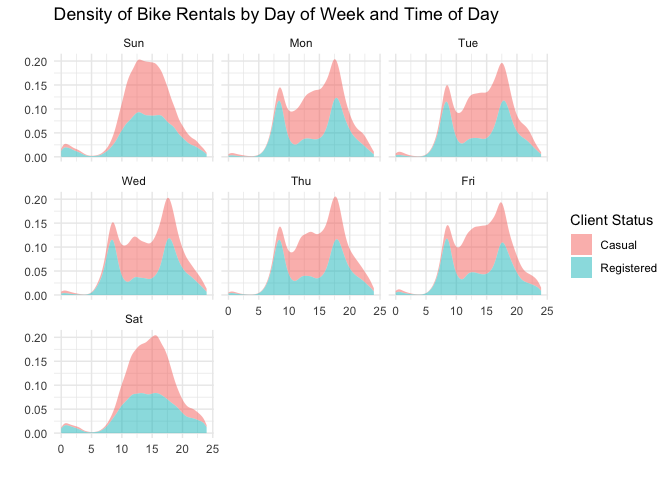

```r
library(tidyverse)     # for graphing and data cleaning
```

```
## ── Attaching packages ─────────────────────────────────────── tidyverse 1.3.1 ──
```

```
## ✓ ggplot2 3.3.5     ✓ purrr   0.3.4
## ✓ tibble  3.1.6     ✓ dplyr   1.0.7
## ✓ tidyr   1.1.4     ✓ stringr 1.4.0
## ✓ readr   2.1.1     ✓ forcats 0.5.1
```

```
## ── Conflicts ────────────────────────────────────────── tidyverse_conflicts() ──
## x dplyr::filter() masks stats::filter()
## x dplyr::lag()    masks stats::lag()
```

```r
library(gardenR)       # for Lisa's garden data
library(lubridate)     # for date manipulation
```

```
## 
## Attaching package: 'lubridate'
```

```
## The following objects are masked from 'package:base':
## 
##     date, intersect, setdiff, union
```

```r
library(ggthemes)      # for even more plotting themes
library(geofacet)      # for special faceting with US map layout
theme_set(theme_minimal())       # My favorite ggplot() theme :)
```


```r
# Lisa's garden data
data("garden_harvest")

# Seeds/plants (and other garden supply) costs
data("garden_spending")

# Planting dates and locations
data("garden_planting")

# Tidy Tuesday dog breed data
breed_traits <- readr::read_csv('https://raw.githubusercontent.com/rfordatascience/tidytuesday/master/data/2022/2022-02-01/breed_traits.csv')
```

```
## Rows: 195 Columns: 17
```

```
## ── Column specification ────────────────────────────────────────────────────────
## Delimiter: ","
## chr  (3): Breed, Coat Type, Coat Length
## dbl (14): Affectionate With Family, Good With Young Children, Good With Othe...
```

```
## 
## ℹ Use `spec()` to retrieve the full column specification for this data.
## ℹ Specify the column types or set `show_col_types = FALSE` to quiet this message.
```

```r
trait_description <- readr::read_csv('https://raw.githubusercontent.com/rfordatascience/tidytuesday/master/data/2022/2022-02-01/trait_description.csv')
```

```
## Rows: 16 Columns: 4
```

```
## ── Column specification ────────────────────────────────────────────────────────
## Delimiter: ","
## chr (4): Trait, Trait_1, Trait_5, Description
```

```
## 
## ℹ Use `spec()` to retrieve the full column specification for this data.
## ℹ Specify the column types or set `show_col_types = FALSE` to quiet this message.
```

```r
breed_rank_all <- readr::read_csv('https://raw.githubusercontent.com/rfordatascience/tidytuesday/master/data/2022/2022-02-01/breed_rank.csv')
```

```
## Rows: 195 Columns: 11
```

```
## ── Column specification ────────────────────────────────────────────────────────
## Delimiter: ","
## chr (3): Breed, links, Image
## dbl (8): 2013 Rank, 2014 Rank, 2015 Rank, 2016 Rank, 2017 Rank, 2018 Rank, 2...
```

```
## 
## ℹ Use `spec()` to retrieve the full column specification for this data.
## ℹ Specify the column types or set `show_col_types = FALSE` to quiet this message.
```

```r
# Tidy Tuesday data for challenge problem
kids <- readr::read_csv('https://raw.githubusercontent.com/rfordatascience/tidytuesday/master/data/2020/2020-09-15/kids.csv')
```

```
## Rows: 23460 Columns: 6
```

```
## ── Column specification ────────────────────────────────────────────────────────
## Delimiter: ","
## chr (2): state, variable
## dbl (4): year, raw, inf_adj, inf_adj_perchild
```

```
## 
## ℹ Use `spec()` to retrieve the full column specification for this data.
## ℹ Specify the column types or set `show_col_types = FALSE` to quiet this message.
```

## Setting up on GitHub!

Before starting your assignment, you need to get yourself set up on GitHub and make sure GitHub is connected to R Studio. To do that, you should read the instruction (through the "Cloning a repo" section) and watch the video [here](https://github.com/llendway/github_for_collaboration/blob/master/github_for_collaboration.md). Then, do the following (if you get stuck on a step, don't worry, I will help! You can always get started on the homework and we can figure out the GitHub piece later):

* Create a repository on GitHub, giving it a nice name so you know it is for the 3rd weekly exercise assignment (follow the instructions in the document/video).  
* Copy the repo name so you can clone it to your computer. In R Studio, go to file --> New project --> Version control --> Git and follow the instructions from the document/video.  
* Download the code from this document and save it in the repository folder/project on your computer.  
* In R Studio, you should then see the .Rmd file in the upper right corner in the Git tab (along with the .Rproj file and probably .gitignore).  
* Check all the boxes of the files in the Git tab and choose commit.  
* In the commit window, write a commit message, something like "Initial upload" would be appropriate, and commit the files.  
* Either click the green up arrow in the commit window or close the commit window and click the green up arrow in the Git tab to push your changes to GitHub.  
* Refresh your GitHub page (online) and make sure the new documents have been pushed out.  
* Back in R Studio, knit the .Rmd file. When you do that, you should have two (as long as you didn't make any changes to the .Rmd file, in which case you might have three) files show up in the Git tab - an .html file and an .md file. The .md file is something we haven't seen before and is here because I included `keep_md: TRUE` in the YAML heading. The .md file is a markdown (NOT R Markdown) file that is an interim step to creating the html file. They are displayed fairly nicely in GitHub, so we want to keep it and look at it there. Click the boxes next to these two files, commit changes (remember to include a commit message), and push them (green up arrow).  
* As you work through your homework, save and commit often, push changes occasionally (maybe after you feel finished with an exercise?), and go check to see what the .md file looks like on GitHub.  
* If you have issues, let me know! This is new to many of you and may not be intuitive at first. But, I promise, you'll get the hang of it! 


## Instructions

* Put your name at the top of the document. 

* **For ALL graphs, you should include appropriate labels.** 

* Feel free to change the default theme, which I currently have set to `theme_minimal()`. 

* Use good coding practice. Read the short sections on good code with [pipes](https://style.tidyverse.org/pipes.html) and [ggplot2](https://style.tidyverse.org/ggplot2.html). **This is part of your grade!**

* When you are finished with ALL the exercises, uncomment the options at the top so your document looks nicer. Don't do it before then, or else you might miss some important warnings and messages.


## Warm-up exercises with garden data

These exercises will reiterate what you learned in the "Expanding the data wrangling toolkit" tutorial. If you haven't gone through the tutorial yet, you should do that first.

  1. Summarize the `garden_harvest` data to find the total harvest weight in pounds for each vegetable and day of week (HINT: use the `wday()` function from `lubridate`). Display the results so that the vegetables are rows but the days of the week are columns.


```r
garden_harvest %>% 
  mutate(day_of_week = wday(date, label = TRUE)) %>% 
  group_by(vegetable, day_of_week) %>% 
  mutate(weight_lb = weight * 0.00220462) %>% 
  summarize(total_harvest_weight = sum(weight_lb)) %>% 
  pivot_wider(names_from = day_of_week,
              values_from = total_harvest_weight)
```

```
## `summarise()` has grouped output by 'vegetable'. You can override using the `.groups` argument.
```

<div data-pagedtable="false">
  <script data-pagedtable-source type="application/json">
{"columns":[{"label":["vegetable"],"name":[1],"type":["chr"],"align":["left"]},{"label":["Sat"],"name":[2],"type":["dbl"],"align":["right"]},{"label":["Mon"],"name":[3],"type":["dbl"],"align":["right"]},{"label":["Tue"],"name":[4],"type":["dbl"],"align":["right"]},{"label":["Thu"],"name":[5],"type":["dbl"],"align":["right"]},{"label":["Fri"],"name":[6],"type":["dbl"],"align":["right"]},{"label":["Sun"],"name":[7],"type":["dbl"],"align":["right"]},{"label":["Wed"],"name":[8],"type":["dbl"],"align":["right"]}],"data":[{"1":"apple","2":"0.34392072","3":"NA","4":"NA","5":"NA","6":"NA","7":"NA","8":"NA"},{"1":"asparagus","2":"0.04409240","3":"NA","4":"NA","5":"NA","6":"NA","7":"NA","8":"NA"},{"1":"basil","2":"0.41005932","3":"0.0661386","4":"0.11023100","5":"0.02645544","6":"0.46737944","7":"NA","8":"NA"},{"1":"beans","2":"4.70906832","3":"6.5080382","4":"4.38719380","5":"3.39291018","6":"1.52559704","7":"1.91361016","8":"4.08295624"},{"1":"beets","2":"0.37919464","3":"0.6724091","4":"0.15873264","5":"11.89172028","6":"0.02425082","7":"0.32187452","8":"0.18298346"},{"1":"broccoli","2":"NA","3":"0.8201186","4":"NA","5":"NA","6":"0.16534650","7":"1.25883802","8":"0.70768302"},{"1":"carrots","2":"2.33028334","3":"0.8708249","4":"0.35273920","5":"2.67420406","6":"2.13848140","7":"2.93655384","8":"5.56225626"},{"1":"chives","2":"NA","3":"NA","4":"NA","5":"NA","6":"NA","7":"NA","8":"0.01763696"},{"1":"cilantro","2":"0.03747854","3":"NA","4":"0.00440924","5":"NA","6":"0.07275246","7":"NA","8":"NA"},{"1":"corn","2":"1.31615814","3":"0.7583893","4":"0.72752460","5":"NA","6":"3.44802568","7":"1.45725382","8":"5.30211110"},{"1":"cucumbers","2":"9.64080326","3":"4.7752069","4":"10.04645334","5":"3.30693000","6":"7.42956940","7":"3.10410496","8":"5.30652034"},{"1":"edamame","2":"4.68922674","3":"NA","4":"1.40213832","5":"NA","6":"NA","7":"NA","8":"NA"},{"1":"hot peppers","2":"NA","3":"1.2588380","4":"0.14109568","5":"NA","6":"NA","7":"NA","8":"0.06834322"},{"1":"jalapeño","2":"1.50796008","3":"5.5534378","4":"0.54895038","5":"0.22487124","6":"1.29411194","7":"0.26234978","8":"0.48060716"},{"1":"kale","2":"1.49032312","3":"2.0679336","4":"0.28219136","5":"0.27998674","6":"0.38139926","7":"0.82673250","8":"0.61729360"},{"1":"kohlrabi","2":"NA","3":"NA","4":"NA","5":"0.42108242","6":"NA","7":"NA","8":"NA"},{"1":"lettuce","2":"1.31615814","3":"2.4581513","4":"0.91712192","5":"2.45153744","6":"1.80117454","7":"1.46607230","8":"1.18608556"},{"1":"onions","2":"1.91361016","3":"0.5092672","4":"0.70768302","5":"0.60186126","6":"0.07275246","7":"0.26014516","8":"NA"},{"1":"peas","2":"2.85277828","3":"4.6341112","4":"2.06793356","5":"3.39731942","6":"0.93696350","7":"2.05691046","8":"1.08026380"},{"1":"peppers","2":"1.38229674","3":"2.5264945","4":"1.44402610","5":"0.70988764","6":"0.33510224","7":"0.50265336","8":"2.44271896"},{"1":"potatoes","2":"2.80207202","3":"0.9700328","4":"NA","5":"11.85203712","6":"3.74124014","7":"NA","8":"4.57017726"},{"1":"pumpkins","2":"92.68883866","3":"30.1195184","4":"31.85675900","5":"NA","6":"NA","7":"NA","8":"NA"},{"1":"radish","2":"0.23148510","3":"0.1962112","4":"0.09479866","5":"0.14770954","6":"0.19400656","7":"0.08157094","8":"NA"},{"1":"raspberries","2":"0.53351804","3":"0.1300726","4":"0.33510224","5":"0.28880522","6":"0.57099658","7":"NA","8":"NA"},{"1":"rutabaga","2":"6.89825598","3":"NA","4":"NA","5":"NA","6":"3.57809826","7":"19.26396956","8":"NA"},{"1":"spinach","2":"0.26014516","3":"0.1477095","4":"0.49603950","5":"0.23368972","6":"0.19621118","7":"0.48722102","8":"0.21384814"},{"1":"squash","2":"56.22221924","3":"24.3345956","4":"18.46810174","5":"NA","6":"NA","7":"NA","8":"NA"},{"1":"strawberries","2":"0.16975574","3":"0.4784025","4":"NA","5":"0.08818480","6":"0.48722102","7":"0.08157094","8":"NA"},{"1":"Swiss chard","2":"0.73413846","3":"1.0736499","4":"0.07054784","5":"2.23107544","6":"0.61729360","7":"1.24781492","8":"0.90830344"},{"1":"tomatoes","2":"35.12621046","3":"11.4926841","4":"48.75076206","5":"34.51773534","6":"85.07628580","7":"75.60964752","8":"58.26590198"},{"1":"zucchini","2":"3.41495638","3":"12.1959578","4":"16.46851140","5":"34.63017096","6":"18.72163304","7":"12.23564100","8":"2.04147812"}],"options":{"columns":{"min":{},"max":[10]},"rows":{"min":[10],"max":[10]},"pages":{}}}
  </script>
</div>

  2. Summarize the `garden_harvest` data to find the total harvest in pound for each vegetable variety and then try adding the plot from the `garden_planting` table. This will not turn out perfectly. What is the problem? How might you fix it?


```r
garden_harvest %>% 
  group_by(vegetable, variety) %>% 
  mutate(weight_lb = weight * 0.00220462) %>% 
  summarize(total_harvest_weight = sum(weight_lb)) %>% 
  left_join(garden_planting,
            by = c("vegetable","variety"))
```

```
## `summarise()` has grouped output by 'vegetable'. You can override using the `.groups` argument.
```

<div data-pagedtable="false">
  <script data-pagedtable-source type="application/json">
{"columns":[{"label":["vegetable"],"name":[1],"type":["chr"],"align":["left"]},{"label":["variety"],"name":[2],"type":["chr"],"align":["left"]},{"label":["total_harvest_weight"],"name":[3],"type":["dbl"],"align":["right"]},{"label":["plot"],"name":[4],"type":["chr"],"align":["left"]},{"label":["number_seeds_planted"],"name":[5],"type":["dbl"],"align":["right"]},{"label":["date"],"name":[6],"type":["date"],"align":["right"]},{"label":["number_seeds_exact"],"name":[7],"type":["lgl"],"align":["right"]},{"label":["notes"],"name":[8],"type":["chr"],"align":["left"]}],"data":[{"1":"apple","2":"unknown","3":"0.34392072","4":"NA","5":"NA","6":"<NA>","7":"NA","8":"NA"},{"1":"asparagus","2":"asparagus","3":"0.04409240","4":"NA","5":"NA","6":"<NA>","7":"NA","8":"NA"},{"1":"basil","2":"Isle of Naxos","3":"1.08026380","4":"potB","5":"40","6":"2020-05-16","7":"FALSE","8":"NA"},{"1":"beans","2":"Bush Bush Slender","3":"22.12997556","4":"M","5":"30","6":"2020-05-16","7":"FALSE","8":"NA"},{"1":"beans","2":"Bush Bush Slender","3":"22.12997556","4":"D","5":"10","6":"2020-05-21","7":"TRUE","8":"NA"},{"1":"beans","2":"Chinese Red Noodle","3":"0.78484472","4":"K","5":"5","6":"2020-05-25","7":"TRUE","8":"NA"},{"1":"beans","2":"Chinese Red Noodle","3":"0.78484472","4":"L","5":"5","6":"2020-05-25","7":"TRUE","8":"NA"},{"1":"beans","2":"Classic Slenderette","3":"3.60455370","4":"E","5":"29","6":"2020-06-20","7":"TRUE","8":"NA"},{"1":"beets","2":"Gourmet Golden","3":"7.02171470","4":"H","5":"40","6":"2020-05-02","7":"FALSE","8":"NA"},{"1":"beets","2":"leaves","3":"0.22266662","4":"NA","5":"NA","6":"<NA>","7":"NA","8":"NA"},{"1":"beets","2":"Sweet Merlin","3":"6.38678414","4":"H","5":"40","6":"2020-05-02","7":"FALSE","8":"NA"},{"1":"broccoli","2":"Main Crop Bravado","3":"2.13186754","4":"D","5":"7","6":"2020-05-22","7":"TRUE","8":"NA"},{"1":"broccoli","2":"Main Crop Bravado","3":"2.13186754","4":"I","5":"7","6":"2020-05-22","7":"TRUE","8":"NA"},{"1":"broccoli","2":"Yod Fah","3":"0.82011864","4":"P","5":"25","6":"2020-05-16","7":"FALSE","8":"NA"},{"1":"carrots","2":"Bolero","3":"8.29157582","4":"H","5":"50","6":"2020-05-02","7":"FALSE","8":"NA"},{"1":"carrots","2":"Bolero","3":"8.29157582","4":"L","5":"50","6":"2020-05-25","7":"FALSE","8":"NA"},{"1":"carrots","2":"Dragon","3":"4.10500244","4":"H","5":"40","6":"2020-05-02","7":"FALSE","8":"NA"},{"1":"carrots","2":"Dragon","3":"4.10500244","4":"L","5":"50","6":"2020-05-25","7":"FALSE","8":"NA"},{"1":"carrots","2":"greens","3":"0.37258078","4":"NA","5":"NA","6":"<NA>","7":"NA","8":"NA"},{"1":"carrots","2":"King Midas","3":"4.09618396","4":"H","5":"50","6":"2020-05-02","7":"FALSE","8":"NA"},{"1":"carrots","2":"King Midas","3":"4.09618396","4":"L","5":"50","6":"2020-05-25","7":"FALSE","8":"NA"},{"1":"chives","2":"perrenial","3":"0.01763696","4":"NA","5":"NA","6":"<NA>","7":"NA","8":"NA"},{"1":"cilantro","2":"cilantro","3":"0.11464024","4":"potD","5":"15","6":"2020-05-16","7":"FALSE","8":"NA"},{"1":"cilantro","2":"cilantro","3":"0.11464024","4":"E","5":"20","6":"2020-06-20","7":"FALSE","8":"NA"},{"1":"corn","2":"Dorinny Sweet","3":"11.40670388","4":"A","5":"20","6":"2020-05-25","7":"FALSE","8":"NA"},{"1":"corn","2":"Golden Bantam","3":"1.60275874","4":"B","5":"20","6":"2020-05-25","7":"FALSE","8":"NA"},{"1":"cucumbers","2":"pickling","3":"43.60958822","4":"L","5":"20","6":"2020-05-25","7":"FALSE","8":"NA"},{"1":"edamame","2":"edamame","3":"6.09136506","4":"O","5":"25","6":"2020-05-16","7":"FALSE","8":"NA"},{"1":"hot peppers","2":"thai","3":"0.14770954","4":"potB","5":"1","6":"2020-05-21","7":"TRUE","8":"NA"},{"1":"hot peppers","2":"variety","3":"1.32056738","4":"potC","5":"6","6":"2020-05-21","7":"TRUE","8":"NA"},{"1":"jalapeño","2":"giant","3":"9.87228836","4":"L","5":"4","6":"2020-05-21","7":"TRUE","8":"NA"},{"1":"kale","2":"Heirloom Lacinto","3":"5.94586014","4":"P","5":"30","6":"2020-05-02","7":"FALSE","8":"NA"},{"1":"kale","2":"Heirloom Lacinto","3":"5.94586014","4":"front","5":"30","6":"2020-06-20","7":"FALSE","8":"NA"},{"1":"kohlrabi","2":"Crispy Colors Duo","3":"0.42108242","4":"front","5":"10","6":"2020-05-20","7":"FALSE","8":"NA"},{"1":"lettuce","2":"Farmer's Market Blend","3":"3.80296950","4":"C","5":"60","6":"2020-05-02","7":"FALSE","8":"NA"},{"1":"lettuce","2":"Farmer's Market Blend","3":"3.80296950","4":"L","5":"60","6":"2020-05-16","7":"FALSE","8":"NA"},{"1":"lettuce","2":"Lettuce Mixture","3":"4.74875148","4":"G","5":"200","6":"2020-06-20","7":"FALSE","8":"NA"},{"1":"lettuce","2":"mustard greens","3":"0.05070626","4":"NA","5":"NA","6":"<NA>","7":"NA","8":"NA"},{"1":"lettuce","2":"reseed","3":"0.09920790","4":"NA","5":"NA","6":"<NA>","7":"NA","8":"NA"},{"1":"lettuce","2":"Tatsoi","3":"2.89466606","4":"P","5":"25","6":"2020-05-02","7":"FALSE","8":"NA"},{"1":"onions","2":"Delicious Duo","3":"0.75398004","4":"P","5":"25","6":"2020-04-26","7":"FALSE","8":"NA"},{"1":"onions","2":"Long Keeping Rainbow","3":"3.31133924","4":"H","5":"40","6":"2020-04-26","7":"FALSE","8":"NA"},{"1":"peas","2":"Magnolia Blossom","3":"7.45822946","4":"B","5":"24","6":"2020-04-19","7":"TRUE","8":"NA"},{"1":"peas","2":"Super Sugar Snap","3":"9.56805080","4":"A","5":"22","6":"2020-04-19","7":"TRUE","8":"NA"},{"1":"peppers","2":"green","3":"5.69232884","4":"K","5":"12","6":"2020-05-21","7":"TRUE","8":"NA"},{"1":"peppers","2":"green","3":"5.69232884","4":"O","5":"5","6":"2020-05-21","7":"TRUE","8":"NA"},{"1":"peppers","2":"variety","3":"3.65085072","4":"potA","5":"3","6":"2020-05-21","7":"TRUE","8":"NA"},{"1":"peppers","2":"variety","3":"3.65085072","4":"potA","5":"3","6":"2020-05-21","7":"TRUE","8":"NA"},{"1":"peppers","2":"variety","3":"3.65085072","4":"potD","5":"1","6":"2020-05-21","7":"TRUE","8":"NA"},{"1":"potatoes","2":"purple","3":"3.00930630","4":"D","5":"5","6":"2020-05-02","7":"FALSE","8":"NA"},{"1":"potatoes","2":"red","3":"4.43349082","4":"I","5":"3","6":"2020-05-22","7":"FALSE","8":"NA"},{"1":"potatoes","2":"Russet","3":"9.09185288","4":"D","5":"8","6":"2020-05-02","7":"FALSE","8":"NA"},{"1":"potatoes","2":"yellow","3":"7.40090934","4":"I","5":"10","6":"2020-05-02","7":"FALSE","8":"NA"},{"1":"potatoes","2":"yellow","3":"7.40090934","4":"I","5":"8","6":"2020-05-22","7":"TRUE","8":"NA"},{"1":"pumpkins","2":"Cinderella's Carraige","3":"32.87308882","4":"B","5":"3","6":"2020-05-20","7":"TRUE","8":"NA"},{"1":"pumpkins","2":"New England Sugar","3":"44.85960776","4":"K","5":"4","6":"2020-05-25","7":"TRUE","8":"NA"},{"1":"pumpkins","2":"saved","3":"76.93241952","4":"B","5":"8","6":"2020-05-20","7":"TRUE","8":"NA"},{"1":"radish","2":"Garden Party Mix","3":"0.94578198","4":"C","5":"20","6":"2020-05-02","7":"FALSE","8":"NA"},{"1":"radish","2":"Garden Party Mix","3":"0.94578198","4":"G","5":"30","6":"2020-05-02","7":"FALSE","8":"NA"},{"1":"radish","2":"Garden Party Mix","3":"0.94578198","4":"H","5":"15","6":"2020-05-02","7":"FALSE","8":"NA"},{"1":"raspberries","2":"perrenial","3":"1.85849466","4":"NA","5":"NA","6":"<NA>","7":"NA","8":"NA"},{"1":"rutabaga","2":"Improved Helenor","3":"29.74032380","4":"NA","5":"NA","6":"<NA>","7":"NA","8":"NA"},{"1":"spinach","2":"Catalina","3":"2.03486426","4":"H","5":"50","6":"2020-05-16","7":"FALSE","8":"NA"},{"1":"spinach","2":"Catalina","3":"2.03486426","4":"E","5":"100","6":"2020-06-20","7":"FALSE","8":"NA"},{"1":"squash","2":"Blue (saved)","3":"41.52401770","4":"A","5":"4","6":"2020-05-20","7":"TRUE","8":"NA"},{"1":"squash","2":"Blue (saved)","3":"41.52401770","4":"B","5":"8","6":"2020-05-20","7":"TRUE","8":"NA"},{"1":"squash","2":"delicata","3":"10.49840044","4":"K","5":"8","6":"2020-05-25","7":"TRUE","8":"NA"},{"1":"squash","2":"Red Kuri","3":"22.73183682","4":"A","5":"4","6":"2020-05-20","7":"TRUE","8":"NA"},{"1":"squash","2":"Red Kuri","3":"22.73183682","4":"B","5":"4","6":"2020-05-20","7":"TRUE","8":"NA"},{"1":"squash","2":"Red Kuri","3":"22.73183682","4":"side","5":"1","6":"2020-05-20","7":"TRUE","8":"NA"},{"1":"squash","2":"Waltham Butternut","3":"24.27066158","4":"A","5":"4","6":"2020-05-20","7":"TRUE","8":"NA"},{"1":"squash","2":"Waltham Butternut","3":"24.27066158","4":"K","5":"6","6":"2020-05-25","7":"TRUE","8":"NA"},{"1":"strawberries","2":"perrenial","3":"1.30513504","4":"NA","5":"NA","6":"<NA>","7":"NA","8":"NA"},{"1":"Swiss chard","2":"Neon Glow","3":"6.88282364","4":"M","5":"25","6":"2020-05-02","7":"FALSE","8":"NA"},{"1":"tomatoes","2":"Amish Paste","3":"65.67342518","4":"J","5":"1","6":"2020-05-20","7":"TRUE","8":"NA"},{"1":"tomatoes","2":"Amish Paste","3":"65.67342518","4":"N","5":"2","6":"2020-05-20","7":"TRUE","8":"NA"},{"1":"tomatoes","2":"Better Boy","3":"34.00846812","4":"J","5":"1","6":"2020-05-20","7":"TRUE","8":"NA"},{"1":"tomatoes","2":"Better Boy","3":"34.00846812","4":"N","5":"1","6":"2020-05-20","7":"TRUE","8":"NA"},{"1":"tomatoes","2":"Big Beef","3":"24.99377694","4":"N","5":"1","6":"2020-05-20","7":"TRUE","8":"NA"},{"1":"tomatoes","2":"Black Krim","3":"15.80712540","4":"N","5":"1","6":"2020-05-20","7":"TRUE","8":"NA"},{"1":"tomatoes","2":"Bonny Best","3":"24.92322910","4":"J","5":"1","6":"2020-05-20","7":"TRUE","8":"NA"},{"1":"tomatoes","2":"Brandywine","3":"15.64618814","4":"J","5":"1","6":"2020-05-20","7":"TRUE","8":"NA"},{"1":"tomatoes","2":"Cherokee Purple","3":"15.71232674","4":"J","5":"1","6":"2020-05-20","7":"TRUE","8":"NA"},{"1":"tomatoes","2":"grape","3":"32.39468628","4":"O","5":"1","6":"2020-05-20","7":"TRUE","8":"NA"},{"1":"tomatoes","2":"Jet Star","3":"15.02448530","4":"N","5":"1","6":"2020-05-20","7":"TRUE","8":"NA"},{"1":"tomatoes","2":"Mortgage Lifter","3":"26.32536742","4":"J","5":"1","6":"2020-05-20","7":"TRUE","8":"died"},{"1":"tomatoes","2":"Mortgage Lifter","3":"26.32536742","4":"N","5":"1","6":"2020-05-20","7":"TRUE","8":"NA"},{"1":"tomatoes","2":"Old German","3":"26.71778978","4":"J","5":"1","6":"2020-05-20","7":"TRUE","8":"NA"},{"1":"tomatoes","2":"volunteers","3":"51.61235882","4":"N","5":"1","6":"2020-06-03","7":"TRUE","8":"NA"},{"1":"tomatoes","2":"volunteers","3":"51.61235882","4":"J","5":"1","6":"2020-06-03","7":"TRUE","8":"NA"},{"1":"tomatoes","2":"volunteers","3":"51.61235882","4":"front","5":"5","6":"2020-06-03","7":"TRUE","8":"NA"},{"1":"tomatoes","2":"volunteers","3":"51.61235882","4":"O","5":"2","6":"2020-06-03","7":"TRUE","8":"NA"},{"1":"zucchini","2":"Romanesco","3":"99.70834874","4":"D","5":"3","6":"2020-05-21","7":"TRUE","8":"NA"}],"options":{"columns":{"min":{},"max":[10]},"rows":{"min":[10],"max":[10]},"pages":{}}}
  </script>
</div>

> The problem is that certain varieties were planted in multiple plots and Lisa didn't track where she harvested the produce from. So, despite the total harvest values being the same for each given variety, the plot data does not represent where the harvest came was planted/came from. Because the total harvest data is the same for each vegetable/variety, we could filter the data to only include the vegetable/variety mix once. Then, I would want to create a new plot variable that listed that different plots that the variety could have been harvested from.

  3. I would like to understand how much money I "saved" by gardening, for each vegetable type. Describe how I could use the `garden_harvest` and `garden_spending` datasets, along with data from somewhere like [this](https://products.wholefoodsmarket.com/search?sort=relevance&store=10542) to answer this question. You can answer this in words, referencing various join functions. You don't need R code but could provide some if it's helpful.

> You could use the left_join() function to join the datasets by vegetable and variety to get information on what Lisa spent to planting and maintaining her garden. Then, you could use or create a dataset with price information from a local grocer store and left_join() that data set to add information about what the harvest would cost from the store. I would make sure that the data set had the price information in dollars per pound to ensure that I could easily estimate what the harvest (in lbs) would cost if store-bought. Then, using the total harvest by variety variable, I would multiply total harvest by cost per pound if store-bought. Then I would create a "money saved" variable where I would subtract Lisa's expenses from that money required to buy it from the store.


```r
garden_harvest %>% 
  left_join(garden_spending, 
            by = c("vegetable","variety"))
```

<div data-pagedtable="false">
  <script data-pagedtable-source type="application/json">
{"columns":[{"label":["vegetable"],"name":[1],"type":["chr"],"align":["left"]},{"label":["variety"],"name":[2],"type":["chr"],"align":["left"]},{"label":["date"],"name":[3],"type":["date"],"align":["right"]},{"label":["weight"],"name":[4],"type":["dbl"],"align":["right"]},{"label":["units"],"name":[5],"type":["chr"],"align":["left"]},{"label":["brand"],"name":[6],"type":["chr"],"align":["left"]},{"label":["eggplant_item_number"],"name":[7],"type":["chr"],"align":["left"]},{"label":["price"],"name":[8],"type":["dbl"],"align":["right"]},{"label":["price_with_tax"],"name":[9],"type":["dbl"],"align":["right"]}],"data":[{"1":"lettuce","2":"reseed","3":"2020-06-06","4":"20","5":"grams","6":"NA","7":"NA","8":"NA","9":"NA"},{"1":"radish","2":"Garden Party Mix","3":"2020-06-06","4":"36","5":"grams","6":"Renee's Garden","7":"2083","8":"2.990000","9":"3.225463"},{"1":"lettuce","2":"reseed","3":"2020-06-08","4":"15","5":"grams","6":"NA","7":"NA","8":"NA","9":"NA"},{"1":"lettuce","2":"reseed","3":"2020-06-09","4":"10","5":"grams","6":"NA","7":"NA","8":"NA","9":"NA"},{"1":"radish","2":"Garden Party Mix","3":"2020-06-11","4":"67","5":"grams","6":"Renee's Garden","7":"2083","8":"2.990000","9":"3.225463"},{"1":"lettuce","2":"Farmer's Market Blend","3":"2020-06-11","4":"12","5":"grams","6":"Renee's Garden","7":"1067","8":"2.790000","9":"3.009713"},{"1":"spinach","2":"Catalina","3":"2020-06-11","4":"9","5":"grams","6":"Renee's Garden","7":"1102","8":"2.990000","9":"3.225463"},{"1":"beets","2":"leaves","3":"2020-06-11","4":"8","5":"grams","6":"NA","7":"NA","8":"NA","9":"NA"},{"1":"radish","2":"Garden Party Mix","3":"2020-06-13","4":"53","5":"grams","6":"Renee's Garden","7":"2083","8":"2.990000","9":"3.225463"},{"1":"lettuce","2":"Farmer's Market Blend","3":"2020-06-13","4":"19","5":"grams","6":"Renee's Garden","7":"1067","8":"2.790000","9":"3.009713"},{"1":"spinach","2":"Catalina","3":"2020-06-13","4":"14","5":"grams","6":"Renee's Garden","7":"1102","8":"2.990000","9":"3.225463"},{"1":"kale","2":"Heirloom Lacinto","3":"2020-06-13","4":"10","5":"grams","6":"Renee's Garden","7":"1058","8":"2.790000","9":"3.009713"},{"1":"lettuce","2":"Farmer's Market Blend","3":"2020-06-17","4":"48","5":"grams","6":"Renee's Garden","7":"1067","8":"2.790000","9":"3.009713"},{"1":"spinach","2":"Catalina","3":"2020-06-17","4":"58","5":"grams","6":"Renee's Garden","7":"1102","8":"2.990000","9":"3.225463"},{"1":"peas","2":"Magnolia Blossom","3":"2020-06-17","4":"8","5":"grams","6":"Renee's Garden","7":"6601","8":"2.990000","9":"3.225463"},{"1":"peas","2":"Super Sugar Snap","3":"2020-06-17","4":"121","5":"grams","6":"Renee's Garden","7":"1090","8":"2.790000","9":"3.009713"},{"1":"chives","2":"perrenial","3":"2020-06-17","4":"8","5":"grams","6":"NA","7":"NA","8":"NA","9":"NA"},{"1":"strawberries","2":"perrenial","3":"2020-06-18","4":"40","5":"grams","6":"NA","7":"NA","8":"NA","9":"NA"},{"1":"lettuce","2":"Farmer's Market Blend","3":"2020-06-18","4":"47","5":"grams","6":"Renee's Garden","7":"1067","8":"2.790000","9":"3.009713"},{"1":"spinach","2":"Catalina","3":"2020-06-18","4":"59","5":"grams","6":"Renee's Garden","7":"1102","8":"2.990000","9":"3.225463"},{"1":"beets","2":"leaves","3":"2020-06-18","4":"25","5":"grams","6":"NA","7":"NA","8":"NA","9":"NA"},{"1":"spinach","2":"Catalina","3":"2020-06-19","4":"58","5":"grams","6":"Renee's Garden","7":"1102","8":"2.990000","9":"3.225463"},{"1":"lettuce","2":"Farmer's Market Blend","3":"2020-06-19","4":"39","5":"grams","6":"Renee's Garden","7":"1067","8":"2.790000","9":"3.009713"},{"1":"beets","2":"leaves","3":"2020-06-19","4":"11","5":"grams","6":"NA","7":"NA","8":"NA","9":"NA"},{"1":"lettuce","2":"Farmer's Market Blend","3":"2020-06-19","4":"38","5":"grams","6":"Renee's Garden","7":"1067","8":"2.790000","9":"3.009713"},{"1":"lettuce","2":"Farmer's Market Blend","3":"2020-06-20","4":"22","5":"grams","6":"Renee's Garden","7":"1067","8":"2.790000","9":"3.009713"},{"1":"spinach","2":"Catalina","3":"2020-06-20","4":"25","5":"grams","6":"Renee's Garden","7":"1102","8":"2.990000","9":"3.225463"},{"1":"lettuce","2":"Tatsoi","3":"2020-06-20","4":"18","5":"grams","6":"Seed Savers","7":"3334","8":"3.250000","9":"3.505938"},{"1":"radish","2":"Garden Party Mix","3":"2020-06-20","4":"16","5":"grams","6":"Renee's Garden","7":"2083","8":"2.990000","9":"3.225463"},{"1":"peas","2":"Magnolia Blossom","3":"2020-06-20","4":"71","5":"grams","6":"Renee's Garden","7":"6601","8":"2.990000","9":"3.225463"},{"1":"peas","2":"Super Sugar Snap","3":"2020-06-20","4":"148","5":"grams","6":"Renee's Garden","7":"1090","8":"2.790000","9":"3.009713"},{"1":"asparagus","2":"asparagus","3":"2020-06-20","4":"20","5":"grams","6":"NA","7":"NA","8":"NA","9":"NA"},{"1":"radish","2":"Garden Party Mix","3":"2020-06-21","4":"37","5":"grams","6":"Renee's Garden","7":"2083","8":"2.990000","9":"3.225463"},{"1":"Swiss chard","2":"Neon Glow","3":"2020-06-21","4":"19","5":"grams","6":"NA","7":"NA","8":"NA","9":"NA"},{"1":"spinach","2":"Catalina","3":"2020-06-21","4":"71","5":"grams","6":"Renee's Garden","7":"1102","8":"2.990000","9":"3.225463"},{"1":"lettuce","2":"Farmer's Market Blend","3":"2020-06-21","4":"95","5":"grams","6":"Renee's Garden","7":"1067","8":"2.790000","9":"3.009713"},{"1":"spinach","2":"Catalina","3":"2020-06-21","4":"51","5":"grams","6":"Renee's Garden","7":"1102","8":"2.990000","9":"3.225463"},{"1":"Swiss chard","2":"Neon Glow","3":"2020-06-21","4":"13","5":"grams","6":"NA","7":"NA","8":"NA","9":"NA"},{"1":"beets","2":"leaves","3":"2020-06-21","4":"57","5":"grams","6":"NA","7":"NA","8":"NA","9":"NA"},{"1":"kale","2":"Heirloom Lacinto","3":"2020-06-21","4":"60","5":"grams","6":"Renee's Garden","7":"1058","8":"2.790000","9":"3.009713"},{"1":"spinach","2":"Catalina","3":"2020-06-22","4":"37","5":"grams","6":"Renee's Garden","7":"1102","8":"2.990000","9":"3.225463"},{"1":"lettuce","2":"Farmer's Market Blend","3":"2020-06-22","4":"52","5":"grams","6":"Renee's Garden","7":"1067","8":"2.790000","9":"3.009713"},{"1":"peas","2":"Super Sugar Snap","3":"2020-06-22","4":"40","5":"grams","6":"Renee's Garden","7":"1090","8":"2.790000","9":"3.009713"},{"1":"peas","2":"Magnolia Blossom","3":"2020-06-22","4":"19","5":"grams","6":"Renee's Garden","7":"6601","8":"2.990000","9":"3.225463"},{"1":"strawberries","2":"perrenial","3":"2020-06-22","4":"19","5":"grams","6":"NA","7":"NA","8":"NA","9":"NA"},{"1":"lettuce","2":"Farmer's Market Blend","3":"2020-06-22","4":"18","5":"grams","6":"Renee's Garden","7":"1067","8":"2.790000","9":"3.009713"},{"1":"peas","2":"Magnolia Blossom","3":"2020-06-23","4":"40","5":"grams","6":"Renee's Garden","7":"6601","8":"2.990000","9":"3.225463"},{"1":"peas","2":"Super Sugar Snap","3":"2020-06-23","4":"165","5":"grams","6":"Renee's Garden","7":"1090","8":"2.790000","9":"3.009713"},{"1":"spinach","2":"Catalina","3":"2020-06-23","4":"41","5":"grams","6":"Renee's Garden","7":"1102","8":"2.990000","9":"3.225463"},{"1":"cilantro","2":"cilantro","3":"2020-06-23","4":"2","5":"grams","6":"Seed Savers","7":"__NA__","8":"3.250000","9":"3.505938"},{"1":"basil","2":"Isle of Naxos","3":"2020-06-23","4":"5","5":"grams","6":"Seed Savers","7":"__NA__","8":"3.250000","9":"3.505938"},{"1":"peas","2":"Super Sugar Snap","3":"2020-06-24","4":"34","5":"grams","6":"Renee's Garden","7":"1090","8":"2.790000","9":"3.009713"},{"1":"lettuce","2":"Farmer's Market Blend","3":"2020-06-24","4":"122","5":"grams","6":"Renee's Garden","7":"1067","8":"2.790000","9":"3.009713"},{"1":"spinach","2":"Catalina","3":"2020-06-25","4":"22","5":"grams","6":"Renee's Garden","7":"1102","8":"2.990000","9":"3.225463"},{"1":"lettuce","2":"Farmer's Market Blend","3":"2020-06-25","4":"30","5":"grams","6":"Renee's Garden","7":"1067","8":"2.790000","9":"3.009713"},{"1":"strawberries","2":"perrenial","3":"2020-06-26","4":"17","5":"grams","6":"NA","7":"NA","8":"NA","9":"NA"},{"1":"peas","2":"Super Sugar Snap","3":"2020-06-26","4":"425","5":"grams","6":"Renee's Garden","7":"1090","8":"2.790000","9":"3.009713"},{"1":"lettuce","2":"Farmer's Market Blend","3":"2020-06-27","4":"52","5":"grams","6":"Renee's Garden","7":"1067","8":"2.790000","9":"3.009713"},{"1":"lettuce","2":"Tatsoi","3":"2020-06-27","4":"89","5":"grams","6":"Seed Savers","7":"3334","8":"3.250000","9":"3.505938"},{"1":"spinach","2":"Catalina","3":"2020-06-27","4":"60","5":"grams","6":"Renee's Garden","7":"1102","8":"2.990000","9":"3.225463"},{"1":"peas","2":"Magnolia Blossom","3":"2020-06-27","4":"333","5":"grams","6":"Renee's Garden","7":"6601","8":"2.990000","9":"3.225463"},{"1":"peas","2":"Super Sugar Snap","3":"2020-06-28","4":"793","5":"grams","6":"Renee's Garden","7":"1090","8":"2.790000","9":"3.009713"},{"1":"spinach","2":"Catalina","3":"2020-06-28","4":"99","5":"grams","6":"Renee's Garden","7":"1102","8":"2.990000","9":"3.225463"},{"1":"lettuce","2":"Farmer's Market Blend","3":"2020-06-28","4":"111","5":"grams","6":"Renee's Garden","7":"1067","8":"2.790000","9":"3.009713"},{"1":"lettuce","2":"Farmer's Market Blend","3":"2020-06-29","4":"58","5":"grams","6":"Renee's Garden","7":"1067","8":"2.790000","9":"3.009713"},{"1":"lettuce","2":"mustard greens","3":"2020-06-29","4":"23","5":"grams","6":"NA","7":"NA","8":"NA","9":"NA"},{"1":"peas","2":"Magnolia Blossom","3":"2020-06-29","4":"625","5":"grams","6":"Renee's Garden","7":"6601","8":"2.990000","9":"3.225463"},{"1":"peas","2":"Super Sugar Snap","3":"2020-06-29","4":"561","5":"grams","6":"Renee's Garden","7":"1090","8":"2.790000","9":"3.009713"},{"1":"raspberries","2":"perrenial","3":"2020-06-29","4":"30","5":"grams","6":"NA","7":"NA","8":"NA","9":"NA"},{"1":"lettuce","2":"Farmer's Market Blend","3":"2020-06-29","4":"82","5":"grams","6":"Renee's Garden","7":"1067","8":"2.790000","9":"3.009713"},{"1":"Swiss chard","2":"Neon Glow","3":"2020-06-30","4":"32","5":"grams","6":"NA","7":"NA","8":"NA","9":"NA"},{"1":"spinach","2":"Catalina","3":"2020-06-30","4":"80","5":"grams","6":"Renee's Garden","7":"1102","8":"2.990000","9":"3.225463"},{"1":"lettuce","2":"Farmer's Market Blend","3":"2020-07-01","4":"60","5":"grams","6":"Renee's Garden","7":"1067","8":"2.790000","9":"3.009713"},{"1":"lettuce","2":"Tatsoi","3":"2020-07-02","4":"144","5":"grams","6":"Seed Savers","7":"3334","8":"3.250000","9":"3.505938"},{"1":"spinach","2":"Catalina","3":"2020-07-02","4":"16","5":"grams","6":"Renee's Garden","7":"1102","8":"2.990000","9":"3.225463"},{"1":"peas","2":"Magnolia Blossom","3":"2020-07-02","4":"798","5":"grams","6":"Renee's Garden","7":"6601","8":"2.990000","9":"3.225463"},{"1":"peas","2":"Super Sugar Snap","3":"2020-07-02","4":"743","5":"grams","6":"Renee's Garden","7":"1090","8":"2.790000","9":"3.009713"},{"1":"lettuce","2":"Farmer's Market Blend","3":"2020-07-03","4":"217","5":"grams","6":"Renee's Garden","7":"1067","8":"2.790000","9":"3.009713"},{"1":"lettuce","2":"Tatsoi","3":"2020-07-03","4":"216","5":"grams","6":"Seed Savers","7":"3334","8":"3.250000","9":"3.505938"},{"1":"radish","2":"Garden Party Mix","3":"2020-07-03","4":"88","5":"grams","6":"Renee's Garden","7":"2083","8":"2.990000","9":"3.225463"},{"1":"basil","2":"Isle of Naxos","3":"2020-07-03","4":"9","5":"grams","6":"Seed Savers","7":"__NA__","8":"3.250000","9":"3.505938"},{"1":"peas","2":"Super Sugar Snap","3":"2020-07-04","4":"285","5":"grams","6":"Renee's Garden","7":"1090","8":"2.790000","9":"3.009713"},{"1":"peas","2":"Magnolia Blossom","3":"2020-07-04","4":"457","5":"grams","6":"Renee's Garden","7":"6601","8":"2.990000","9":"3.225463"},{"1":"lettuce","2":"Farmer's Market Blend","3":"2020-07-04","4":"147","5":"grams","6":"Renee's Garden","7":"1067","8":"2.790000","9":"3.009713"},{"1":"basil","2":"Isle of Naxos","3":"2020-07-06","4":"17","5":"grams","6":"Seed Savers","7":"__NA__","8":"3.250000","9":"3.505938"},{"1":"zucchini","2":"Romanesco","3":"2020-07-06","4":"175","5":"grams","6":"Renee's Garden","7":"2204","8":"2.990000","9":"3.225463"},{"1":"beans","2":"Bush Bush Slender","3":"2020-07-06","4":"235","5":"grams","6":"Renee's Garden","7":"2156","8":"2.790000","9":"3.009713"},{"1":"lettuce","2":"Tatsoi","3":"2020-07-06","4":"189","5":"grams","6":"Seed Savers","7":"3334","8":"3.250000","9":"3.505938"},{"1":"peas","2":"Magnolia Blossom","3":"2020-07-06","4":"433","5":"grams","6":"Renee's Garden","7":"6601","8":"2.990000","9":"3.225463"},{"1":"peas","2":"Super Sugar Snap","3":"2020-07-06","4":"48","5":"grams","6":"Renee's Garden","7":"1090","8":"2.790000","9":"3.009713"},{"1":"lettuce","2":"Farmer's Market Blend","3":"2020-07-07","4":"67","5":"grams","6":"Renee's Garden","7":"1067","8":"2.790000","9":"3.009713"},{"1":"beets","2":"Gourmet Golden","3":"2020-07-07","4":"62","5":"grams","6":"Renee's Garden","7":"1018","8":"3.190000","9":"3.441213"},{"1":"beets","2":"Sweet Merlin","3":"2020-07-07","4":"10","5":"grams","6":"Renee's Garden","7":"2114","8":"2.990000","9":"3.225463"},{"1":"radish","2":"Garden Party Mix","3":"2020-07-07","4":"43","5":"grams","6":"Renee's Garden","7":"2083","8":"2.990000","9":"3.225463"},{"1":"basil","2":"Isle of Naxos","3":"2020-07-07","4":"11","5":"grams","6":"Seed Savers","7":"__NA__","8":"3.250000","9":"3.505938"},{"1":"lettuce","2":"Farmer's Market Blend","3":"2020-07-07","4":"13","5":"grams","6":"Renee's Garden","7":"1067","8":"2.790000","9":"3.009713"},{"1":"peas","2":"Super Sugar Snap","3":"2020-07-08","4":"75","5":"grams","6":"Renee's Garden","7":"1090","8":"2.790000","9":"3.009713"},{"1":"peas","2":"Magnolia Blossom","3":"2020-07-08","4":"252","5":"grams","6":"Renee's Garden","7":"6601","8":"2.990000","9":"3.225463"},{"1":"beans","2":"Bush Bush Slender","3":"2020-07-08","4":"178","5":"grams","6":"Renee's Garden","7":"2156","8":"2.790000","9":"3.009713"},{"1":"lettuce","2":"Farmer's Market Blend","3":"2020-07-08","4":"39","5":"grams","6":"Renee's Garden","7":"1067","8":"2.790000","9":"3.009713"},{"1":"cucumbers","2":"pickling","3":"2020-07-08","4":"181","5":"grams","6":"Renee's Garden","7":"2169","8":"2.790000","9":"3.009713"},{"1":"beets","2":"Gourmet Golden","3":"2020-07-08","4":"83","5":"grams","6":"Renee's Garden","7":"1018","8":"3.190000","9":"3.441213"},{"1":"Swiss chard","2":"Neon Glow","3":"2020-07-08","4":"96","5":"grams","6":"NA","7":"NA","8":"NA","9":"NA"},{"1":"lettuce","2":"Tatsoi","3":"2020-07-08","4":"75","5":"grams","6":"Seed Savers","7":"3334","8":"3.250000","9":"3.505938"},{"1":"lettuce","2":"Farmer's Market Blend","3":"2020-07-09","4":"61","5":"grams","6":"Renee's Garden","7":"1067","8":"2.790000","9":"3.009713"},{"1":"raspberries","2":"perrenial","3":"2020-07-09","4":"131","5":"grams","6":"NA","7":"NA","8":"NA","9":"NA"},{"1":"beans","2":"Bush Bush Slender","3":"2020-07-09","4":"140","5":"grams","6":"Renee's Garden","7":"2156","8":"2.790000","9":"3.009713"},{"1":"beets","2":"Sweet Merlin","3":"2020-07-09","4":"69","5":"grams","6":"Renee's Garden","7":"2114","8":"2.990000","9":"3.225463"},{"1":"cucumbers","2":"pickling","3":"2020-07-09","4":"78","5":"grams","6":"Renee's Garden","7":"2169","8":"2.790000","9":"3.009713"},{"1":"raspberries","2":"perrenial","3":"2020-07-10","4":"61","5":"grams","6":"NA","7":"NA","8":"NA","9":"NA"},{"1":"basil","2":"Isle of Naxos","3":"2020-07-10","4":"150","5":"grams","6":"Seed Savers","7":"__NA__","8":"3.250000","9":"3.505938"},{"1":"raspberries","2":"perrenial","3":"2020-07-11","4":"60","5":"grams","6":"NA","7":"NA","8":"NA","9":"NA"},{"1":"strawberries","2":"perrenial","3":"2020-07-11","4":"77","5":"grams","6":"NA","7":"NA","8":"NA","9":"NA"},{"1":"spinach","2":"Catalina","3":"2020-07-11","4":"19","5":"grams","6":"Renee's Garden","7":"1102","8":"2.990000","9":"3.225463"},{"1":"lettuce","2":"Farmer's Market Blend","3":"2020-07-11","4":"79","5":"grams","6":"Renee's Garden","7":"1067","8":"2.790000","9":"3.009713"},{"1":"raspberries","2":"perrenial","3":"2020-07-11","4":"105","5":"grams","6":"NA","7":"NA","8":"NA","9":"NA"},{"1":"beans","2":"Bush Bush Slender","3":"2020-07-11","4":"701","5":"grams","6":"Renee's Garden","7":"2156","8":"2.790000","9":"3.009713"},{"1":"tomatoes","2":"grape","3":"2020-07-11","4":"24","5":"grams","6":"farmer's market","7":"__NA__","8":"1.544998","9":"1.666667"},{"1":"cucumbers","2":"pickling","3":"2020-07-12","4":"130","5":"grams","6":"Renee's Garden","7":"2169","8":"2.790000","9":"3.009713"},{"1":"beets","2":"Sweet Merlin","3":"2020-07-12","4":"89","5":"grams","6":"Renee's Garden","7":"2114","8":"2.990000","9":"3.225463"},{"1":"zucchini","2":"Romanesco","3":"2020-07-12","4":"492","5":"grams","6":"Renee's Garden","7":"2204","8":"2.990000","9":"3.225463"},{"1":"lettuce","2":"Farmer's Market Blend","3":"2020-07-12","4":"83","5":"grams","6":"Renee's Garden","7":"1067","8":"2.790000","9":"3.009713"},{"1":"cucumbers","2":"pickling","3":"2020-07-13","4":"47","5":"grams","6":"Renee's Garden","7":"2169","8":"2.790000","9":"3.009713"},{"1":"zucchini","2":"Romanesco","3":"2020-07-13","4":"145","5":"grams","6":"Renee's Garden","7":"2204","8":"2.990000","9":"3.225463"},{"1":"radish","2":"Garden Party Mix","3":"2020-07-13","4":"50","5":"grams","6":"Renee's Garden","7":"2083","8":"2.990000","9":"3.225463"},{"1":"strawberries","2":"perrenial","3":"2020-07-13","4":"85","5":"grams","6":"NA","7":"NA","8":"NA","9":"NA"},{"1":"lettuce","2":"Farmer's Market Blend","3":"2020-07-13","4":"53","5":"grams","6":"Renee's Garden","7":"1067","8":"2.790000","9":"3.009713"},{"1":"lettuce","2":"Tatsoi","3":"2020-07-13","4":"137","5":"grams","6":"Seed Savers","7":"3334","8":"3.250000","9":"3.505938"},{"1":"peas","2":"Super Sugar Snap","3":"2020-07-13","4":"40","5":"grams","6":"Renee's Garden","7":"1090","8":"2.790000","9":"3.009713"},{"1":"beans","2":"Bush Bush Slender","3":"2020-07-13","4":"443","5":"grams","6":"Renee's Garden","7":"2156","8":"2.790000","9":"3.009713"},{"1":"kale","2":"Heirloom Lacinto","3":"2020-07-14","4":"128","5":"grams","6":"Renee's Garden","7":"1058","8":"2.790000","9":"3.009713"},{"1":"cucumbers","2":"pickling","3":"2020-07-14","4":"152","5":"grams","6":"Renee's Garden","7":"2169","8":"2.790000","9":"3.009713"},{"1":"peas","2":"Magnolia Blossom","3":"2020-07-14","4":"207","5":"grams","6":"Renee's Garden","7":"6601","8":"2.990000","9":"3.225463"},{"1":"peas","2":"Super Sugar Snap","3":"2020-07-14","4":"526","5":"grams","6":"Renee's Garden","7":"1090","8":"2.790000","9":"3.009713"},{"1":"raspberries","2":"perrenial","3":"2020-07-14","4":"152","5":"grams","6":"NA","7":"NA","8":"NA","9":"NA"},{"1":"zucchini","2":"Romanesco","3":"2020-07-15","4":"393","5":"grams","6":"Renee's Garden","7":"2204","8":"2.990000","9":"3.225463"},{"1":"beans","2":"Bush Bush Slender","3":"2020-07-15","4":"743","5":"grams","6":"Renee's Garden","7":"2156","8":"2.790000","9":"3.009713"},{"1":"cucumbers","2":"pickling","3":"2020-07-15","4":"1057","5":"grams","6":"Renee's Garden","7":"2169","8":"2.790000","9":"3.009713"},{"1":"spinach","2":"Catalina","3":"2020-07-15","4":"39","5":"grams","6":"Renee's Garden","7":"1102","8":"2.990000","9":"3.225463"},{"1":"Swiss chard","2":"Neon Glow","3":"2020-07-16","4":"29","5":"grams","6":"NA","7":"NA","8":"NA","9":"NA"},{"1":"lettuce","2":"Farmer's Market Blend","3":"2020-07-16","4":"61","5":"grams","6":"Renee's Garden","7":"1067","8":"2.790000","9":"3.009713"},{"1":"onions","2":"Delicious Duo","3":"2020-07-16","4":"50","5":"grams","6":"Renee's Garden","7":"2185","8":"2.990000","9":"3.225463"},{"1":"strawberries","2":"perrenial","3":"2020-07-17","4":"88","5":"grams","6":"NA","7":"NA","8":"NA","9":"NA"},{"1":"cilantro","2":"cilantro","3":"2020-07-17","4":"33","5":"grams","6":"Seed Savers","7":"__NA__","8":"3.250000","9":"3.505938"},{"1":"basil","2":"Isle of Naxos","3":"2020-07-17","4":"16","5":"grams","6":"Seed Savers","7":"__NA__","8":"3.250000","9":"3.505938"},{"1":"jalapeño","2":"giant","3":"2020-07-17","4":"20","5":"grams","6":"farmer's market","7":"__NA__","8":"1.544998","9":"1.666667"},{"1":"jalapeño","2":"giant","3":"2020-07-17","4":"20","5":"grams","6":"farmer's market","7":"__NA__","8":"1.544998","9":"1.666667"},{"1":"jalapeño","2":"giant","3":"2020-07-17","4":"20","5":"grams","6":"farmer's market","7":"__NA__","8":"1.544998","9":"1.666667"},{"1":"cucumbers","2":"pickling","3":"2020-07-17","4":"347","5":"grams","6":"Renee's Garden","7":"2169","8":"2.790000","9":"3.009713"},{"1":"raspberries","2":"perrenial","3":"2020-07-18","4":"77","5":"grams","6":"NA","7":"NA","8":"NA","9":"NA"},{"1":"beets","2":"Sweet Merlin","3":"2020-07-18","4":"172","5":"grams","6":"Renee's Garden","7":"2114","8":"2.990000","9":"3.225463"},{"1":"kale","2":"Heirloom Lacinto","3":"2020-07-18","4":"61","5":"grams","6":"Renee's Garden","7":"1058","8":"2.790000","9":"3.009713"},{"1":"zucchini","2":"Romanesco","3":"2020-07-18","4":"81","5":"grams","6":"Renee's Garden","7":"2204","8":"2.990000","9":"3.225463"},{"1":"cucumbers","2":"pickling","3":"2020-07-18","4":"294","5":"grams","6":"Renee's Garden","7":"2169","8":"2.790000","9":"3.009713"},{"1":"beans","2":"Bush Bush Slender","3":"2020-07-18","4":"660","5":"grams","6":"Renee's Garden","7":"2156","8":"2.790000","9":"3.009713"},{"1":"kale","2":"Heirloom Lacinto","3":"2020-07-19","4":"113","5":"grams","6":"Renee's Garden","7":"1058","8":"2.790000","9":"3.009713"},{"1":"cucumbers","2":"pickling","3":"2020-07-19","4":"531","5":"grams","6":"Renee's Garden","7":"2169","8":"2.790000","9":"3.009713"},{"1":"zucchini","2":"Romanesco","3":"2020-07-19","4":"344","5":"grams","6":"Renee's Garden","7":"2204","8":"2.990000","9":"3.225463"},{"1":"strawberries","2":"perrenial","3":"2020-07-19","4":"37","5":"grams","6":"NA","7":"NA","8":"NA","9":"NA"},{"1":"peas","2":"Magnolia Blossom","3":"2020-07-19","4":"140","5":"grams","6":"Renee's Garden","7":"6601","8":"2.990000","9":"3.225463"},{"1":"zucchini","2":"Romanesco","3":"2020-07-20","4":"134","5":"grams","6":"Renee's Garden","7":"2204","8":"2.990000","9":"3.225463"},{"1":"cucumbers","2":"pickling","3":"2020-07-20","4":"179","5":"grams","6":"Renee's Garden","7":"2169","8":"2.790000","9":"3.009713"},{"1":"peas","2":"Super Sugar Snap","3":"2020-07-20","4":"336","5":"grams","6":"Renee's Garden","7":"1090","8":"2.790000","9":"3.009713"},{"1":"beets","2":"Gourmet Golden","3":"2020-07-20","4":"107","5":"grams","6":"Renee's Garden","7":"1018","8":"3.190000","9":"3.441213"},{"1":"kale","2":"Heirloom Lacinto","3":"2020-07-20","4":"128","5":"grams","6":"Renee's Garden","7":"1058","8":"2.790000","9":"3.009713"},{"1":"hot peppers","2":"thai","3":"2020-07-20","4":"12","5":"grams","6":"NA","7":"NA","8":"NA","9":"NA"},{"1":"beans","2":"Bush Bush Slender","3":"2020-07-20","4":"519","5":"grams","6":"Renee's Garden","7":"2156","8":"2.790000","9":"3.009713"},{"1":"hot peppers","2":"variety","3":"2020-07-20","4":"559","5":"grams","6":"Adrienne","7":"__NA__","8":"0.000000","9":"0.000000"},{"1":"jalapeño","2":"giant","3":"2020-07-20","4":"197","5":"grams","6":"farmer's market","7":"__NA__","8":"1.544998","9":"1.666667"},{"1":"jalapeño","2":"giant","3":"2020-07-20","4":"197","5":"grams","6":"farmer's market","7":"__NA__","8":"1.544998","9":"1.666667"},{"1":"jalapeño","2":"giant","3":"2020-07-20","4":"197","5":"grams","6":"farmer's market","7":"__NA__","8":"1.544998","9":"1.666667"},{"1":"lettuce","2":"Tatsoi","3":"2020-07-20","4":"123","5":"grams","6":"Seed Savers","7":"3334","8":"3.250000","9":"3.505938"},{"1":"Swiss chard","2":"Neon Glow","3":"2020-07-20","4":"178","5":"grams","6":"NA","7":"NA","8":"NA","9":"NA"},{"1":"onions","2":"Long Keeping Rainbow","3":"2020-07-20","4":"102","5":"grams","6":"Renee's Garden","7":"6599","8":"3.290000","9":"3.549088"},{"1":"zucchini","2":"Romanesco","3":"2020-07-21","4":"110","5":"grams","6":"Renee's Garden","7":"2204","8":"2.990000","9":"3.225463"},{"1":"tomatoes","2":"grape","3":"2020-07-21","4":"86","5":"grams","6":"farmer's market","7":"__NA__","8":"1.544998","9":"1.666667"},{"1":"tomatoes","2":"Big Beef","3":"2020-07-21","4":"137","5":"grams","6":"farmer's market","7":"__NA__","8":"1.544998","9":"1.666667"},{"1":"tomatoes","2":"Bonny Best","3":"2020-07-21","4":"339","5":"grams","6":"farmer's market","7":"__NA__","8":"1.544998","9":"1.666667"},{"1":"beans","2":"Bush Bush Slender","3":"2020-07-21","4":"21","5":"grams","6":"Renee's Garden","7":"2156","8":"2.790000","9":"3.009713"},{"1":"spinach","2":"Catalina","3":"2020-07-21","4":"21","5":"grams","6":"Renee's Garden","7":"1102","8":"2.990000","9":"3.225463"},{"1":"basil","2":"Isle of Naxos","3":"2020-07-21","4":"7","5":"grams","6":"Seed Savers","7":"__NA__","8":"3.250000","9":"3.505938"},{"1":"zucchini","2":"Romanesco","3":"2020-07-22","4":"76","5":"grams","6":"Renee's Garden","7":"2204","8":"2.990000","9":"3.225463"},{"1":"beans","2":"Bush Bush Slender","3":"2020-07-22","4":"351","5":"grams","6":"Renee's Garden","7":"2156","8":"2.790000","9":"3.009713"},{"1":"cucumbers","2":"pickling","3":"2020-07-22","4":"655","5":"grams","6":"Renee's Garden","7":"2169","8":"2.790000","9":"3.009713"},{"1":"lettuce","2":"Lettuce Mixture","3":"2020-07-22","4":"23","5":"grams","6":"Seed Savers","7":"__NA__","8":"3.250000","9":"3.505938"},{"1":"beans","2":"Bush Bush Slender","3":"2020-07-23","4":"129","5":"grams","6":"Renee's Garden","7":"2156","8":"2.790000","9":"3.009713"},{"1":"carrots","2":"King Midas","3":"2020-07-23","4":"56","5":"grams","6":"Renee's Garden","7":"2337","8":"2.790000","9":"3.009713"},{"1":"Swiss chard","2":"Neon Glow","3":"2020-07-23","4":"466","5":"grams","6":"NA","7":"NA","8":"NA","9":"NA"},{"1":"onions","2":"Long Keeping Rainbow","3":"2020-07-23","4":"91","5":"grams","6":"Renee's Garden","7":"6599","8":"3.290000","9":"3.549088"},{"1":"lettuce","2":"Lettuce Mixture","3":"2020-07-23","4":"130","5":"grams","6":"Seed Savers","7":"__NA__","8":"3.250000","9":"3.505938"},{"1":"cucumbers","2":"pickling","3":"2020-07-24","4":"525","5":"grams","6":"Renee's Garden","7":"2169","8":"2.790000","9":"3.009713"},{"1":"tomatoes","2":"grape","3":"2020-07-24","4":"31","5":"grams","6":"farmer's market","7":"__NA__","8":"1.544998","9":"1.666667"},{"1":"tomatoes","2":"Bonny Best","3":"2020-07-24","4":"140","5":"grams","6":"farmer's market","7":"__NA__","8":"1.544998","9":"1.666667"},{"1":"tomatoes","2":"Cherokee Purple","3":"2020-07-24","4":"247","5":"grams","6":"farmer's market","7":"__NA__","8":"1.544998","9":"1.666667"},{"1":"tomatoes","2":"Better Boy","3":"2020-07-24","4":"220","5":"grams","6":"farmer's market","7":"__NA__","8":"3.089996","9":"3.333333"},{"1":"zucchini","2":"Romanesco","3":"2020-07-24","4":"1321","5":"grams","6":"Renee's Garden","7":"2204","8":"2.990000","9":"3.225463"},{"1":"beans","2":"Bush Bush Slender","3":"2020-07-24","4":"100","5":"grams","6":"Renee's Garden","7":"2156","8":"2.790000","9":"3.009713"},{"1":"raspberries","2":"perrenial","3":"2020-07-24","4":"32","5":"grams","6":"NA","7":"NA","8":"NA","9":"NA"},{"1":"strawberries","2":"perrenial","3":"2020-07-24","4":"93","5":"grams","6":"NA","7":"NA","8":"NA","9":"NA"},{"1":"lettuce","2":"Lettuce Mixture","3":"2020-07-24","4":"16","5":"grams","6":"Seed Savers","7":"__NA__","8":"3.250000","9":"3.505938"},{"1":"basil","2":"Isle of Naxos","3":"2020-07-24","4":"3","5":"grams","6":"Seed Savers","7":"__NA__","8":"3.250000","9":"3.505938"},{"1":"peppers","2":"variety","3":"2020-07-24","4":"68","5":"grams","6":"Naomi","7":"__NA__","8":"0.000000","9":"0.000000"},{"1":"carrots","2":"King Midas","3":"2020-07-24","4":"178","5":"grams","6":"Renee's Garden","7":"2337","8":"2.790000","9":"3.009713"},{"1":"carrots","2":"Dragon","3":"2020-07-24","4":"80","5":"grams","6":"Seed Savers","7":"1581","8":"3.250000","9":"3.505938"},{"1":"tomatoes","2":"Amish Paste","3":"2020-07-25","4":"463","5":"grams","6":"farmer's market","7":"__NA__","8":"3.089996","9":"3.333333"},{"1":"tomatoes","2":"grape","3":"2020-07-25","4":"106","5":"grams","6":"farmer's market","7":"__NA__","8":"1.544998","9":"1.666667"},{"1":"kale","2":"Heirloom Lacinto","3":"2020-07-25","4":"121","5":"grams","6":"Renee's Garden","7":"1058","8":"2.790000","9":"3.009713"},{"1":"cucumbers","2":"pickling","3":"2020-07-25","4":"901","5":"grams","6":"Renee's Garden","7":"2169","8":"2.790000","9":"3.009713"},{"1":"lettuce","2":"Lettuce Mixture","3":"2020-07-26","4":"81","5":"grams","6":"Seed Savers","7":"__NA__","8":"3.250000","9":"3.505938"},{"1":"tomatoes","2":"Bonny Best","3":"2020-07-26","4":"148","5":"grams","6":"farmer's market","7":"__NA__","8":"1.544998","9":"1.666667"},{"1":"zucchini","2":"Romanesco","3":"2020-07-27","4":"1542","5":"grams","6":"Renee's Garden","7":"2204","8":"2.990000","9":"3.225463"},{"1":"beans","2":"Bush Bush Slender","3":"2020-07-27","4":"728","5":"grams","6":"Renee's Garden","7":"2156","8":"2.790000","9":"3.009713"},{"1":"cucumbers","2":"pickling","3":"2020-07-27","4":"785","5":"grams","6":"Renee's Garden","7":"2169","8":"2.790000","9":"3.009713"},{"1":"strawberries","2":"perrenial","3":"2020-07-27","4":"113","5":"grams","6":"NA","7":"NA","8":"NA","9":"NA"},{"1":"raspberries","2":"perrenial","3":"2020-07-27","4":"29","5":"grams","6":"NA","7":"NA","8":"NA","9":"NA"},{"1":"tomatoes","2":"Mortgage Lifter","3":"2020-07-27","4":"801","5":"grams","6":"farmer's market","7":"__NA__","8":"3.090139","9":"3.333488"},{"1":"lettuce","2":"Lettuce Mixture","3":"2020-07-27","4":"99","5":"grams","6":"Seed Savers","7":"__NA__","8":"3.250000","9":"3.505938"},{"1":"beets","2":"Sweet Merlin","3":"2020-07-27","4":"49","5":"grams","6":"Renee's Garden","7":"2114","8":"2.990000","9":"3.225463"},{"1":"beets","2":"Gourmet Golden","3":"2020-07-27","4":"149","5":"grams","6":"Renee's Garden","7":"1018","8":"3.190000","9":"3.441213"},{"1":"radish","2":"Garden Party Mix","3":"2020-07-27","4":"39","5":"grams","6":"Renee's Garden","7":"2083","8":"2.990000","9":"3.225463"},{"1":"carrots","2":"King Midas","3":"2020-07-27","4":"174","5":"grams","6":"Renee's Garden","7":"2337","8":"2.790000","9":"3.009713"},{"1":"onions","2":"Long Keeping Rainbow","3":"2020-07-27","4":"129","5":"grams","6":"Renee's Garden","7":"6599","8":"3.290000","9":"3.549088"},{"1":"broccoli","2":"Yod Fah","3":"2020-07-27","4":"372","5":"grams","6":"Baker Creek","7":"37097","8":"3.000000","9":"3.236250"},{"1":"carrots","2":"King Midas","3":"2020-07-28","4":"160","5":"grams","6":"Renee's Garden","7":"2337","8":"2.790000","9":"3.009713"},{"1":"tomatoes","2":"Old German","3":"2020-07-28","4":"611","5":"grams","6":"farmer's market","7":"__NA__","8":"1.544998","9":"1.666667"},{"1":"tomatoes","2":"Big Beef","3":"2020-07-28","4":"203","5":"grams","6":"farmer's market","7":"__NA__","8":"1.544998","9":"1.666667"},{"1":"tomatoes","2":"Better Boy","3":"2020-07-28","4":"312","5":"grams","6":"farmer's market","7":"__NA__","8":"3.089996","9":"3.333333"},{"1":"tomatoes","2":"Jet Star","3":"2020-07-28","4":"315","5":"grams","6":"farmer's market","7":"__NA__","8":"1.544998","9":"1.666667"},{"1":"tomatoes","2":"grape","3":"2020-07-28","4":"131","5":"grams","6":"farmer's market","7":"__NA__","8":"1.544998","9":"1.666667"},{"1":"lettuce","2":"Lettuce Mixture","3":"2020-07-28","4":"91","5":"grams","6":"Seed Savers","7":"__NA__","8":"3.250000","9":"3.505938"},{"1":"cucumbers","2":"pickling","3":"2020-07-28","4":"76","5":"grams","6":"Renee's Garden","7":"2169","8":"2.790000","9":"3.009713"},{"1":"tomatoes","2":"Bonny Best","3":"2020-07-29","4":"153","5":"grams","6":"farmer's market","7":"__NA__","8":"1.544998","9":"1.666667"},{"1":"tomatoes","2":"Better Boy","3":"2020-07-29","4":"442","5":"grams","6":"farmer's market","7":"__NA__","8":"3.089996","9":"3.333333"},{"1":"tomatoes","2":"Cherokee Purple","3":"2020-07-29","4":"240","5":"grams","6":"farmer's market","7":"__NA__","8":"1.544998","9":"1.666667"},{"1":"tomatoes","2":"Amish Paste","3":"2020-07-29","4":"209","5":"grams","6":"farmer's market","7":"__NA__","8":"3.089996","9":"3.333333"},{"1":"lettuce","2":"Lettuce Mixture","3":"2020-07-29","4":"73","5":"grams","6":"Seed Savers","7":"__NA__","8":"3.250000","9":"3.505938"},{"1":"tomatoes","2":"grape","3":"2020-07-29","4":"40","5":"grams","6":"farmer's market","7":"__NA__","8":"1.544998","9":"1.666667"},{"1":"zucchini","2":"Romanesco","3":"2020-07-29","4":"457","5":"grams","6":"Renee's Garden","7":"2204","8":"2.990000","9":"3.225463"},{"1":"cucumbers","2":"pickling","3":"2020-07-29","4":"514","5":"grams","6":"Renee's Garden","7":"2169","8":"2.790000","9":"3.009713"},{"1":"beans","2":"Bush Bush Slender","3":"2020-07-29","4":"305","5":"grams","6":"Renee's Garden","7":"2156","8":"2.790000","9":"3.009713"},{"1":"kale","2":"Heirloom Lacinto","3":"2020-07-29","4":"280","5":"grams","6":"Renee's Garden","7":"1058","8":"2.790000","9":"3.009713"},{"1":"tomatoes","2":"grape","3":"2020-07-30","4":"91","5":"grams","6":"farmer's market","7":"__NA__","8":"1.544998","9":"1.666667"},{"1":"beets","2":"Sweet Merlin","3":"2020-07-30","4":"101","5":"grams","6":"Renee's Garden","7":"2114","8":"2.990000","9":"3.225463"},{"1":"onions","2":"Long Keeping Rainbow","3":"2020-07-30","4":"19","5":"grams","6":"Renee's Garden","7":"6599","8":"3.290000","9":"3.549088"},{"1":"lettuce","2":"Lettuce Mixture","3":"2020-07-30","4":"94","5":"grams","6":"Seed Savers","7":"__NA__","8":"3.250000","9":"3.505938"},{"1":"carrots","2":"Bolero","3":"2020-07-30","4":"116","5":"grams","6":"Renee's Garden","7":"2160","8":"2.990000","9":"3.225463"},{"1":"carrots","2":"King Midas","3":"2020-07-30","4":"107","5":"grams","6":"Renee's Garden","7":"2337","8":"2.790000","9":"3.009713"},{"1":"cucumbers","2":"pickling","3":"2020-07-30","4":"626","5":"grams","6":"Renee's Garden","7":"2169","8":"2.790000","9":"3.009713"},{"1":"tomatoes","2":"Cherokee Purple","3":"2020-07-31","4":"307","5":"grams","6":"farmer's market","7":"__NA__","8":"1.544998","9":"1.666667"},{"1":"tomatoes","2":"Amish Paste","3":"2020-07-31","4":"197","5":"grams","6":"farmer's market","7":"__NA__","8":"3.089996","9":"3.333333"},{"1":"tomatoes","2":"Old German","3":"2020-07-31","4":"633","5":"grams","6":"farmer's market","7":"__NA__","8":"1.544998","9":"1.666667"},{"1":"tomatoes","2":"Better Boy","3":"2020-07-31","4":"290","5":"grams","6":"farmer's market","7":"__NA__","8":"3.089996","9":"3.333333"},{"1":"tomatoes","2":"grape","3":"2020-07-31","4":"100","5":"grams","6":"farmer's market","7":"__NA__","8":"1.544998","9":"1.666667"},{"1":"zucchini","2":"Romanesco","3":"2020-07-31","4":"1215","5":"grams","6":"Renee's Garden","7":"2204","8":"2.990000","9":"3.225463"},{"1":"beans","2":"Bush Bush Slender","3":"2020-07-31","4":"592","5":"grams","6":"Renee's Garden","7":"2156","8":"2.790000","9":"3.009713"},{"1":"strawberries","2":"perrenial","3":"2020-07-31","4":"23","5":"grams","6":"NA","7":"NA","8":"NA","9":"NA"},{"1":"spinach","2":"Catalina","3":"2020-07-31","4":"31","5":"grams","6":"Renee's Garden","7":"1102","8":"2.990000","9":"3.225463"},{"1":"lettuce","2":"Lettuce Mixture","3":"2020-07-31","4":"107","5":"grams","6":"Seed Savers","7":"__NA__","8":"3.250000","9":"3.505938"},{"1":"cucumbers","2":"pickling","3":"2020-07-31","4":"174","5":"grams","6":"Renee's Garden","7":"2169","8":"2.790000","9":"3.009713"},{"1":"tomatoes","2":"Bonny Best","3":"2020-08-01","4":"435","5":"grams","6":"farmer's market","7":"__NA__","8":"1.544998","9":"1.666667"},{"1":"tomatoes","2":"Brandywine","3":"2020-08-01","4":"320","5":"grams","6":"farmer's market","7":"__NA__","8":"1.544998","9":"1.666667"},{"1":"tomatoes","2":"Cherokee Purple","3":"2020-08-01","4":"619","5":"grams","6":"farmer's market","7":"__NA__","8":"1.544998","9":"1.666667"},{"1":"tomatoes","2":"Amish Paste","3":"2020-08-01","4":"97","5":"grams","6":"farmer's market","7":"__NA__","8":"3.089996","9":"3.333333"},{"1":"tomatoes","2":"Black Krim","3":"2020-08-01","4":"436","5":"grams","6":"farmer's market","7":"__NA__","8":"1.544998","9":"1.666667"},{"1":"tomatoes","2":"grape","3":"2020-08-01","4":"168","5":"grams","6":"farmer's market","7":"__NA__","8":"1.544998","9":"1.666667"},{"1":"zucchini","2":"Romanesco","3":"2020-08-01","4":"164","5":"grams","6":"Renee's Garden","7":"2204","8":"2.990000","9":"3.225463"},{"1":"cucumbers","2":"pickling","3":"2020-08-01","4":"1130","5":"grams","6":"Renee's Garden","7":"2169","8":"2.790000","9":"3.009713"},{"1":"basil","2":"Isle of Naxos","3":"2020-08-01","4":"137","5":"grams","6":"Seed Savers","7":"__NA__","8":"3.250000","9":"3.505938"},{"1":"jalapeño","2":"giant","3":"2020-08-01","4":"74","5":"grams","6":"farmer's market","7":"__NA__","8":"1.544998","9":"1.666667"},{"1":"jalapeño","2":"giant","3":"2020-08-01","4":"74","5":"grams","6":"farmer's market","7":"__NA__","8":"1.544998","9":"1.666667"},{"1":"jalapeño","2":"giant","3":"2020-08-01","4":"74","5":"grams","6":"farmer's market","7":"__NA__","8":"1.544998","9":"1.666667"},{"1":"cilantro","2":"cilantro","3":"2020-08-01","4":"17","5":"grams","6":"Seed Savers","7":"__NA__","8":"3.250000","9":"3.505938"},{"1":"onions","2":"Delicious Duo","3":"2020-08-01","4":"182","5":"grams","6":"Renee's Garden","7":"2185","8":"2.990000","9":"3.225463"},{"1":"zucchini","2":"Romanesco","3":"2020-08-02","4":"1175","5":"grams","6":"Renee's Garden","7":"2204","8":"2.990000","9":"3.225463"},{"1":"tomatoes","2":"Amish Paste","3":"2020-08-02","4":"509","5":"grams","6":"farmer's market","7":"__NA__","8":"3.089996","9":"3.333333"},{"1":"tomatoes","2":"Black Krim","3":"2020-08-02","4":"857","5":"grams","6":"farmer's market","7":"__NA__","8":"1.544998","9":"1.666667"},{"1":"tomatoes","2":"Old German","3":"2020-08-02","4":"336","5":"grams","6":"farmer's market","7":"__NA__","8":"1.544998","9":"1.666667"},{"1":"tomatoes","2":"Bonny Best","3":"2020-08-02","4":"156","5":"grams","6":"farmer's market","7":"__NA__","8":"1.544998","9":"1.666667"},{"1":"tomatoes","2":"Better Boy","3":"2020-08-02","4":"211","5":"grams","6":"farmer's market","7":"__NA__","8":"3.089996","9":"3.333333"},{"1":"tomatoes","2":"grape","3":"2020-08-02","4":"102","5":"grams","6":"farmer's market","7":"__NA__","8":"1.544998","9":"1.666667"},{"1":"tomatoes","2":"Better Boy","3":"2020-08-03","4":"308","5":"grams","6":"farmer's market","7":"__NA__","8":"3.089996","9":"3.333333"},{"1":"zucchini","2":"Romanesco","3":"2020-08-03","4":"252","5":"grams","6":"Renee's Garden","7":"2204","8":"2.990000","9":"3.225463"},{"1":"cucumbers","2":"pickling","3":"2020-08-03","4":"1155","5":"grams","6":"Renee's Garden","7":"2169","8":"2.790000","9":"3.009713"},{"1":"beans","2":"Bush Bush Slender","3":"2020-08-03","4":"572","5":"grams","6":"Renee's Garden","7":"2156","8":"2.790000","9":"3.009713"},{"1":"lettuce","2":"Lettuce Mixture","3":"2020-08-03","4":"65","5":"grams","6":"Seed Savers","7":"__NA__","8":"3.250000","9":"3.505938"},{"1":"kale","2":"Heirloom Lacinto","3":"2020-08-03","4":"383","5":"grams","6":"Renee's Garden","7":"1058","8":"2.790000","9":"3.009713"},{"1":"tomatoes","2":"Bonny Best","3":"2020-08-04","4":"387","5":"grams","6":"farmer's market","7":"__NA__","8":"1.544998","9":"1.666667"},{"1":"tomatoes","2":"Brandywine","3":"2020-08-04","4":"231","5":"grams","6":"farmer's market","7":"__NA__","8":"1.544998","9":"1.666667"},{"1":"tomatoes","2":"volunteers","3":"2020-08-04","4":"73","5":"grams","6":"NA","7":"NA","8":"NA","9":"NA"},{"1":"tomatoes","2":"Mortgage Lifter","3":"2020-08-04","4":"339","5":"grams","6":"farmer's market","7":"__NA__","8":"3.090139","9":"3.333488"},{"1":"tomatoes","2":"grape","3":"2020-08-04","4":"118","5":"grams","6":"farmer's market","7":"__NA__","8":"1.544998","9":"1.666667"},{"1":"peppers","2":"variety","3":"2020-08-04","4":"270","5":"grams","6":"Naomi","7":"__NA__","8":"0.000000","9":"0.000000"},{"1":"jalapeño","2":"giant","3":"2020-08-04","4":"162","5":"grams","6":"farmer's market","7":"__NA__","8":"1.544998","9":"1.666667"},{"1":"jalapeño","2":"giant","3":"2020-08-04","4":"162","5":"grams","6":"farmer's market","7":"__NA__","8":"1.544998","9":"1.666667"},{"1":"jalapeño","2":"giant","3":"2020-08-04","4":"162","5":"grams","6":"farmer's market","7":"__NA__","8":"1.544998","9":"1.666667"},{"1":"lettuce","2":"Lettuce Mixture","3":"2020-08-04","4":"56","5":"grams","6":"Seed Savers","7":"__NA__","8":"3.250000","9":"3.505938"},{"1":"peppers","2":"variety","3":"2020-08-04","4":"192","5":"grams","6":"Naomi","7":"__NA__","8":"0.000000","9":"0.000000"},{"1":"onions","2":"Long Keeping Rainbow","3":"2020-08-04","4":"195","5":"grams","6":"Renee's Garden","7":"6599","8":"3.290000","9":"3.549088"},{"1":"peppers","2":"green","3":"2020-08-04","4":"81","5":"grams","6":"Naomi","7":"__NA__","8":"0.000000","9":"0.000000"},{"1":"jalapeño","2":"giant","3":"2020-08-04","4":"87","5":"grams","6":"farmer's market","7":"__NA__","8":"1.544998","9":"1.666667"},{"1":"jalapeño","2":"giant","3":"2020-08-04","4":"87","5":"grams","6":"farmer's market","7":"__NA__","8":"1.544998","9":"1.666667"},{"1":"jalapeño","2":"giant","3":"2020-08-04","4":"87","5":"grams","6":"farmer's market","7":"__NA__","8":"1.544998","9":"1.666667"},{"1":"hot peppers","2":"thai","3":"2020-08-04","4":"24","5":"grams","6":"NA","7":"NA","8":"NA","9":"NA"},{"1":"hot peppers","2":"variety","3":"2020-08-04","4":"40","5":"grams","6":"Adrienne","7":"__NA__","8":"0.000000","9":"0.000000"},{"1":"spinach","2":"Catalina","3":"2020-08-04","4":"44","5":"grams","6":"Renee's Garden","7":"1102","8":"2.990000","9":"3.225463"},{"1":"zucchini","2":"Romanesco","3":"2020-08-04","4":"427","5":"grams","6":"Renee's Garden","7":"2204","8":"2.990000","9":"3.225463"},{"1":"tomatoes","2":"Bonny Best","3":"2020-08-05","4":"563","5":"grams","6":"farmer's market","7":"__NA__","8":"1.544998","9":"1.666667"},{"1":"tomatoes","2":"Brandywine","3":"2020-08-05","4":"290","5":"grams","6":"farmer's market","7":"__NA__","8":"1.544998","9":"1.666667"},{"1":"tomatoes","2":"Mortgage Lifter","3":"2020-08-05","4":"781","5":"grams","6":"farmer's market","7":"__NA__","8":"3.090139","9":"3.333488"},{"1":"tomatoes","2":"Big Beef","3":"2020-08-05","4":"223","5":"grams","6":"farmer's market","7":"__NA__","8":"1.544998","9":"1.666667"},{"1":"tomatoes","2":"Amish Paste","3":"2020-08-05","4":"382","5":"grams","6":"farmer's market","7":"__NA__","8":"3.089996","9":"3.333333"},{"1":"tomatoes","2":"grape","3":"2020-08-05","4":"217","5":"grams","6":"farmer's market","7":"__NA__","8":"1.544998","9":"1.666667"},{"1":"tomatoes","2":"volunteers","3":"2020-08-05","4":"67","5":"grams","6":"NA","7":"NA","8":"NA","9":"NA"},{"1":"beans","2":"Classic Slenderette","3":"2020-08-05","4":"41","5":"grams","6":"Renee's Garden","7":"2157","8":"2.990000","9":"3.225463"},{"1":"beans","2":"Bush Bush Slender","3":"2020-08-05","4":"234","5":"grams","6":"Renee's Garden","7":"2156","8":"2.790000","9":"3.009713"},{"1":"tomatoes","2":"Black Krim","3":"2020-08-06","4":"393","5":"grams","6":"farmer's market","7":"__NA__","8":"1.544998","9":"1.666667"},{"1":"tomatoes","2":"Big Beef","3":"2020-08-06","4":"307","5":"grams","6":"farmer's market","7":"__NA__","8":"1.544998","9":"1.666667"},{"1":"tomatoes","2":"Amish Paste","3":"2020-08-06","4":"175","5":"grams","6":"farmer's market","7":"__NA__","8":"3.089996","9":"3.333333"},{"1":"tomatoes","2":"Cherokee Purple","3":"2020-08-06","4":"303","5":"grams","6":"farmer's market","7":"__NA__","8":"1.544998","9":"1.666667"},{"1":"cucumbers","2":"pickling","3":"2020-08-06","4":"127","5":"grams","6":"Renee's Garden","7":"2169","8":"2.790000","9":"3.009713"},{"1":"lettuce","2":"Lettuce Mixture","3":"2020-08-06","4":"98","5":"grams","6":"Seed Savers","7":"__NA__","8":"3.250000","9":"3.505938"},{"1":"carrots","2":"Bolero","3":"2020-08-06","4":"164","5":"grams","6":"Renee's Garden","7":"2160","8":"2.990000","9":"3.225463"},{"1":"carrots","2":"Dragon","3":"2020-08-06","4":"442","5":"grams","6":"Seed Savers","7":"1581","8":"3.250000","9":"3.505938"},{"1":"potatoes","2":"purple","3":"2020-08-06","4":"317","5":"grams","6":"mine","7":"__NA__","8":"0.000000","9":"0.000000"},{"1":"potatoes","2":"yellow","3":"2020-08-06","4":"439","5":"grams","6":"leftover","7":"__NA__","8":"0.000000","9":"0.000000"},{"1":"tomatoes","2":"Bonny Best","3":"2020-08-07","4":"359","5":"grams","6":"farmer's market","7":"__NA__","8":"1.544998","9":"1.666667"},{"1":"tomatoes","2":"Brandywine","3":"2020-08-07","4":"356","5":"grams","6":"farmer's market","7":"__NA__","8":"1.544998","9":"1.666667"},{"1":"tomatoes","2":"Old German","3":"2020-08-07","4":"233","5":"grams","6":"farmer's market","7":"__NA__","8":"1.544998","9":"1.666667"},{"1":"tomatoes","2":"Mortgage Lifter","3":"2020-08-07","4":"364","5":"grams","6":"farmer's market","7":"__NA__","8":"3.090139","9":"3.333488"},{"1":"tomatoes","2":"Better Boy","3":"2020-08-07","4":"1045","5":"grams","6":"farmer's market","7":"__NA__","8":"3.089996","9":"3.333333"},{"1":"tomatoes","2":"Jet Star","3":"2020-08-07","4":"562","5":"grams","6":"farmer's market","7":"__NA__","8":"1.544998","9":"1.666667"},{"1":"tomatoes","2":"grape","3":"2020-08-07","4":"292","5":"grams","6":"farmer's market","7":"__NA__","8":"1.544998","9":"1.666667"},{"1":"zucchini","2":"Romanesco","3":"2020-08-07","4":"1219","5":"grams","6":"Renee's Garden","7":"2204","8":"2.990000","9":"3.225463"},{"1":"cucumbers","2":"pickling","3":"2020-08-07","4":"1327","5":"grams","6":"Renee's Garden","7":"2169","8":"2.790000","9":"3.009713"},{"1":"carrots","2":"Bolero","3":"2020-08-07","4":"255","5":"grams","6":"Renee's Garden","7":"2160","8":"2.990000","9":"3.225463"},{"1":"lettuce","2":"Lettuce Mixture","3":"2020-08-07","4":"19","5":"grams","6":"Seed Savers","7":"__NA__","8":"3.250000","9":"3.505938"},{"1":"tomatoes","2":"Big Beef","3":"2020-08-08","4":"162","5":"grams","6":"farmer's market","7":"__NA__","8":"1.544998","9":"1.666667"},{"1":"tomatoes","2":"grape","3":"2020-08-08","4":"81","5":"grams","6":"farmer's market","7":"__NA__","8":"1.544998","9":"1.666667"},{"1":"tomatoes","2":"Bonny Best","3":"2020-08-08","4":"564","5":"grams","6":"farmer's market","7":"__NA__","8":"1.544998","9":"1.666667"},{"1":"tomatoes","2":"Jet Star","3":"2020-08-08","4":"184","5":"grams","6":"farmer's market","7":"__NA__","8":"1.544998","9":"1.666667"},{"1":"beans","2":"Chinese Red Noodle","3":"2020-08-08","4":"108","5":"grams","6":"Baker Creek","7":"2138","8":"3.000000","9":"3.236250"},{"1":"beans","2":"Classic Slenderette","3":"2020-08-08","4":"122","5":"grams","6":"Renee's Garden","7":"2157","8":"2.990000","9":"3.225463"},{"1":"cucumbers","2":"pickling","3":"2020-08-08","4":"1697","5":"grams","6":"Renee's Garden","7":"2169","8":"2.790000","9":"3.009713"},{"1":"beans","2":"Bush Bush Slender","3":"2020-08-08","4":"545","5":"grams","6":"Renee's Garden","7":"2156","8":"2.790000","9":"3.009713"},{"1":"zucchini","2":"Romanesco","3":"2020-08-08","4":"445","5":"grams","6":"Renee's Garden","7":"2204","8":"2.990000","9":"3.225463"},{"1":"kale","2":"Heirloom Lacinto","3":"2020-08-08","4":"305","5":"grams","6":"Renee's Garden","7":"1058","8":"2.790000","9":"3.009713"},{"1":"tomatoes","2":"Bonny Best","3":"2020-08-09","4":"179","5":"grams","6":"farmer's market","7":"__NA__","8":"1.544998","9":"1.666667"},{"1":"tomatoes","2":"Jet Star","3":"2020-08-09","4":"591","5":"grams","6":"farmer's market","7":"__NA__","8":"1.544998","9":"1.666667"},{"1":"tomatoes","2":"Better Boy","3":"2020-08-09","4":"1102","5":"grams","6":"farmer's market","7":"__NA__","8":"3.089996","9":"3.333333"},{"1":"tomatoes","2":"Cherokee Purple","3":"2020-08-09","4":"308","5":"grams","6":"farmer's market","7":"__NA__","8":"1.544998","9":"1.666667"},{"1":"tomatoes","2":"volunteers","3":"2020-08-09","4":"54","5":"grams","6":"NA","7":"NA","8":"NA","9":"NA"},{"1":"tomatoes","2":"grape","3":"2020-08-09","4":"64","5":"grams","6":"farmer's market","7":"__NA__","8":"1.544998","9":"1.666667"},{"1":"zucchini","2":"Romanesco","3":"2020-08-09","4":"443","5":"grams","6":"Renee's Garden","7":"2204","8":"2.990000","9":"3.225463"},{"1":"onions","2":"Long Keeping Rainbow","3":"2020-08-09","4":"118","5":"grams","6":"Renee's Garden","7":"6599","8":"3.290000","9":"3.549088"},{"1":"Swiss chard","2":"Neon Glow","3":"2020-08-09","4":"302","5":"grams","6":"NA","7":"NA","8":"NA","9":"NA"},{"1":"basil","2":"Isle of Naxos","3":"2020-08-10","4":"13","5":"grams","6":"Seed Savers","7":"__NA__","8":"3.250000","9":"3.505938"},{"1":"potatoes","2":"yellow","3":"2020-08-10","4":"272","5":"grams","6":"leftover","7":"__NA__","8":"0.000000","9":"0.000000"},{"1":"potatoes","2":"purple","3":"2020-08-10","4":"168","5":"grams","6":"mine","7":"__NA__","8":"0.000000","9":"0.000000"},{"1":"tomatoes","2":"Cherokee Purple","3":"2020-08-10","4":"216","5":"grams","6":"farmer's market","7":"__NA__","8":"1.544998","9":"1.666667"},{"1":"tomatoes","2":"Jet Star","3":"2020-08-10","4":"241","5":"grams","6":"farmer's market","7":"__NA__","8":"1.544998","9":"1.666667"},{"1":"Swiss chard","2":"Neon Glow","3":"2020-08-10","4":"309","5":"grams","6":"NA","7":"NA","8":"NA","9":"NA"},{"1":"carrots","2":"Bolero","3":"2020-08-10","4":"221","5":"grams","6":"Renee's Garden","7":"2160","8":"2.990000","9":"3.225463"},{"1":"zucchini","2":"Romanesco","3":"2020-08-11","4":"731","5":"grams","6":"Renee's Garden","7":"2204","8":"2.990000","9":"3.225463"},{"1":"tomatoes","2":"grape","3":"2020-08-11","4":"302","5":"grams","6":"farmer's market","7":"__NA__","8":"1.544998","9":"1.666667"},{"1":"tomatoes","2":"Bonny Best","3":"2020-08-11","4":"307","5":"grams","6":"farmer's market","7":"__NA__","8":"1.544998","9":"1.666667"},{"1":"tomatoes","2":"volunteers","3":"2020-08-11","4":"160","5":"grams","6":"NA","7":"NA","8":"NA","9":"NA"},{"1":"beans","2":"Bush Bush Slender","3":"2020-08-11","4":"755","5":"grams","6":"Renee's Garden","7":"2156","8":"2.790000","9":"3.009713"},{"1":"cucumbers","2":"pickling","3":"2020-08-11","4":"1029","5":"grams","6":"Renee's Garden","7":"2169","8":"2.790000","9":"3.009713"},{"1":"beans","2":"Chinese Red Noodle","3":"2020-08-11","4":"78","5":"grams","6":"Baker Creek","7":"2138","8":"3.000000","9":"3.236250"},{"1":"beans","2":"Classic Slenderette","3":"2020-08-11","4":"245","5":"grams","6":"Renee's Garden","7":"2157","8":"2.990000","9":"3.225463"},{"1":"tomatoes","2":"Brandywine","3":"2020-08-11","4":"218","5":"grams","6":"farmer's market","7":"__NA__","8":"1.544998","9":"1.666667"},{"1":"tomatoes","2":"Cherokee Purple","3":"2020-08-11","4":"802","5":"grams","6":"farmer's market","7":"__NA__","8":"1.544998","9":"1.666667"},{"1":"tomatoes","2":"Better Boy","3":"2020-08-11","4":"354","5":"grams","6":"farmer's market","7":"__NA__","8":"3.089996","9":"3.333333"},{"1":"tomatoes","2":"Black Krim","3":"2020-08-11","4":"359","5":"grams","6":"farmer's market","7":"__NA__","8":"1.544998","9":"1.666667"},{"1":"tomatoes","2":"Amish Paste","3":"2020-08-11","4":"506","5":"grams","6":"farmer's market","7":"__NA__","8":"3.089996","9":"3.333333"},{"1":"lettuce","2":"Lettuce Mixture","3":"2020-08-11","4":"92","5":"grams","6":"Seed Savers","7":"__NA__","8":"3.250000","9":"3.505938"},{"1":"edamame","2":"edamame","3":"2020-08-11","4":"109","5":"grams","6":"Renee's Garden","7":"1012","8":"3.190000","9":"3.441213"},{"1":"corn","2":"Dorinny Sweet","3":"2020-08-11","4":"330","5":"grams","6":"Baker Creek","7":"6134","8":"3.500000","9":"3.775625"},{"1":"lettuce","2":"Lettuce Mixture","3":"2020-08-12","4":"73","5":"grams","6":"Seed Savers","7":"__NA__","8":"3.250000","9":"3.505938"},{"1":"zucchini","2":"Romanesco","3":"2020-08-13","4":"1774","5":"grams","6":"Renee's Garden","7":"2204","8":"2.990000","9":"3.225463"},{"1":"beans","2":"Bush Bush Slender","3":"2020-08-13","4":"468","5":"grams","6":"Renee's Garden","7":"2156","8":"2.790000","9":"3.009713"},{"1":"beans","2":"Classic Slenderette","3":"2020-08-13","4":"122","5":"grams","6":"Renee's Garden","7":"2157","8":"2.990000","9":"3.225463"},{"1":"tomatoes","2":"grape","3":"2020-08-13","4":"421","5":"grams","6":"farmer's market","7":"__NA__","8":"1.544998","9":"1.666667"},{"1":"tomatoes","2":"Bonny Best","3":"2020-08-13","4":"332","5":"grams","6":"farmer's market","7":"__NA__","8":"1.544998","9":"1.666667"},{"1":"tomatoes","2":"Better Boy","3":"2020-08-13","4":"727","5":"grams","6":"farmer's market","7":"__NA__","8":"3.089996","9":"3.333333"},{"1":"tomatoes","2":"Amish Paste","3":"2020-08-13","4":"642","5":"grams","6":"farmer's market","7":"__NA__","8":"3.089996","9":"3.333333"},{"1":"tomatoes","2":"Big Beef","3":"2020-08-13","4":"413","5":"grams","6":"farmer's market","7":"__NA__","8":"1.544998","9":"1.666667"},{"1":"beans","2":"Chinese Red Noodle","3":"2020-08-13","4":"65","5":"grams","6":"Baker Creek","7":"2138","8":"3.000000","9":"3.236250"},{"1":"cucumbers","2":"pickling","3":"2020-08-13","4":"599","5":"grams","6":"Renee's Garden","7":"2169","8":"2.790000","9":"3.009713"},{"1":"basil","2":"Isle of Naxos","3":"2020-08-13","4":"12","5":"grams","6":"Seed Savers","7":"__NA__","8":"3.250000","9":"3.505938"},{"1":"beets","2":"Sweet Merlin","3":"2020-08-13","4":"198","5":"grams","6":"Renee's Garden","7":"2114","8":"2.990000","9":"3.225463"},{"1":"beets","2":"Gourmet Golden","3":"2020-08-13","4":"308","5":"grams","6":"Renee's Garden","7":"1018","8":"3.190000","9":"3.441213"},{"1":"Swiss chard","2":"Neon Glow","3":"2020-08-13","4":"517","5":"grams","6":"NA","7":"NA","8":"NA","9":"NA"},{"1":"beets","2":"Sweet Merlin","3":"2020-08-13","4":"2209","5":"grams","6":"Renee's Garden","7":"2114","8":"2.990000","9":"3.225463"},{"1":"beets","2":"Gourmet Golden","3":"2020-08-13","4":"2476","5":"grams","6":"Renee's Garden","7":"1018","8":"3.190000","9":"3.441213"},{"1":"corn","2":"Dorinny Sweet","3":"2020-08-14","4":"1564","5":"grams","6":"Baker Creek","7":"6134","8":"3.500000","9":"3.775625"},{"1":"lettuce","2":"Lettuce Mixture","3":"2020-08-14","4":"80","5":"grams","6":"Seed Savers","7":"__NA__","8":"3.250000","9":"3.505938"},{"1":"tomatoes","2":"Bonny Best","3":"2020-08-14","4":"711","5":"grams","6":"farmer's market","7":"__NA__","8":"1.544998","9":"1.666667"},{"1":"tomatoes","2":"Old German","3":"2020-08-14","4":"238","5":"grams","6":"farmer's market","7":"__NA__","8":"1.544998","9":"1.666667"},{"1":"tomatoes","2":"Amish Paste","3":"2020-08-14","4":"525","5":"grams","6":"farmer's market","7":"__NA__","8":"3.089996","9":"3.333333"},{"1":"tomatoes","2":"Jet Star","3":"2020-08-14","4":"181","5":"grams","6":"farmer's market","7":"__NA__","8":"1.544998","9":"1.666667"},{"1":"tomatoes","2":"Big Beef","3":"2020-08-14","4":"266","5":"grams","6":"farmer's market","7":"__NA__","8":"1.544998","9":"1.666667"},{"1":"tomatoes","2":"volunteers","3":"2020-08-14","4":"490","5":"grams","6":"NA","7":"NA","8":"NA","9":"NA"},{"1":"tomatoes","2":"grape","3":"2020-08-14","4":"126","5":"grams","6":"farmer's market","7":"__NA__","8":"1.544998","9":"1.666667"},{"1":"zucchini","2":"Romanesco","3":"2020-08-14","4":"371","5":"grams","6":"Renee's Garden","7":"2204","8":"2.990000","9":"3.225463"},{"1":"corn","2":"Golden Bantam","3":"2020-08-15","4":"383","5":"grams","6":"Seed Savers","7":"1364","8":"3.250000","9":"3.505938"},{"1":"cucumbers","2":"pickling","3":"2020-08-15","4":"351","5":"grams","6":"Renee's Garden","7":"2169","8":"2.790000","9":"3.009713"},{"1":"zucchini","2":"Romanesco","3":"2020-08-15","4":"859","5":"grams","6":"Renee's Garden","7":"2204","8":"2.990000","9":"3.225463"},{"1":"basil","2":"Isle of Naxos","3":"2020-08-15","4":"25","5":"grams","6":"Seed Savers","7":"__NA__","8":"3.250000","9":"3.505938"},{"1":"onions","2":"Long Keeping Rainbow","3":"2020-08-15","4":"137","5":"grams","6":"Renee's Garden","7":"6599","8":"3.290000","9":"3.549088"},{"1":"kale","2":"Heirloom Lacinto","3":"2020-08-15","4":"71","5":"grams","6":"Renee's Garden","7":"1058","8":"2.790000","9":"3.009713"},{"1":"lettuce","2":"Lettuce Mixture","3":"2020-08-15","4":"56","5":"grams","6":"Seed Savers","7":"__NA__","8":"3.250000","9":"3.505938"},{"1":"tomatoes","2":"grape","3":"2020-08-16","4":"477","5":"grams","6":"farmer's market","7":"__NA__","8":"1.544998","9":"1.666667"},{"1":"tomatoes","2":"volunteers","3":"2020-08-16","4":"328","5":"grams","6":"NA","7":"NA","8":"NA","9":"NA"},{"1":"lettuce","2":"Lettuce Mixture","3":"2020-08-16","4":"45","5":"grams","6":"Seed Savers","7":"__NA__","8":"3.250000","9":"3.505938"},{"1":"tomatoes","2":"Bonny Best","3":"2020-08-16","4":"543","5":"grams","6":"farmer's market","7":"__NA__","8":"1.544998","9":"1.666667"},{"1":"tomatoes","2":"Old German","3":"2020-08-16","4":"599","5":"grams","6":"farmer's market","7":"__NA__","8":"1.544998","9":"1.666667"},{"1":"tomatoes","2":"Amish Paste","3":"2020-08-16","4":"560","5":"grams","6":"farmer's market","7":"__NA__","8":"3.089996","9":"3.333333"},{"1":"tomatoes","2":"Black Krim","3":"2020-08-16","4":"291","5":"grams","6":"farmer's market","7":"__NA__","8":"1.544998","9":"1.666667"},{"1":"tomatoes","2":"Better Boy","3":"2020-08-16","4":"238","5":"grams","6":"farmer's market","7":"__NA__","8":"3.089996","9":"3.333333"},{"1":"tomatoes","2":"Big Beef","3":"2020-08-16","4":"397","5":"grams","6":"farmer's market","7":"__NA__","8":"1.544998","9":"1.666667"},{"1":"zucchini","2":"Romanesco","3":"2020-08-16","4":"660","5":"grams","6":"Renee's Garden","7":"2204","8":"2.990000","9":"3.225463"},{"1":"beans","2":"Bush Bush Slender","3":"2020-08-16","4":"693","5":"grams","6":"Renee's Garden","7":"2156","8":"2.790000","9":"3.009713"},{"1":"tomatoes","2":"Bonny Best","3":"2020-08-17","4":"364","5":"grams","6":"farmer's market","7":"__NA__","8":"1.544998","9":"1.666667"},{"1":"tomatoes","2":"Brandywine","3":"2020-08-17","4":"305","5":"grams","6":"farmer's market","7":"__NA__","8":"1.544998","9":"1.666667"},{"1":"tomatoes","2":"Amish Paste","3":"2020-08-17","4":"588","5":"grams","6":"farmer's market","7":"__NA__","8":"3.089996","9":"3.333333"},{"1":"tomatoes","2":"Better Boy","3":"2020-08-17","4":"764","5":"grams","6":"farmer's market","7":"__NA__","8":"3.089996","9":"3.333333"},{"1":"tomatoes","2":"grape","3":"2020-08-17","4":"436","5":"grams","6":"farmer's market","7":"__NA__","8":"1.544998","9":"1.666667"},{"1":"tomatoes","2":"volunteers","3":"2020-08-17","4":"306","5":"grams","6":"NA","7":"NA","8":"NA","9":"NA"},{"1":"beans","2":"Classic Slenderette","3":"2020-08-17","4":"350","5":"grams","6":"Renee's Garden","7":"2157","8":"2.990000","9":"3.225463"},{"1":"beans","2":"Chinese Red Noodle","3":"2020-08-17","4":"105","5":"grams","6":"Baker Creek","7":"2138","8":"3.000000","9":"3.236250"},{"1":"spinach","2":"Catalina","3":"2020-08-17","4":"30","5":"grams","6":"Renee's Garden","7":"1102","8":"2.990000","9":"3.225463"},{"1":"lettuce","2":"Lettuce Mixture","3":"2020-08-17","4":"67","5":"grams","6":"Seed Savers","7":"__NA__","8":"3.250000","9":"3.505938"},{"1":"corn","2":"Golden Bantam","3":"2020-08-17","4":"344","5":"grams","6":"Seed Savers","7":"1364","8":"3.250000","9":"3.505938"},{"1":"kale","2":"Heirloom Lacinto","3":"2020-08-17","4":"173","5":"grams","6":"Renee's Garden","7":"1058","8":"2.790000","9":"3.009713"},{"1":"basil","2":"Isle of Naxos","3":"2020-08-18","4":"27","5":"grams","6":"Seed Savers","7":"__NA__","8":"3.250000","9":"3.505938"},{"1":"onions","2":"Long Keeping Rainbow","3":"2020-08-18","4":"126","5":"grams","6":"Renee's Garden","7":"6599","8":"3.290000","9":"3.549088"},{"1":"peppers","2":"variety","3":"2020-08-18","4":"112","5":"grams","6":"Naomi","7":"__NA__","8":"0.000000","9":"0.000000"},{"1":"zucchini","2":"Romanesco","3":"2020-08-18","4":"1151","5":"grams","6":"Renee's Garden","7":"2204","8":"2.990000","9":"3.225463"},{"1":"beans","2":"Bush Bush Slender","3":"2020-08-18","4":"225","5":"grams","6":"Renee's Garden","7":"2156","8":"2.790000","9":"3.009713"},{"1":"cucumbers","2":"pickling","3":"2020-08-18","4":"2888","5":"grams","6":"Renee's Garden","7":"2169","8":"2.790000","9":"3.009713"},{"1":"tomatoes","2":"Mortgage Lifter","3":"2020-08-18","4":"608","5":"grams","6":"farmer's market","7":"__NA__","8":"3.090139","9":"3.333488"},{"1":"tomatoes","2":"grape","3":"2020-08-18","4":"136","5":"grams","6":"farmer's market","7":"__NA__","8":"1.544998","9":"1.666667"},{"1":"tomatoes","2":"volunteers","3":"2020-08-18","4":"148","5":"grams","6":"NA","7":"NA","8":"NA","9":"NA"},{"1":"tomatoes","2":"Black Krim","3":"2020-08-18","4":"317","5":"grams","6":"farmer's market","7":"__NA__","8":"1.544998","9":"1.666667"},{"1":"tomatoes","2":"Old German","3":"2020-08-18","4":"105","5":"grams","6":"farmer's market","7":"__NA__","8":"1.544998","9":"1.666667"},{"1":"tomatoes","2":"Bonny Best","3":"2020-08-18","4":"271","5":"grams","6":"farmer's market","7":"__NA__","8":"1.544998","9":"1.666667"},{"1":"spinach","2":"Catalina","3":"2020-08-18","4":"39","5":"grams","6":"Renee's Garden","7":"1102","8":"2.990000","9":"3.225463"},{"1":"lettuce","2":"Lettuce Mixture","3":"2020-08-18","4":"87","5":"grams","6":"Seed Savers","7":"__NA__","8":"3.250000","9":"3.505938"},{"1":"cucumbers","2":"pickling","3":"2020-08-18","4":"233","5":"grams","6":"Renee's Garden","7":"2169","8":"2.790000","9":"3.009713"},{"1":"edamame","2":"edamame","3":"2020-08-18","4":"527","5":"grams","6":"Renee's Garden","7":"1012","8":"3.190000","9":"3.441213"},{"1":"potatoes","2":"purple","3":"2020-08-19","4":"323","5":"grams","6":"mine","7":"__NA__","8":"0.000000","9":"0.000000"},{"1":"potatoes","2":"yellow","3":"2020-08-19","4":"278","5":"grams","6":"leftover","7":"__NA__","8":"0.000000","9":"0.000000"},{"1":"hot peppers","2":"thai","3":"2020-08-19","4":"31","5":"grams","6":"NA","7":"NA","8":"NA","9":"NA"},{"1":"tomatoes","2":"Cherokee Purple","3":"2020-08-19","4":"872","5":"grams","6":"farmer's market","7":"__NA__","8":"1.544998","9":"1.666667"},{"1":"tomatoes","2":"Black Krim","3":"2020-08-19","4":"579","5":"grams","6":"farmer's market","7":"__NA__","8":"1.544998","9":"1.666667"},{"1":"tomatoes","2":"Better Boy","3":"2020-08-19","4":"615","5":"grams","6":"farmer's market","7":"__NA__","8":"3.089996","9":"3.333333"},{"1":"tomatoes","2":"Amish Paste","3":"2020-08-19","4":"997","5":"grams","6":"farmer's market","7":"__NA__","8":"3.089996","9":"3.333333"},{"1":"tomatoes","2":"Brandywine","3":"2020-08-19","4":"335","5":"grams","6":"farmer's market","7":"__NA__","8":"1.544998","9":"1.666667"},{"1":"tomatoes","2":"Big Beef","3":"2020-08-19","4":"264","5":"grams","6":"farmer's market","7":"__NA__","8":"1.544998","9":"1.666667"},{"1":"tomatoes","2":"grape","3":"2020-08-19","4":"451","5":"grams","6":"farmer's market","7":"__NA__","8":"1.544998","9":"1.666667"},{"1":"tomatoes","2":"volunteers","3":"2020-08-19","4":"306","5":"grams","6":"NA","7":"NA","8":"NA","9":"NA"},{"1":"lettuce","2":"Lettuce Mixture","3":"2020-08-20","4":"99","5":"grams","6":"Seed Savers","7":"__NA__","8":"3.250000","9":"3.505938"},{"1":"cucumbers","2":"pickling","3":"2020-08-20","4":"70","5":"grams","6":"Renee's Garden","7":"2169","8":"2.790000","9":"3.009713"},{"1":"tomatoes","2":"volunteers","3":"2020-08-20","4":"333","5":"grams","6":"NA","7":"NA","8":"NA","9":"NA"},{"1":"tomatoes","2":"Brandywine","3":"2020-08-20","4":"483","5":"grams","6":"farmer's market","7":"__NA__","8":"1.544998","9":"1.666667"},{"1":"tomatoes","2":"Bonny Best","3":"2020-08-20","4":"632","5":"grams","6":"farmer's market","7":"__NA__","8":"1.544998","9":"1.666667"},{"1":"tomatoes","2":"Jet Star","3":"2020-08-20","4":"360","5":"grams","6":"farmer's market","7":"__NA__","8":"1.544998","9":"1.666667"},{"1":"tomatoes","2":"Better Boy","3":"2020-08-20","4":"230","5":"grams","6":"farmer's market","7":"__NA__","8":"3.089996","9":"3.333333"},{"1":"tomatoes","2":"Big Beef","3":"2020-08-20","4":"344","5":"grams","6":"farmer's market","7":"__NA__","8":"1.544998","9":"1.666667"},{"1":"tomatoes","2":"Amish Paste","3":"2020-08-20","4":"1010","5":"grams","6":"farmer's market","7":"__NA__","8":"3.089996","9":"3.333333"},{"1":"beans","2":"Classic Slenderette","3":"2020-08-20","4":"328","5":"grams","6":"Renee's Garden","7":"2157","8":"2.990000","9":"3.225463"},{"1":"beans","2":"Bush Bush Slender","3":"2020-08-20","4":"287","5":"grams","6":"Renee's Garden","7":"2156","8":"2.790000","9":"3.009713"},{"1":"lettuce","2":"Tatsoi","3":"2020-08-20","4":"322","5":"grams","6":"Seed Savers","7":"3334","8":"3.250000","9":"3.505938"},{"1":"tomatoes","2":"grape","3":"2020-08-20","4":"493","5":"grams","6":"farmer's market","7":"__NA__","8":"1.544998","9":"1.666667"},{"1":"peppers","2":"green","3":"2020-08-20","4":"252","5":"grams","6":"Naomi","7":"__NA__","8":"0.000000","9":"0.000000"},{"1":"peppers","2":"variety","3":"2020-08-20","4":"70","5":"grams","6":"Naomi","7":"__NA__","8":"0.000000","9":"0.000000"},{"1":"zucchini","2":"Romanesco","3":"2020-08-20","4":"834","5":"grams","6":"Renee's Garden","7":"2204","8":"2.990000","9":"3.225463"},{"1":"onions","2":"Long Keeping Rainbow","3":"2020-08-20","4":"113","5":"grams","6":"Renee's Garden","7":"6599","8":"3.290000","9":"3.549088"},{"1":"zucchini","2":"Romanesco","3":"2020-08-21","4":"1122","5":"grams","6":"Renee's Garden","7":"2204","8":"2.990000","9":"3.225463"},{"1":"basil","2":"Isle of Naxos","3":"2020-08-21","4":"34","5":"grams","6":"Seed Savers","7":"__NA__","8":"3.250000","9":"3.505938"},{"1":"jalapeño","2":"giant","3":"2020-08-21","4":"509","5":"grams","6":"farmer's market","7":"__NA__","8":"1.544998","9":"1.666667"},{"1":"jalapeño","2":"giant","3":"2020-08-21","4":"509","5":"grams","6":"farmer's market","7":"__NA__","8":"1.544998","9":"1.666667"},{"1":"jalapeño","2":"giant","3":"2020-08-21","4":"509","5":"grams","6":"farmer's market","7":"__NA__","8":"1.544998","9":"1.666667"},{"1":"tomatoes","2":"Cherokee Purple","3":"2020-08-21","4":"1601","5":"grams","6":"farmer's market","7":"__NA__","8":"1.544998","9":"1.666667"},{"1":"tomatoes","2":"Big Beef","3":"2020-08-21","4":"842","5":"grams","6":"farmer's market","7":"__NA__","8":"1.544998","9":"1.666667"},{"1":"tomatoes","2":"Black Krim","3":"2020-08-21","4":"1538","5":"grams","6":"farmer's market","7":"__NA__","8":"1.544998","9":"1.666667"},{"1":"tomatoes","2":"Amish Paste","3":"2020-08-21","4":"428","5":"grams","6":"farmer's market","7":"__NA__","8":"3.089996","9":"3.333333"},{"1":"tomatoes","2":"Old German","3":"2020-08-21","4":"243","5":"grams","6":"farmer's market","7":"__NA__","8":"1.544998","9":"1.666667"},{"1":"tomatoes","2":"Bonny Best","3":"2020-08-21","4":"330","5":"grams","6":"farmer's market","7":"__NA__","8":"1.544998","9":"1.666667"},{"1":"cucumbers","2":"pickling","3":"2020-08-21","4":"997","5":"grams","6":"Renee's Garden","7":"2169","8":"2.790000","9":"3.009713"},{"1":"tomatoes","2":"grape","3":"2020-08-21","4":"265","5":"grams","6":"farmer's market","7":"__NA__","8":"1.544998","9":"1.666667"},{"1":"tomatoes","2":"volunteers","3":"2020-08-21","4":"562","5":"grams","6":"NA","7":"NA","8":"NA","9":"NA"},{"1":"carrots","2":"Dragon","3":"2020-08-21","4":"457","5":"grams","6":"Seed Savers","7":"1581","8":"3.250000","9":"3.505938"},{"1":"tomatoes","2":"Amish Paste","3":"2020-08-23","4":"1542","5":"grams","6":"farmer's market","7":"__NA__","8":"3.089996","9":"3.333333"},{"1":"tomatoes","2":"Old German","3":"2020-08-23","4":"801","5":"grams","6":"farmer's market","7":"__NA__","8":"1.544998","9":"1.666667"},{"1":"tomatoes","2":"grape","3":"2020-08-23","4":"436","5":"grams","6":"farmer's market","7":"__NA__","8":"1.544998","9":"1.666667"},{"1":"cucumbers","2":"pickling","3":"2020-08-23","4":"747","5":"grams","6":"Renee's Garden","7":"2169","8":"2.790000","9":"3.009713"},{"1":"tomatoes","2":"Black Krim","3":"2020-08-23","4":"1573","5":"grams","6":"farmer's market","7":"__NA__","8":"1.544998","9":"1.666667"},{"1":"tomatoes","2":"Mortgage Lifter","3":"2020-08-23","4":"704","5":"grams","6":"farmer's market","7":"__NA__","8":"3.090139","9":"3.333488"},{"1":"tomatoes","2":"Brandywine","3":"2020-08-23","4":"446","5":"grams","6":"farmer's market","7":"__NA__","8":"1.544998","9":"1.666667"},{"1":"tomatoes","2":"Bonny Best","3":"2020-08-23","4":"269","5":"grams","6":"farmer's market","7":"__NA__","8":"1.544998","9":"1.666667"},{"1":"corn","2":"Dorinny Sweet","3":"2020-08-23","4":"661","5":"grams","6":"Baker Creek","7":"6134","8":"3.500000","9":"3.775625"},{"1":"zucchini","2":"Romanesco","3":"2020-08-23","4":"2436","5":"grams","6":"Renee's Garden","7":"2204","8":"2.990000","9":"3.225463"},{"1":"lettuce","2":"Lettuce Mixture","3":"2020-08-23","4":"111","5":"grams","6":"Seed Savers","7":"__NA__","8":"3.250000","9":"3.505938"},{"1":"lettuce","2":"Lettuce Mixture","3":"2020-08-24","4":"134","5":"grams","6":"Seed Savers","7":"__NA__","8":"3.250000","9":"3.505938"},{"1":"peppers","2":"green","3":"2020-08-24","4":"115","5":"grams","6":"Naomi","7":"__NA__","8":"0.000000","9":"0.000000"},{"1":"tomatoes","2":"grape","3":"2020-08-24","4":"75","5":"grams","6":"farmer's market","7":"__NA__","8":"1.544998","9":"1.666667"},{"1":"kale","2":"Heirloom Lacinto","3":"2020-08-24","4":"117","5":"grams","6":"Renee's Garden","7":"1058","8":"2.790000","9":"3.009713"},{"1":"tomatoes","2":"Jet Star","3":"2020-08-25","4":"578","5":"grams","6":"farmer's market","7":"__NA__","8":"1.544998","9":"1.666667"},{"1":"tomatoes","2":"Brandywine","3":"2020-08-25","4":"871","5":"grams","6":"farmer's market","7":"__NA__","8":"1.544998","9":"1.666667"},{"1":"tomatoes","2":"Old German","3":"2020-08-25","4":"115","5":"grams","6":"farmer's market","7":"__NA__","8":"1.544998","9":"1.666667"},{"1":"tomatoes","2":"Bonny Best","3":"2020-08-25","4":"629","5":"grams","6":"farmer's market","7":"__NA__","8":"1.544998","9":"1.666667"},{"1":"beans","2":"Classic Slenderette","3":"2020-08-25","4":"186","5":"grams","6":"Renee's Garden","7":"2157","8":"2.990000","9":"3.225463"},{"1":"beans","2":"Bush Bush Slender","3":"2020-08-25","4":"320","5":"grams","6":"Renee's Garden","7":"2156","8":"2.790000","9":"3.009713"},{"1":"tomatoes","2":"volunteers","3":"2020-08-25","4":"488","5":"grams","6":"NA","7":"NA","8":"NA","9":"NA"},{"1":"tomatoes","2":"grape","3":"2020-08-25","4":"506","5":"grams","6":"farmer's market","7":"__NA__","8":"1.544998","9":"1.666667"},{"1":"zucchini","2":"Romanesco","3":"2020-08-25","4":"920","5":"grams","6":"Renee's Garden","7":"2204","8":"2.990000","9":"3.225463"},{"1":"cucumbers","2":"pickling","3":"2020-08-25","4":"179","5":"grams","6":"Renee's Garden","7":"2169","8":"2.790000","9":"3.009713"},{"1":"tomatoes","2":"Amish Paste","3":"2020-08-25","4":"1400","5":"grams","6":"farmer's market","7":"__NA__","8":"3.089996","9":"3.333333"},{"1":"tomatoes","2":"Big Beef","3":"2020-08-25","4":"993","5":"grams","6":"farmer's market","7":"__NA__","8":"1.544998","9":"1.666667"},{"1":"tomatoes","2":"Mortgage Lifter","3":"2020-08-25","4":"1026","5":"grams","6":"farmer's market","7":"__NA__","8":"3.090139","9":"3.333488"},{"1":"tomatoes","2":"Amish Paste","3":"2020-08-26","4":"1886","5":"grams","6":"farmer's market","7":"__NA__","8":"3.089996","9":"3.333333"},{"1":"tomatoes","2":"Old German","3":"2020-08-26","4":"666","5":"grams","6":"farmer's market","7":"__NA__","8":"1.544998","9":"1.666667"},{"1":"tomatoes","2":"Brandywine","3":"2020-08-26","4":"1042","5":"grams","6":"farmer's market","7":"__NA__","8":"1.544998","9":"1.666667"},{"1":"tomatoes","2":"Cherokee Purple","3":"2020-08-26","4":"593","5":"grams","6":"farmer's market","7":"__NA__","8":"1.544998","9":"1.666667"},{"1":"tomatoes","2":"Black Krim","3":"2020-08-26","4":"216","5":"grams","6":"farmer's market","7":"__NA__","8":"1.544998","9":"1.666667"},{"1":"tomatoes","2":"Better Boy","3":"2020-08-26","4":"309","5":"grams","6":"farmer's market","7":"__NA__","8":"3.089996","9":"3.333333"},{"1":"tomatoes","2":"Big Beef","3":"2020-08-26","4":"497","5":"grams","6":"farmer's market","7":"__NA__","8":"1.544998","9":"1.666667"},{"1":"tomatoes","2":"volunteers","3":"2020-08-26","4":"261","5":"grams","6":"NA","7":"NA","8":"NA","9":"NA"},{"1":"tomatoes","2":"grape","3":"2020-08-26","4":"819","5":"grams","6":"farmer's market","7":"__NA__","8":"1.544998","9":"1.666667"},{"1":"corn","2":"Dorinny Sweet","3":"2020-08-26","4":"1607","5":"grams","6":"Baker Creek","7":"6134","8":"3.500000","9":"3.775625"},{"1":"lettuce","2":"Lettuce Mixture","3":"2020-08-27","4":"14","5":"grams","6":"Seed Savers","7":"__NA__","8":"3.250000","9":"3.505938"},{"1":"raspberries","2":"perrenial","3":"2020-08-28","4":"29","5":"grams","6":"NA","7":"NA","8":"NA","9":"NA"},{"1":"zucchini","2":"Romanesco","3":"2020-08-28","4":"3244","5":"grams","6":"Renee's Garden","7":"2204","8":"2.990000","9":"3.225463"},{"1":"lettuce","2":"Lettuce Mixture","3":"2020-08-28","4":"85","5":"grams","6":"Seed Savers","7":"__NA__","8":"3.250000","9":"3.505938"},{"1":"basil","2":"Isle of Naxos","3":"2020-08-29","4":"24","5":"grams","6":"Seed Savers","7":"__NA__","8":"3.250000","9":"3.505938"},{"1":"onions","2":"Long Keeping Rainbow","3":"2020-08-29","4":"289","5":"grams","6":"Renee's Garden","7":"6599","8":"3.290000","9":"3.549088"},{"1":"tomatoes","2":"grape","3":"2020-08-29","4":"380","5":"grams","6":"farmer's market","7":"__NA__","8":"1.544998","9":"1.666667"},{"1":"tomatoes","2":"volunteers","3":"2020-08-29","4":"737","5":"grams","6":"NA","7":"NA","8":"NA","9":"NA"},{"1":"tomatoes","2":"Big Beef","3":"2020-08-29","4":"1033","5":"grams","6":"farmer's market","7":"__NA__","8":"1.544998","9":"1.666667"},{"1":"tomatoes","2":"Mortgage Lifter","3":"2020-08-29","4":"1097","5":"grams","6":"farmer's market","7":"__NA__","8":"3.090139","9":"3.333488"},{"1":"edamame","2":"edamame","3":"2020-08-29","4":"483","5":"grams","6":"Renee's Garden","7":"1012","8":"3.190000","9":"3.441213"},{"1":"peppers","2":"variety","3":"2020-08-29","4":"627","5":"grams","6":"Naomi","7":"__NA__","8":"0.000000","9":"0.000000"},{"1":"jalapeño","2":"giant","3":"2020-08-29","4":"352","5":"grams","6":"farmer's market","7":"__NA__","8":"1.544998","9":"1.666667"},{"1":"jalapeño","2":"giant","3":"2020-08-29","4":"352","5":"grams","6":"farmer's market","7":"__NA__","8":"1.544998","9":"1.666667"},{"1":"jalapeño","2":"giant","3":"2020-08-29","4":"352","5":"grams","6":"farmer's market","7":"__NA__","8":"1.544998","9":"1.666667"},{"1":"potatoes","2":"purple","3":"2020-08-29","4":"262","5":"grams","6":"mine","7":"__NA__","8":"0.000000","9":"0.000000"},{"1":"potatoes","2":"yellow","3":"2020-08-29","4":"716","5":"grams","6":"leftover","7":"__NA__","8":"0.000000","9":"0.000000"},{"1":"carrots","2":"Bolero","3":"2020-08-29","4":"888","5":"grams","6":"Renee's Garden","7":"2160","8":"2.990000","9":"3.225463"},{"1":"tomatoes","2":"volunteers","3":"2020-08-29","4":"566","5":"grams","6":"NA","7":"NA","8":"NA","9":"NA"},{"1":"carrots","2":"greens","3":"2020-08-29","4":"169","5":"grams","6":"NA","7":"NA","8":"NA","9":"NA"},{"1":"tomatoes","2":"Old German","3":"2020-08-30","4":"861","5":"grams","6":"farmer's market","7":"__NA__","8":"1.544998","9":"1.666667"},{"1":"tomatoes","2":"Brandywine","3":"2020-08-30","4":"460","5":"grams","6":"farmer's market","7":"__NA__","8":"1.544998","9":"1.666667"},{"1":"tomatoes","2":"Amish Paste","3":"2020-08-30","4":"2934","5":"grams","6":"farmer's market","7":"__NA__","8":"3.089996","9":"3.333333"},{"1":"tomatoes","2":"Cherokee Purple","3":"2020-08-30","4":"599","5":"grams","6":"farmer's market","7":"__NA__","8":"1.544998","9":"1.666667"},{"1":"tomatoes","2":"Bonny Best","3":"2020-08-30","4":"155","5":"grams","6":"farmer's market","7":"__NA__","8":"1.544998","9":"1.666667"},{"1":"tomatoes","2":"volunteers","3":"2020-08-30","4":"822","5":"grams","6":"NA","7":"NA","8":"NA","9":"NA"},{"1":"tomatoes","2":"Mortgage Lifter","3":"2020-08-30","4":"589","5":"grams","6":"farmer's market","7":"__NA__","8":"3.090139","9":"3.333488"},{"1":"tomatoes","2":"Better Boy","3":"2020-08-30","4":"393","5":"grams","6":"farmer's market","7":"__NA__","8":"3.089996","9":"3.333333"},{"1":"tomatoes","2":"Jet Star","3":"2020-08-30","4":"752","5":"grams","6":"farmer's market","7":"__NA__","8":"1.544998","9":"1.666667"},{"1":"tomatoes","2":"grape","3":"2020-08-30","4":"833","5":"grams","6":"farmer's market","7":"__NA__","8":"1.544998","9":"1.666667"},{"1":"zucchini","2":"Romanesco","3":"2020-09-01","4":"2831","5":"grams","6":"Renee's Garden","7":"2204","8":"2.990000","9":"3.225463"},{"1":"tomatoes","2":"volunteers","3":"2020-09-01","4":"1953","5":"grams","6":"NA","7":"NA","8":"NA","9":"NA"},{"1":"beans","2":"Classic Slenderette","3":"2020-09-01","4":"160","5":"grams","6":"Renee's Garden","7":"2157","8":"2.990000","9":"3.225463"},{"1":"pumpkins","2":"saved","3":"2020-09-01","4":"4758","5":"grams","6":"NA","7":"NA","8":"NA","9":"NA"},{"1":"pumpkins","2":"saved","3":"2020-09-01","4":"2342","5":"grams","6":"NA","7":"NA","8":"NA","9":"NA"},{"1":"squash","2":"Blue (saved)","3":"2020-09-01","4":"3227","5":"grams","6":"NA","7":"NA","8":"NA","9":"NA"},{"1":"squash","2":"Blue (saved)","3":"2020-09-01","4":"5150","5":"grams","6":"NA","7":"NA","8":"NA","9":"NA"},{"1":"pumpkins","2":"Cinderella's Carraige","3":"2020-09-01","4":"7350","5":"grams","6":"Renee's Garden","7":"2193","8":"2.990000","9":"3.225463"},{"1":"tomatoes","2":"Old German","3":"2020-09-01","4":"805","5":"grams","6":"farmer's market","7":"__NA__","8":"1.544998","9":"1.666667"},{"1":"tomatoes","2":"Brandywine","3":"2020-09-01","4":"178","5":"grams","6":"farmer's market","7":"__NA__","8":"1.544998","9":"1.666667"},{"1":"tomatoes","2":"Cherokee Purple","3":"2020-09-01","4":"201","5":"grams","6":"farmer's market","7":"__NA__","8":"1.544998","9":"1.666667"},{"1":"tomatoes","2":"Amish Paste","3":"2020-09-01","4":"1537","5":"grams","6":"farmer's market","7":"__NA__","8":"3.089996","9":"3.333333"},{"1":"tomatoes","2":"Jet Star","3":"2020-09-01","4":"773","5":"grams","6":"farmer's market","7":"__NA__","8":"1.544998","9":"1.666667"},{"1":"tomatoes","2":"Mortgage Lifter","3":"2020-09-01","4":"1202","5":"grams","6":"farmer's market","7":"__NA__","8":"3.090139","9":"3.333488"},{"1":"corn","2":"Dorinny Sweet","3":"2020-09-02","4":"798","5":"grams","6":"Baker Creek","7":"6134","8":"3.500000","9":"3.775625"},{"1":"peppers","2":"green","3":"2020-09-02","4":"370","5":"grams","6":"Naomi","7":"__NA__","8":"0.000000","9":"0.000000"},{"1":"jalapeño","2":"giant","3":"2020-09-02","4":"43","5":"grams","6":"farmer's market","7":"__NA__","8":"1.544998","9":"1.666667"},{"1":"jalapeño","2":"giant","3":"2020-09-02","4":"43","5":"grams","6":"farmer's market","7":"__NA__","8":"1.544998","9":"1.666667"},{"1":"jalapeño","2":"giant","3":"2020-09-02","4":"43","5":"grams","6":"farmer's market","7":"__NA__","8":"1.544998","9":"1.666667"},{"1":"peppers","2":"variety","3":"2020-09-02","4":"60","5":"grams","6":"Naomi","7":"__NA__","8":"0.000000","9":"0.000000"},{"1":"tomatoes","2":"grape","3":"2020-09-03","4":"1131","5":"grams","6":"farmer's market","7":"__NA__","8":"1.544998","9":"1.666667"},{"1":"tomatoes","2":"volunteers","3":"2020-09-03","4":"610","5":"grams","6":"NA","7":"NA","8":"NA","9":"NA"},{"1":"tomatoes","2":"Big Beef","3":"2020-09-03","4":"1265","5":"grams","6":"farmer's market","7":"__NA__","8":"1.544998","9":"1.666667"},{"1":"jalapeño","2":"giant","3":"2020-09-03","4":"102","5":"grams","6":"farmer's market","7":"__NA__","8":"1.544998","9":"1.666667"},{"1":"jalapeño","2":"giant","3":"2020-09-03","4":"102","5":"grams","6":"farmer's market","7":"__NA__","8":"1.544998","9":"1.666667"},{"1":"jalapeño","2":"giant","3":"2020-09-03","4":"102","5":"grams","6":"farmer's market","7":"__NA__","8":"1.544998","9":"1.666667"},{"1":"tomatoes","2":"Amish Paste","3":"2020-09-04","4":"2160","5":"grams","6":"farmer's market","7":"__NA__","8":"3.089996","9":"3.333333"},{"1":"tomatoes","2":"Better Boy","3":"2020-09-04","4":"2899","5":"grams","6":"farmer's market","7":"__NA__","8":"3.089996","9":"3.333333"},{"1":"tomatoes","2":"grape","3":"2020-09-04","4":"442","5":"grams","6":"farmer's market","7":"__NA__","8":"1.544998","9":"1.666667"},{"1":"tomatoes","2":"volunteers","3":"2020-09-04","4":"1234","5":"grams","6":"NA","7":"NA","8":"NA","9":"NA"},{"1":"tomatoes","2":"Jet Star","3":"2020-09-04","4":"1178","5":"grams","6":"farmer's market","7":"__NA__","8":"1.544998","9":"1.666667"},{"1":"tomatoes","2":"Mortgage Lifter","3":"2020-09-04","4":"255","5":"grams","6":"farmer's market","7":"__NA__","8":"3.090139","9":"3.333488"},{"1":"tomatoes","2":"Brandywine","3":"2020-09-04","4":"430","5":"grams","6":"farmer's market","7":"__NA__","8":"1.544998","9":"1.666667"},{"1":"onions","2":"Delicious Duo","3":"2020-09-04","4":"33","5":"grams","6":"Renee's Garden","7":"2185","8":"2.990000","9":"3.225463"},{"1":"Swiss chard","2":"Neon Glow","3":"2020-09-04","4":"256","5":"grams","6":"NA","7":"NA","8":"NA","9":"NA"},{"1":"jalapeño","2":"giant","3":"2020-09-04","4":"58","5":"grams","6":"farmer's market","7":"__NA__","8":"1.544998","9":"1.666667"},{"1":"jalapeño","2":"giant","3":"2020-09-04","4":"58","5":"grams","6":"farmer's market","7":"__NA__","8":"1.544998","9":"1.666667"},{"1":"jalapeño","2":"giant","3":"2020-09-04","4":"58","5":"grams","6":"farmer's market","7":"__NA__","8":"1.544998","9":"1.666667"},{"1":"corn","2":"Dorinny Sweet","3":"2020-09-05","4":"214","5":"grams","6":"Baker Creek","7":"6134","8":"3.500000","9":"3.775625"},{"1":"edamame","2":"edamame","3":"2020-09-05","4":"1644","5":"grams","6":"Renee's Garden","7":"1012","8":"3.190000","9":"3.441213"},{"1":"tomatoes","2":"volunteers","3":"2020-09-06","4":"2377","5":"grams","6":"NA","7":"NA","8":"NA","9":"NA"},{"1":"tomatoes","2":"Bonny Best","3":"2020-09-06","4":"710","5":"grams","6":"farmer's market","7":"__NA__","8":"1.544998","9":"1.666667"},{"1":"tomatoes","2":"Amish Paste","3":"2020-09-06","4":"1317","5":"grams","6":"farmer's market","7":"__NA__","8":"3.089996","9":"3.333333"},{"1":"tomatoes","2":"Big Beef","3":"2020-09-06","4":"1649","5":"grams","6":"farmer's market","7":"__NA__","8":"1.544998","9":"1.666667"},{"1":"tomatoes","2":"grape","3":"2020-09-06","4":"615","5":"grams","6":"farmer's market","7":"__NA__","8":"1.544998","9":"1.666667"},{"1":"zucchini","2":"Romanesco","3":"2020-09-07","4":"3284","5":"grams","6":"Renee's Garden","7":"2204","8":"2.990000","9":"3.225463"},{"1":"zucchini","2":"Romanesco","3":"2020-09-08","4":"1300","5":"grams","6":"Renee's Garden","7":"2204","8":"2.990000","9":"3.225463"},{"1":"potatoes","2":"yellow","3":"2020-09-09","4":"843","5":"grams","6":"leftover","7":"__NA__","8":"0.000000","9":"0.000000"},{"1":"broccoli","2":"Main Crop Bravado","3":"2020-09-09","4":"102","5":"grams","6":"Renee's Garden","7":"7163","8":"3.190000","9":"3.441213"},{"1":"Swiss chard","2":"Neon Glow","3":"2020-09-09","4":"228","5":"grams","6":"NA","7":"NA","8":"NA","9":"NA"},{"1":"tomatoes","2":"Amish Paste","3":"2020-09-10","4":"692","5":"grams","6":"farmer's market","7":"__NA__","8":"3.089996","9":"3.333333"},{"1":"tomatoes","2":"Old German","3":"2020-09-10","4":"674","5":"grams","6":"farmer's market","7":"__NA__","8":"1.544998","9":"1.666667"},{"1":"tomatoes","2":"Better Boy","3":"2020-09-10","4":"1392","5":"grams","6":"farmer's market","7":"__NA__","8":"3.089996","9":"3.333333"},{"1":"tomatoes","2":"Mortgage Lifter","3":"2020-09-10","4":"316","5":"grams","6":"farmer's market","7":"__NA__","8":"3.090139","9":"3.333488"},{"1":"tomatoes","2":"Jet Star","3":"2020-09-10","4":"754","5":"grams","6":"farmer's market","7":"__NA__","8":"1.544998","9":"1.666667"},{"1":"tomatoes","2":"volunteers","3":"2020-09-10","4":"413","5":"grams","6":"NA","7":"NA","8":"NA","9":"NA"},{"1":"tomatoes","2":"grape","3":"2020-09-10","4":"509","5":"grams","6":"farmer's market","7":"__NA__","8":"1.544998","9":"1.666667"},{"1":"kale","2":"Heirloom Lacinto","3":"2020-09-12","4":"108","5":"grams","6":"Renee's Garden","7":"1058","8":"2.790000","9":"3.009713"},{"1":"tomatoes","2":"grape","3":"2020-09-15","4":"258","5":"grams","6":"farmer's market","7":"__NA__","8":"1.544998","9":"1.666667"},{"1":"tomatoes","2":"volunteers","3":"2020-09-15","4":"725","5":"grams","6":"NA","7":"NA","8":"NA","9":"NA"},{"1":"potatoes","2":"Russet","3":"2020-09-16","4":"629","5":"grams","6":"NA","7":"NA","8":"NA","9":"NA"},{"1":"broccoli","2":"Main Crop Bravado","3":"2020-09-16","4":"219","5":"grams","6":"Renee's Garden","7":"7163","8":"3.190000","9":"3.441213"},{"1":"lettuce","2":"Lettuce Mixture","3":"2020-09-16","4":"8","5":"grams","6":"Seed Savers","7":"__NA__","8":"3.250000","9":"3.505938"},{"1":"carrots","2":"King Midas","3":"2020-09-17","4":"160","5":"grams","6":"Renee's Garden","7":"2337","8":"2.790000","9":"3.009713"},{"1":"carrots","2":"Bolero","3":"2020-09-17","4":"168","5":"grams","6":"Renee's Garden","7":"2160","8":"2.990000","9":"3.225463"},{"1":"kohlrabi","2":"Crispy Colors Duo","3":"2020-09-17","4":"191","5":"grams","6":"Renee's Garden","7":"1059","8":"3.290000","9":"3.549088"},{"1":"tomatoes","2":"volunteers","3":"2020-09-17","4":"212","5":"grams","6":"NA","7":"NA","8":"NA","9":"NA"},{"1":"tomatoes","2":"Brandywine","3":"2020-09-18","4":"714","5":"grams","6":"farmer's market","7":"__NA__","8":"1.544998","9":"1.666667"},{"1":"tomatoes","2":"Amish Paste","3":"2020-09-18","4":"228","5":"grams","6":"farmer's market","7":"__NA__","8":"3.089996","9":"3.333333"},{"1":"tomatoes","2":"Better Boy","3":"2020-09-18","4":"670","5":"grams","6":"farmer's market","7":"__NA__","8":"3.089996","9":"3.333333"},{"1":"tomatoes","2":"Bonny Best","3":"2020-09-18","4":"1052","5":"grams","6":"farmer's market","7":"__NA__","8":"1.544998","9":"1.666667"},{"1":"tomatoes","2":"Old German","3":"2020-09-18","4":"1631","5":"grams","6":"farmer's market","7":"__NA__","8":"1.544998","9":"1.666667"},{"1":"raspberries","2":"perrenial","3":"2020-09-18","4":"137","5":"grams","6":"NA","7":"NA","8":"NA","9":"NA"},{"1":"tomatoes","2":"volunteers","3":"2020-09-19","4":"2934","5":"grams","6":"NA","7":"NA","8":"NA","9":"NA"},{"1":"tomatoes","2":"Big Beef","3":"2020-09-19","4":"304","5":"grams","6":"farmer's market","7":"__NA__","8":"1.544998","9":"1.666667"},{"1":"tomatoes","2":"grape","3":"2020-09-19","4":"1058","5":"grams","6":"farmer's market","7":"__NA__","8":"1.544998","9":"1.666667"},{"1":"squash","2":"delicata","3":"2020-09-19","4":"307","5":"grams","6":"NA","7":"NA","8":"NA","9":"NA"},{"1":"squash","2":"delicata","3":"2020-09-19","4":"397","5":"grams","6":"NA","7":"NA","8":"NA","9":"NA"},{"1":"squash","2":"delicata","3":"2020-09-19","4":"537","5":"grams","6":"NA","7":"NA","8":"NA","9":"NA"},{"1":"squash","2":"delicata","3":"2020-09-19","4":"314","5":"grams","6":"NA","7":"NA","8":"NA","9":"NA"},{"1":"squash","2":"delicata","3":"2020-09-19","4":"494","5":"grams","6":"NA","7":"NA","8":"NA","9":"NA"},{"1":"squash","2":"delicata","3":"2020-09-19","4":"484","5":"grams","6":"NA","7":"NA","8":"NA","9":"NA"},{"1":"squash","2":"delicata","3":"2020-09-19","4":"454","5":"grams","6":"NA","7":"NA","8":"NA","9":"NA"},{"1":"squash","2":"delicata","3":"2020-09-19","4":"480","5":"grams","6":"NA","7":"NA","8":"NA","9":"NA"},{"1":"squash","2":"delicata","3":"2020-09-19","4":"252","5":"grams","6":"NA","7":"NA","8":"NA","9":"NA"},{"1":"squash","2":"delicata","3":"2020-09-19","4":"294","5":"grams","6":"NA","7":"NA","8":"NA","9":"NA"},{"1":"squash","2":"delicata","3":"2020-09-19","4":"437","5":"grams","6":"NA","7":"NA","8":"NA","9":"NA"},{"1":"squash","2":"Waltham Butternut","3":"2020-09-19","4":"1834","5":"grams","6":"Seed Savers","7":"1421","8":"3.250000","9":"3.505938"},{"1":"squash","2":"Waltham Butternut","3":"2020-09-19","4":"1655","5":"grams","6":"Seed Savers","7":"1421","8":"3.250000","9":"3.505938"},{"1":"squash","2":"Waltham Butternut","3":"2020-09-19","4":"1927","5":"grams","6":"Seed Savers","7":"1421","8":"3.250000","9":"3.505938"},{"1":"squash","2":"Waltham Butternut","3":"2020-09-19","4":"1558","5":"grams","6":"Seed Savers","7":"1421","8":"3.250000","9":"3.505938"},{"1":"squash","2":"Waltham Butternut","3":"2020-09-19","4":"1183","5":"grams","6":"Seed Savers","7":"1421","8":"3.250000","9":"3.505938"},{"1":"squash","2":"Red Kuri","3":"2020-09-19","4":"1178","5":"grams","6":"Baker Creek","7":"1106","8":"3.500000","9":"3.775625"},{"1":"squash","2":"Red Kuri","3":"2020-09-19","4":"706","5":"grams","6":"Baker Creek","7":"1106","8":"3.500000","9":"3.775625"},{"1":"squash","2":"Red Kuri","3":"2020-09-19","4":"1686","5":"grams","6":"Baker Creek","7":"1106","8":"3.500000","9":"3.775625"},{"1":"squash","2":"Red Kuri","3":"2020-09-19","4":"1785","5":"grams","6":"Baker Creek","7":"1106","8":"3.500000","9":"3.775625"},{"1":"squash","2":"Blue (saved)","3":"2020-09-19","4":"1923","5":"grams","6":"NA","7":"NA","8":"NA","9":"NA"},{"1":"squash","2":"Blue (saved)","3":"2020-09-19","4":"2120","5":"grams","6":"NA","7":"NA","8":"NA","9":"NA"},{"1":"squash","2":"Blue (saved)","3":"2020-09-19","4":"2325","5":"grams","6":"NA","7":"NA","8":"NA","9":"NA"},{"1":"squash","2":"Blue (saved)","3":"2020-09-19","4":"1172","5":"grams","6":"NA","7":"NA","8":"NA","9":"NA"},{"1":"pumpkins","2":"Cinderella's Carraige","3":"2020-09-19","4":"1311","5":"grams","6":"Renee's Garden","7":"2193","8":"2.990000","9":"3.225463"},{"1":"pumpkins","2":"Cinderella's Carraige","3":"2020-09-19","4":"6250","5":"grams","6":"Renee's Garden","7":"2193","8":"2.990000","9":"3.225463"},{"1":"pumpkins","2":"saved","3":"2020-09-19","4":"1154","5":"grams","6":"NA","7":"NA","8":"NA","9":"NA"},{"1":"pumpkins","2":"saved","3":"2020-09-19","4":"1208","5":"grams","6":"NA","7":"NA","8":"NA","9":"NA"},{"1":"pumpkins","2":"saved","3":"2020-09-19","4":"2882","5":"grams","6":"NA","7":"NA","8":"NA","9":"NA"},{"1":"pumpkins","2":"saved","3":"2020-09-19","4":"2689","5":"grams","6":"NA","7":"NA","8":"NA","9":"NA"},{"1":"pumpkins","2":"saved","3":"2020-09-19","4":"3441","5":"grams","6":"NA","7":"NA","8":"NA","9":"NA"},{"1":"pumpkins","2":"saved","3":"2020-09-19","4":"7050","5":"grams","6":"NA","7":"NA","8":"NA","9":"NA"},{"1":"pumpkins","2":"New England Sugar","3":"2020-09-19","4":"1109","5":"grams","6":"Baker Creek","7":"6244","8":"2.500000","9":"2.696875"},{"1":"pumpkins","2":"New England Sugar","3":"2020-09-19","4":"1028","5":"grams","6":"Baker Creek","7":"6244","8":"2.500000","9":"2.696875"},{"1":"pumpkins","2":"New England Sugar","3":"2020-09-19","4":"1131","5":"grams","6":"Baker Creek","7":"6244","8":"2.500000","9":"2.696875"},{"1":"pumpkins","2":"New England Sugar","3":"2020-09-19","4":"1302","5":"grams","6":"Baker Creek","7":"6244","8":"2.500000","9":"2.696875"},{"1":"pumpkins","2":"New England Sugar","3":"2020-09-19","4":"1570","5":"grams","6":"Baker Creek","7":"6244","8":"2.500000","9":"2.696875"},{"1":"pumpkins","2":"New England Sugar","3":"2020-09-19","4":"1359","5":"grams","6":"Baker Creek","7":"6244","8":"2.500000","9":"2.696875"},{"1":"pumpkins","2":"New England Sugar","3":"2020-09-19","4":"1608","5":"grams","6":"Baker Creek","7":"6244","8":"2.500000","9":"2.696875"},{"1":"pumpkins","2":"New England Sugar","3":"2020-09-19","4":"2277","5":"grams","6":"Baker Creek","7":"6244","8":"2.500000","9":"2.696875"},{"1":"pumpkins","2":"New England Sugar","3":"2020-09-19","4":"1743","5":"grams","6":"Baker Creek","7":"6244","8":"2.500000","9":"2.696875"},{"1":"pumpkins","2":"New England Sugar","3":"2020-09-19","4":"2931","5":"grams","6":"Baker Creek","7":"6244","8":"2.500000","9":"2.696875"},{"1":"kale","2":"Heirloom Lacinto","3":"2020-09-20","4":"163","5":"grams","6":"Renee's Garden","7":"1058","8":"2.790000","9":"3.009713"},{"1":"tomatoes","2":"Bonny Best","3":"2020-09-21","4":"714","5":"grams","6":"farmer's market","7":"__NA__","8":"1.544998","9":"1.666667"},{"1":"tomatoes","2":"volunteers","3":"2020-09-21","4":"95","5":"grams","6":"NA","7":"NA","8":"NA","9":"NA"},{"1":"tomatoes","2":"Bonny Best","3":"2020-09-25","4":"477","5":"grams","6":"farmer's market","7":"__NA__","8":"1.544998","9":"1.666667"},{"1":"tomatoes","2":"Amish Paste","3":"2020-09-25","4":"2738","5":"grams","6":"farmer's market","7":"__NA__","8":"3.089996","9":"3.333333"},{"1":"tomatoes","2":"Black Krim","3":"2020-09-25","4":"236","5":"grams","6":"farmer's market","7":"__NA__","8":"1.544998","9":"1.666667"},{"1":"tomatoes","2":"Old German","3":"2020-09-25","4":"1823","5":"grams","6":"farmer's market","7":"__NA__","8":"1.544998","9":"1.666667"},{"1":"tomatoes","2":"grape","3":"2020-09-25","4":"819","5":"grams","6":"farmer's market","7":"__NA__","8":"1.544998","9":"1.666667"},{"1":"tomatoes","2":"Mortgage Lifter","3":"2020-09-25","4":"2006","5":"grams","6":"farmer's market","7":"__NA__","8":"3.090139","9":"3.333488"},{"1":"tomatoes","2":"Big Beef","3":"2020-09-25","4":"659","5":"grams","6":"farmer's market","7":"__NA__","8":"1.544998","9":"1.666667"},{"1":"tomatoes","2":"Better Boy","3":"2020-09-25","4":"1239","5":"grams","6":"farmer's market","7":"__NA__","8":"3.089996","9":"3.333333"},{"1":"tomatoes","2":"volunteers","3":"2020-09-25","4":"1978","5":"grams","6":"NA","7":"NA","8":"NA","9":"NA"},{"1":"kale","2":"Heirloom Lacinto","3":"2020-09-25","4":"28","5":"grams","6":"Renee's Garden","7":"1058","8":"2.790000","9":"3.009713"},{"1":"Swiss chard","2":"Neon Glow","3":"2020-09-25","4":"24","5":"grams","6":"NA","7":"NA","8":"NA","9":"NA"},{"1":"broccoli","2":"Main Crop Bravado","3":"2020-09-25","4":"75","5":"grams","6":"Renee's Garden","7":"7163","8":"3.190000","9":"3.441213"},{"1":"peppers","2":"variety","3":"2020-09-25","4":"84","5":"grams","6":"Naomi","7":"__NA__","8":"0.000000","9":"0.000000"},{"1":"apple","2":"unknown","3":"2020-09-26","4":"156","5":"grams","6":"NA","7":"NA","8":"NA","9":"NA"},{"1":"lettuce","2":"Lettuce Mixture","3":"2020-09-26","4":"95","5":"grams","6":"Seed Savers","7":"__NA__","8":"3.250000","9":"3.505938"},{"1":"beans","2":"Bush Bush Slender","3":"2020-09-27","4":"94","5":"grams","6":"Renee's Garden","7":"2156","8":"2.790000","9":"3.009713"},{"1":"beans","2":"Classic Slenderette","3":"2020-09-27","4":"81","5":"grams","6":"Renee's Garden","7":"2157","8":"2.990000","9":"3.225463"},{"1":"lettuce","2":"Lettuce Mixture","3":"2020-09-27","4":"139","5":"grams","6":"Seed Savers","7":"__NA__","8":"3.250000","9":"3.505938"},{"1":"broccoli","2":"Main Crop Bravado","3":"2020-09-27","4":"134","5":"grams","6":"Renee's Garden","7":"7163","8":"3.190000","9":"3.441213"},{"1":"carrots","2":"Dragon","3":"2020-09-27","4":"883","5":"grams","6":"Seed Savers","7":"1581","8":"3.250000","9":"3.505938"},{"1":"carrots","2":"Bolero","3":"2020-09-27","4":"449","5":"grams","6":"Renee's Garden","7":"2160","8":"2.990000","9":"3.225463"},{"1":"Swiss chard","2":"Neon Glow","3":"2020-09-27","4":"232","5":"grams","6":"NA","7":"NA","8":"NA","9":"NA"},{"1":"Swiss chard","2":"Neon Glow","3":"2020-09-30","4":"88","5":"grams","6":"NA","7":"NA","8":"NA","9":"NA"},{"1":"peppers","2":"green","3":"2020-09-30","4":"92","5":"grams","6":"Naomi","7":"__NA__","8":"0.000000","9":"0.000000"},{"1":"tomatoes","2":"Amish Paste","3":"2020-09-30","4":"1447","5":"grams","6":"farmer's market","7":"__NA__","8":"3.089996","9":"3.333333"},{"1":"tomatoes","2":"Better Boy","3":"2020-09-30","4":"494","5":"grams","6":"farmer's market","7":"__NA__","8":"3.089996","9":"3.333333"},{"1":"tomatoes","2":"grape","3":"2020-09-30","4":"678","5":"grams","6":"farmer's market","7":"__NA__","8":"1.544998","9":"1.666667"},{"1":"tomatoes","2":"volunteers","3":"2020-09-30","4":"70","5":"grams","6":"NA","7":"NA","8":"NA","9":"NA"},{"1":"tomatoes","2":"Mortgage Lifter","3":"2020-09-30","4":"327","5":"grams","6":"farmer's market","7":"__NA__","8":"3.090139","9":"3.333488"},{"1":"kale","2":"Heirloom Lacinto","3":"2020-10-01","4":"127","5":"grams","6":"Renee's Garden","7":"1058","8":"2.790000","9":"3.009713"},{"1":"potatoes","2":"Russet","3":"2020-10-02","4":"1596","5":"grams","6":"NA","7":"NA","8":"NA","9":"NA"},{"1":"potatoes","2":"yellow","3":"2020-10-02","4":"101","5":"grams","6":"leftover","7":"__NA__","8":"0.000000","9":"0.000000"},{"1":"kale","2":"Heirloom Lacinto","3":"2020-10-02","4":"145","5":"grams","6":"Renee's Garden","7":"1058","8":"2.790000","9":"3.009713"},{"1":"tomatoes","2":"Amish Paste","3":"2020-10-03","4":"252","5":"grams","6":"farmer's market","7":"__NA__","8":"3.089996","9":"3.333333"},{"1":"tomatoes","2":"Mortgage Lifter","3":"2020-10-03","4":"213","5":"grams","6":"farmer's market","7":"__NA__","8":"3.090139","9":"3.333488"},{"1":"tomatoes","2":"Jet Star","3":"2020-10-03","4":"346","5":"grams","6":"farmer's market","7":"__NA__","8":"1.544998","9":"1.666667"},{"1":"kale","2":"Heirloom Lacinto","3":"2020-10-04","4":"39","5":"grams","6":"Renee's Garden","7":"1058","8":"2.790000","9":"3.009713"},{"1":"tomatoes","2":"Mortgage Lifter","3":"2020-10-07","4":"254","5":"grams","6":"farmer's market","7":"__NA__","8":"3.090139","9":"3.333488"},{"1":"tomatoes","2":"Old German","3":"2020-10-07","4":"363","5":"grams","6":"farmer's market","7":"__NA__","8":"1.544998","9":"1.666667"},{"1":"tomatoes","2":"Amish Paste","3":"2020-10-07","4":"715","5":"grams","6":"farmer's market","7":"__NA__","8":"3.089996","9":"3.333333"},{"1":"tomatoes","2":"Big Beef","3":"2020-10-07","4":"272","5":"grams","6":"farmer's market","7":"__NA__","8":"1.544998","9":"1.666667"},{"1":"tomatoes","2":"volunteers","3":"2020-10-07","4":"64","5":"grams","6":"NA","7":"NA","8":"NA","9":"NA"},{"1":"lettuce","2":"Lettuce Mixture","3":"2020-10-07","4":"17","5":"grams","6":"Seed Savers","7":"__NA__","8":"3.250000","9":"3.505938"},{"1":"peppers","2":"green","3":"2020-10-07","4":"169","5":"grams","6":"Naomi","7":"__NA__","8":"0.000000","9":"0.000000"},{"1":"potatoes","2":"Russet","3":"2020-10-08","4":"372","5":"grams","6":"NA","7":"NA","8":"NA","9":"NA"},{"1":"potatoes","2":"yellow","3":"2020-10-08","4":"436","5":"grams","6":"leftover","7":"__NA__","8":"0.000000","9":"0.000000"},{"1":"tomatoes","2":"grape","3":"2020-10-10","4":"1377","5":"grams","6":"farmer's market","7":"__NA__","8":"1.544998","9":"1.666667"},{"1":"tomatoes","2":"volunteers","3":"2020-10-10","4":"1977","5":"grams","6":"NA","7":"NA","8":"NA","9":"NA"},{"1":"jalapeño","2":"giant","3":"2020-10-10","4":"258","5":"grams","6":"farmer's market","7":"__NA__","8":"1.544998","9":"1.666667"},{"1":"jalapeño","2":"giant","3":"2020-10-10","4":"258","5":"grams","6":"farmer's market","7":"__NA__","8":"1.544998","9":"1.666667"},{"1":"jalapeño","2":"giant","3":"2020-10-10","4":"258","5":"grams","6":"farmer's market","7":"__NA__","8":"1.544998","9":"1.666667"},{"1":"Swiss chard","2":"Neon Glow","3":"2020-10-10","4":"23","5":"grams","6":"NA","7":"NA","8":"NA","9":"NA"},{"1":"tomatoes","2":"Amish Paste","3":"2020-10-11","4":"2478","5":"grams","6":"farmer's market","7":"__NA__","8":"3.089996","9":"3.333333"},{"1":"tomatoes","2":"Mortgage Lifter","3":"2020-10-11","4":"200","5":"grams","6":"farmer's market","7":"__NA__","8":"3.090139","9":"3.333488"},{"1":"tomatoes","2":"Black Krim","3":"2020-10-11","4":"375","5":"grams","6":"farmer's market","7":"__NA__","8":"1.544998","9":"1.666667"},{"1":"tomatoes","2":"Big Beef","3":"2020-10-11","4":"316","5":"grams","6":"farmer's market","7":"__NA__","8":"1.544998","9":"1.666667"},{"1":"tomatoes","2":"Old German","3":"2020-10-11","4":"898","5":"grams","6":"farmer's market","7":"__NA__","8":"1.544998","9":"1.666667"},{"1":"tomatoes","2":"Better Boy","3":"2020-10-11","4":"526","5":"grams","6":"farmer's market","7":"__NA__","8":"3.089996","9":"3.333333"},{"1":"tomatoes","2":"Bonny Best","3":"2020-10-11","4":"386","5":"grams","6":"farmer's market","7":"__NA__","8":"1.544998","9":"1.666667"},{"1":"tomatoes","2":"volunteers","3":"2020-10-11","4":"230","5":"grams","6":"NA","7":"NA","8":"NA","9":"NA"},{"1":"peppers","2":"variety","3":"2020-10-11","4":"84","5":"grams","6":"Naomi","7":"__NA__","8":"0.000000","9":"0.000000"},{"1":"jalapeño","2":"giant","3":"2020-10-11","4":"119","5":"grams","6":"farmer's market","7":"__NA__","8":"1.544998","9":"1.666667"},{"1":"jalapeño","2":"giant","3":"2020-10-11","4":"119","5":"grams","6":"farmer's market","7":"__NA__","8":"1.544998","9":"1.666667"},{"1":"jalapeño","2":"giant","3":"2020-10-11","4":"119","5":"grams","6":"farmer's market","7":"__NA__","8":"1.544998","9":"1.666667"},{"1":"peppers","2":"green","3":"2020-10-11","4":"144","5":"grams","6":"Naomi","7":"__NA__","8":"0.000000","9":"0.000000"},{"1":"broccoli","2":"Main Crop Bravado","3":"2020-10-11","4":"437","5":"grams","6":"Renee's Garden","7":"7163","8":"3.190000","9":"3.441213"},{"1":"peppers","2":"green","3":"2020-10-12","4":"1031","5":"grams","6":"Naomi","7":"__NA__","8":"0.000000","9":"0.000000"},{"1":"jalapeño","2":"giant","3":"2020-10-12","4":"2322","5":"grams","6":"farmer's market","7":"__NA__","8":"1.544998","9":"1.666667"},{"1":"jalapeño","2":"giant","3":"2020-10-12","4":"2322","5":"grams","6":"farmer's market","7":"__NA__","8":"1.544998","9":"1.666667"},{"1":"jalapeño","2":"giant","3":"2020-10-12","4":"2322","5":"grams","6":"farmer's market","7":"__NA__","8":"1.544998","9":"1.666667"},{"1":"squash","2":"Red Kuri","3":"2020-10-12","4":"296","5":"grams","6":"Baker Creek","7":"1106","8":"3.500000","9":"3.775625"},{"1":"squash","2":"delicata","3":"2020-10-12","4":"312","5":"grams","6":"NA","7":"NA","8":"NA","9":"NA"},{"1":"squash","2":"Waltham Butternut","3":"2020-10-12","4":"709","5":"grams","6":"Seed Savers","7":"1421","8":"3.250000","9":"3.505938"},{"1":"squash","2":"Waltham Butternut","3":"2020-10-12","4":"2143","5":"grams","6":"Seed Savers","7":"1421","8":"3.250000","9":"3.505938"},{"1":"squash","2":"Red Kuri","3":"2020-10-12","4":"1950","5":"grams","6":"Baker Creek","7":"1106","8":"3.500000","9":"3.775625"},{"1":"squash","2":"Blue (saved)","3":"2020-10-12","4":"1291","5":"grams","6":"NA","7":"NA","8":"NA","9":"NA"},{"1":"squash","2":"Blue (saved)","3":"2020-10-12","4":"1627","5":"grams","6":"NA","7":"NA","8":"NA","9":"NA"},{"1":"pumpkins","2":"saved","3":"2020-10-12","4":"4372","5":"grams","6":"NA","7":"NA","8":"NA","9":"NA"},{"1":"pumpkins","2":"saved","3":"2020-10-12","4":"5000","5":"grams","6":"NA","7":"NA","8":"NA","9":"NA"},{"1":"pumpkins","2":"New England Sugar","3":"2020-10-12","4":"2990","5":"grams","6":"Baker Creek","7":"6244","8":"2.500000","9":"2.696875"},{"1":"pumpkins","2":"New England Sugar","3":"2020-10-12","4":"1300","5":"grams","6":"Baker Creek","7":"6244","8":"2.500000","9":"2.696875"},{"1":"squash","2":"Red Kuri","3":"2020-10-12","4":"2710","5":"grams","6":"Baker Creek","7":"1106","8":"3.500000","9":"3.775625"},{"1":"kale","2":"Heirloom Lacinto","3":"2020-10-12","4":"137","5":"grams","6":"Renee's Garden","7":"1058","8":"2.790000","9":"3.009713"},{"1":"tomatoes","2":"Mortgage Lifter","3":"2020-10-14","4":"859","5":"grams","6":"farmer's market","7":"__NA__","8":"3.090139","9":"3.333488"},{"1":"tomatoes","2":"Big Beef","3":"2020-10-14","4":"791","5":"grams","6":"farmer's market","7":"__NA__","8":"1.544998","9":"1.666667"},{"1":"tomatoes","2":"Amish Paste","3":"2020-10-14","4":"1175","5":"grams","6":"farmer's market","7":"__NA__","8":"3.089996","9":"3.333333"},{"1":"tomatoes","2":"Brandywine","3":"2020-10-14","4":"418","5":"grams","6":"farmer's market","7":"__NA__","8":"1.544998","9":"1.666667"},{"1":"tomatoes","2":"Old German","3":"2020-10-14","4":"484","5":"grams","6":"farmer's market","7":"__NA__","8":"1.544998","9":"1.666667"},{"1":"tomatoes","2":"Cherokee Purple","3":"2020-10-14","4":"219","5":"grams","6":"farmer's market","7":"__NA__","8":"1.544998","9":"1.666667"},{"1":"tomatoes","2":"Better Boy","3":"2020-10-14","4":"646","5":"grams","6":"farmer's market","7":"__NA__","8":"3.089996","9":"3.333333"},{"1":"tomatoes","2":"volunteers","3":"2020-10-14","4":"2838","5":"grams","6":"NA","7":"NA","8":"NA","9":"NA"},{"1":"carrots","2":"Bolero","3":"2020-10-14","4":"1500","5":"grams","6":"Renee's Garden","7":"2160","8":"2.990000","9":"3.225463"},{"1":"carrots","2":"King Midas","3":"2020-10-14","4":"1023","5":"grams","6":"Renee's Garden","7":"2337","8":"2.790000","9":"3.009713"},{"1":"peppers","2":"green","3":"2020-10-14","4":"328","5":"grams","6":"Naomi","7":"__NA__","8":"0.000000","9":"0.000000"},{"1":"jalapeño","2":"giant","3":"2020-10-14","4":"175","5":"grams","6":"farmer's market","7":"__NA__","8":"1.544998","9":"1.666667"},{"1":"jalapeño","2":"giant","3":"2020-10-14","4":"175","5":"grams","6":"farmer's market","7":"__NA__","8":"1.544998","9":"1.666667"},{"1":"jalapeño","2":"giant","3":"2020-10-14","4":"175","5":"grams","6":"farmer's market","7":"__NA__","8":"1.544998","9":"1.666667"},{"1":"peppers","2":"variety","3":"2020-10-14","4":"89","5":"grams","6":"Naomi","7":"__NA__","8":"0.000000","9":"0.000000"},{"1":"zucchini","2":"Romanesco","3":"2020-10-15","4":"3800","5":"grams","6":"Renee's Garden","7":"2204","8":"2.990000","9":"3.225463"},{"1":"zucchini","2":"Romanesco","3":"2020-10-15","4":"5700","5":"grams","6":"Renee's Garden","7":"2204","8":"2.990000","9":"3.225463"},{"1":"zucchini","2":"Romanesco","3":"2020-10-15","4":"3600","5":"grams","6":"Renee's Garden","7":"2204","8":"2.990000","9":"3.225463"},{"1":"potatoes","2":"Russet","3":"2020-10-15","4":"1527","5":"grams","6":"NA","7":"NA","8":"NA","9":"NA"},{"1":"potatoes","2":"yellow","3":"2020-10-15","4":"272","5":"grams","6":"leftover","7":"__NA__","8":"0.000000","9":"0.000000"},{"1":"potatoes","2":"red","3":"2020-10-15","4":"1718","5":"grams","6":"leftover","7":"__NA__","8":"0.000000","9":"0.000000"},{"1":"potatoes","2":"purple","3":"2020-10-15","4":"295","5":"grams","6":"mine","7":"__NA__","8":"0.000000","9":"0.000000"},{"1":"rutabaga","2":"Improved Helenor","3":"2020-10-16","4":"883","5":"grams","6":"Renee's Garden","7":"6604","8":"2.990000","9":"3.225463"},{"1":"rutabaga","2":"Improved Helenor","3":"2020-10-16","4":"740","5":"grams","6":"Renee's Garden","7":"6604","8":"2.990000","9":"3.225463"},{"1":"Swiss chard","2":"Neon Glow","3":"2020-10-17","4":"310","5":"grams","6":"NA","7":"NA","8":"NA","9":"NA"},{"1":"rutabaga","2":"Improved Helenor","3":"2020-10-17","4":"932","5":"grams","6":"Renee's Garden","7":"6604","8":"2.990000","9":"3.225463"},{"1":"rutabaga","2":"Improved Helenor","3":"2020-10-17","4":"1096","5":"grams","6":"Renee's Garden","7":"6604","8":"2.990000","9":"3.225463"},{"1":"rutabaga","2":"Improved Helenor","3":"2020-10-17","4":"1101","5":"grams","6":"Renee's Garden","7":"6604","8":"2.990000","9":"3.225463"},{"1":"potatoes","2":"red","3":"2020-10-17","4":"293","5":"grams","6":"leftover","7":"__NA__","8":"0.000000","9":"0.000000"},{"1":"onions","2":"Long Keeping Rainbow","3":"2020-10-17","4":"183","5":"grams","6":"Renee's Garden","7":"6599","8":"3.290000","9":"3.549088"},{"1":"onions","2":"Delicious Duo","3":"2020-10-17","4":"77","5":"grams","6":"Renee's Garden","7":"2185","8":"2.990000","9":"3.225463"},{"1":"rutabaga","2":"Improved Helenor","3":"2020-10-18","4":"2001","5":"grams","6":"Renee's Garden","7":"6604","8":"2.990000","9":"3.225463"},{"1":"rutabaga","2":"Improved Helenor","3":"2020-10-18","4":"673","5":"grams","6":"Renee's Garden","7":"6604","8":"2.990000","9":"3.225463"},{"1":"rutabaga","2":"Improved Helenor","3":"2020-10-18","4":"144","5":"grams","6":"Renee's Garden","7":"6604","8":"2.990000","9":"3.225463"},{"1":"rutabaga","2":"Improved Helenor","3":"2020-10-18","4":"366","5":"grams","6":"Renee's Garden","7":"6604","8":"2.990000","9":"3.225463"},{"1":"rutabaga","2":"Improved Helenor","3":"2020-10-18","4":"1393","5":"grams","6":"Renee's Garden","7":"6604","8":"2.990000","9":"3.225463"},{"1":"rutabaga","2":"Improved Helenor","3":"2020-10-18","4":"903","5":"grams","6":"Renee's Garden","7":"6604","8":"2.990000","9":"3.225463"},{"1":"rutabaga","2":"Improved Helenor","3":"2020-10-18","4":"419","5":"grams","6":"Renee's Garden","7":"6604","8":"2.990000","9":"3.225463"},{"1":"rutabaga","2":"Improved Helenor","3":"2020-10-18","4":"1026","5":"grams","6":"Renee's Garden","7":"6604","8":"2.990000","9":"3.225463"},{"1":"rutabaga","2":"Improved Helenor","3":"2020-10-18","4":"1350","5":"grams","6":"Renee's Garden","7":"6604","8":"2.990000","9":"3.225463"},{"1":"rutabaga","2":"Improved Helenor","3":"2020-10-18","4":"297","5":"grams","6":"Renee's Garden","7":"6604","8":"2.990000","9":"3.225463"},{"1":"rutabaga","2":"Improved Helenor","3":"2020-10-18","4":"52","5":"grams","6":"Renee's Garden","7":"6604","8":"2.990000","9":"3.225463"},{"1":"rutabaga","2":"Improved Helenor","3":"2020-10-18","4":"114","5":"grams","6":"Renee's Garden","7":"6604","8":"2.990000","9":"3.225463"}],"options":{"columns":{"min":{},"max":[10]},"rows":{"min":[10],"max":[10]},"pages":{}}}
  </script>
</div>


  4. Subset the data to tomatoes. Reorder the tomato varieties from smallest to largest first harvest date. Create a barplot of total harvest in pounds for each variety, in the new order.CHALLENGE: add the date near the end of the bar. (This is probably not a super useful graph because it's difficult to read. This is more an exercise in using some of the functions you just learned.)


```r
garden_harvest %>% 
  filter(vegetable == "tomatoes") %>% 
  group_by(variety) %>% 
  mutate(weight_lb = weight * 0.00220462) %>%
  summarise(first_harvest_date = min(date),
            total_harvest_weight = sum(weight_lb)) %>% 
  ggplot(aes(x = total_harvest_weight, y = fct_reorder(variety, first_harvest_date))) +
  geom_col() +
    labs(title = "Total Tomato Harvest from by First Harvest Date",
       y = "",
       x = "Weight (lb)")
```

<!-- -->

  5. In the `garden_harvest` data, create two new variables: one that makes the varieties lowercase and another that finds the length of the variety name. Arrange the data by vegetable and length of variety name (smallest to largest), with one row for each vegetable variety. HINT: use `str_to_lower()`, `str_length()`, and `distinct()`.
  

```r
garden_harvest %>% 
  mutate(variety_lower = str_to_lower(variety),
         string_length = str_length(variety)) %>%  
  arrange(vegetable, string_length) %>% 
  distinct(variety_lower,.keep_all = TRUE)
```

<div data-pagedtable="false">
  <script data-pagedtable-source type="application/json">
{"columns":[{"label":["vegetable"],"name":[1],"type":["chr"],"align":["left"]},{"label":["variety"],"name":[2],"type":["chr"],"align":["left"]},{"label":["date"],"name":[3],"type":["date"],"align":["right"]},{"label":["weight"],"name":[4],"type":["dbl"],"align":["right"]},{"label":["units"],"name":[5],"type":["chr"],"align":["left"]},{"label":["variety_lower"],"name":[6],"type":["chr"],"align":["left"]},{"label":["string_length"],"name":[7],"type":["int"],"align":["right"]}],"data":[{"1":"apple","2":"unknown","3":"2020-09-26","4":"156","5":"grams","6":"unknown","7":"7"},{"1":"asparagus","2":"asparagus","3":"2020-06-20","4":"20","5":"grams","6":"asparagus","7":"9"},{"1":"basil","2":"Isle of Naxos","3":"2020-06-23","4":"5","5":"grams","6":"isle of naxos","7":"13"},{"1":"beans","2":"Bush Bush Slender","3":"2020-07-06","4":"235","5":"grams","6":"bush bush slender","7":"17"},{"1":"beans","2":"Chinese Red Noodle","3":"2020-08-08","4":"108","5":"grams","6":"chinese red noodle","7":"18"},{"1":"beans","2":"Classic Slenderette","3":"2020-08-05","4":"41","5":"grams","6":"classic slenderette","7":"19"},{"1":"beets","2":"leaves","3":"2020-06-11","4":"8","5":"grams","6":"leaves","7":"6"},{"1":"beets","2":"Sweet Merlin","3":"2020-07-07","4":"10","5":"grams","6":"sweet merlin","7":"12"},{"1":"beets","2":"Gourmet Golden","3":"2020-07-07","4":"62","5":"grams","6":"gourmet golden","7":"14"},{"1":"broccoli","2":"Yod Fah","3":"2020-07-27","4":"372","5":"grams","6":"yod fah","7":"7"},{"1":"broccoli","2":"Main Crop Bravado","3":"2020-09-09","4":"102","5":"grams","6":"main crop bravado","7":"17"},{"1":"carrots","2":"Dragon","3":"2020-07-24","4":"80","5":"grams","6":"dragon","7":"6"},{"1":"carrots","2":"Bolero","3":"2020-07-30","4":"116","5":"grams","6":"bolero","7":"6"},{"1":"carrots","2":"greens","3":"2020-08-29","4":"169","5":"grams","6":"greens","7":"6"},{"1":"carrots","2":"King Midas","3":"2020-07-23","4":"56","5":"grams","6":"king midas","7":"10"},{"1":"chives","2":"perrenial","3":"2020-06-17","4":"8","5":"grams","6":"perrenial","7":"9"},{"1":"cilantro","2":"cilantro","3":"2020-06-23","4":"2","5":"grams","6":"cilantro","7":"8"},{"1":"corn","2":"Dorinny Sweet","3":"2020-08-11","4":"330","5":"grams","6":"dorinny sweet","7":"13"},{"1":"corn","2":"Golden Bantam","3":"2020-08-15","4":"383","5":"grams","6":"golden bantam","7":"13"},{"1":"cucumbers","2":"pickling","3":"2020-07-08","4":"181","5":"grams","6":"pickling","7":"8"},{"1":"edamame","2":"edamame","3":"2020-08-11","4":"109","5":"grams","6":"edamame","7":"7"},{"1":"hot peppers","2":"thai","3":"2020-07-20","4":"12","5":"grams","6":"thai","7":"4"},{"1":"hot peppers","2":"variety","3":"2020-07-20","4":"559","5":"grams","6":"variety","7":"7"},{"1":"jalapeño","2":"giant","3":"2020-07-17","4":"20","5":"grams","6":"giant","7":"5"},{"1":"kale","2":"Heirloom Lacinto","3":"2020-06-13","4":"10","5":"grams","6":"heirloom lacinto","7":"16"},{"1":"kohlrabi","2":"Crispy Colors Duo","3":"2020-09-17","4":"191","5":"grams","6":"crispy colors duo","7":"17"},{"1":"lettuce","2":"reseed","3":"2020-06-06","4":"20","5":"grams","6":"reseed","7":"6"},{"1":"lettuce","2":"Tatsoi","3":"2020-06-20","4":"18","5":"grams","6":"tatsoi","7":"6"},{"1":"lettuce","2":"mustard greens","3":"2020-06-29","4":"23","5":"grams","6":"mustard greens","7":"14"},{"1":"lettuce","2":"Lettuce Mixture","3":"2020-07-22","4":"23","5":"grams","6":"lettuce mixture","7":"15"},{"1":"lettuce","2":"Farmer's Market Blend","3":"2020-06-11","4":"12","5":"grams","6":"farmer's market blend","7":"21"},{"1":"onions","2":"Delicious Duo","3":"2020-07-16","4":"50","5":"grams","6":"delicious duo","7":"13"},{"1":"onions","2":"Long Keeping Rainbow","3":"2020-07-20","4":"102","5":"grams","6":"long keeping rainbow","7":"20"},{"1":"peas","2":"Magnolia Blossom","3":"2020-06-17","4":"8","5":"grams","6":"magnolia blossom","7":"16"},{"1":"peas","2":"Super Sugar Snap","3":"2020-06-17","4":"121","5":"grams","6":"super sugar snap","7":"16"},{"1":"peppers","2":"green","3":"2020-08-04","4":"81","5":"grams","6":"green","7":"5"},{"1":"potatoes","2":"red","3":"2020-10-15","4":"1718","5":"grams","6":"red","7":"3"},{"1":"potatoes","2":"purple","3":"2020-08-06","4":"317","5":"grams","6":"purple","7":"6"},{"1":"potatoes","2":"yellow","3":"2020-08-06","4":"439","5":"grams","6":"yellow","7":"6"},{"1":"potatoes","2":"Russet","3":"2020-09-16","4":"629","5":"grams","6":"russet","7":"6"},{"1":"pumpkins","2":"saved","3":"2020-09-01","4":"4758","5":"grams","6":"saved","7":"5"},{"1":"pumpkins","2":"New England Sugar","3":"2020-09-19","4":"1109","5":"grams","6":"new england sugar","7":"17"},{"1":"pumpkins","2":"Cinderella's Carraige","3":"2020-09-01","4":"7350","5":"grams","6":"cinderella's carraige","7":"21"},{"1":"radish","2":"Garden Party Mix","3":"2020-06-06","4":"36","5":"grams","6":"garden party mix","7":"16"},{"1":"rutabaga","2":"Improved Helenor","3":"2020-10-16","4":"883","5":"grams","6":"improved helenor","7":"16"},{"1":"spinach","2":"Catalina","3":"2020-06-11","4":"9","5":"grams","6":"catalina","7":"8"},{"1":"squash","2":"delicata","3":"2020-09-19","4":"307","5":"grams","6":"delicata","7":"8"},{"1":"squash","2":"Red Kuri","3":"2020-09-19","4":"1178","5":"grams","6":"red kuri","7":"8"},{"1":"squash","2":"Blue (saved)","3":"2020-09-01","4":"3227","5":"grams","6":"blue (saved)","7":"12"},{"1":"squash","2":"Waltham Butternut","3":"2020-09-19","4":"1834","5":"grams","6":"waltham butternut","7":"17"},{"1":"Swiss chard","2":"Neon Glow","3":"2020-06-21","4":"19","5":"grams","6":"neon glow","7":"9"},{"1":"tomatoes","2":"grape","3":"2020-07-11","4":"24","5":"grams","6":"grape","7":"5"},{"1":"tomatoes","2":"Big Beef","3":"2020-07-21","4":"137","5":"grams","6":"big beef","7":"8"},{"1":"tomatoes","2":"Jet Star","3":"2020-07-28","4":"315","5":"grams","6":"jet star","7":"8"},{"1":"tomatoes","2":"Bonny Best","3":"2020-07-21","4":"339","5":"grams","6":"bonny best","7":"10"},{"1":"tomatoes","2":"Better Boy","3":"2020-07-24","4":"220","5":"grams","6":"better boy","7":"10"},{"1":"tomatoes","2":"Old German","3":"2020-07-28","4":"611","5":"grams","6":"old german","7":"10"},{"1":"tomatoes","2":"Brandywine","3":"2020-08-01","4":"320","5":"grams","6":"brandywine","7":"10"},{"1":"tomatoes","2":"Black Krim","3":"2020-08-01","4":"436","5":"grams","6":"black krim","7":"10"},{"1":"tomatoes","2":"volunteers","3":"2020-08-04","4":"73","5":"grams","6":"volunteers","7":"10"},{"1":"tomatoes","2":"Amish Paste","3":"2020-07-25","4":"463","5":"grams","6":"amish paste","7":"11"},{"1":"tomatoes","2":"Cherokee Purple","3":"2020-07-24","4":"247","5":"grams","6":"cherokee purple","7":"15"},{"1":"tomatoes","2":"Mortgage Lifter","3":"2020-07-27","4":"801","5":"grams","6":"mortgage lifter","7":"15"},{"1":"zucchini","2":"Romanesco","3":"2020-07-06","4":"175","5":"grams","6":"romanesco","7":"9"}],"options":{"columns":{"min":{},"max":[10]},"rows":{"min":[10],"max":[10]},"pages":{}}}
  </script>
</div>

  6. In the `garden_harvest` data, find all distinct vegetable varieties that have "er" or "ar" in their name. HINT: `str_detect()` with an "or" statement (use the | for "or") and `distinct()`.


```r
garden_harvest %>% 
  distinct(variety,.keep_all = TRUE) %>%
  mutate(has_id = str_detect(variety, "er|ar")) %>% 
  filter(has_id == TRUE)
```

<div data-pagedtable="false">
  <script data-pagedtable-source type="application/json">
{"columns":[{"label":["vegetable"],"name":[1],"type":["chr"],"align":["left"]},{"label":["variety"],"name":[2],"type":["chr"],"align":["left"]},{"label":["date"],"name":[3],"type":["date"],"align":["right"]},{"label":["weight"],"name":[4],"type":["dbl"],"align":["right"]},{"label":["units"],"name":[5],"type":["chr"],"align":["left"]},{"label":["has_id"],"name":[6],"type":["lgl"],"align":["right"]}],"data":[{"1":"radish","2":"Garden Party Mix","3":"2020-06-06","4":"36","5":"grams","6":"TRUE"},{"1":"lettuce","2":"Farmer's Market Blend","3":"2020-06-11","4":"12","5":"grams","6":"TRUE"},{"1":"peas","2":"Super Sugar Snap","3":"2020-06-17","4":"121","5":"grams","6":"TRUE"},{"1":"chives","2":"perrenial","3":"2020-06-17","4":"8","5":"grams","6":"TRUE"},{"1":"asparagus","2":"asparagus","3":"2020-06-20","4":"20","5":"grams","6":"TRUE"},{"1":"lettuce","2":"mustard greens","3":"2020-06-29","4":"23","5":"grams","6":"TRUE"},{"1":"beans","2":"Bush Bush Slender","3":"2020-07-06","4":"235","5":"grams","6":"TRUE"},{"1":"beets","2":"Sweet Merlin","3":"2020-07-07","4":"10","5":"grams","6":"TRUE"},{"1":"hot peppers","2":"variety","3":"2020-07-20","4":"559","5":"grams","6":"TRUE"},{"1":"tomatoes","2":"Cherokee Purple","3":"2020-07-24","4":"247","5":"grams","6":"TRUE"},{"1":"tomatoes","2":"Better Boy","3":"2020-07-24","4":"220","5":"grams","6":"TRUE"},{"1":"tomatoes","2":"Mortgage Lifter","3":"2020-07-27","4":"801","5":"grams","6":"TRUE"},{"1":"tomatoes","2":"Old German","3":"2020-07-28","4":"611","5":"grams","6":"TRUE"},{"1":"tomatoes","2":"Jet Star","3":"2020-07-28","4":"315","5":"grams","6":"TRUE"},{"1":"carrots","2":"Bolero","3":"2020-07-30","4":"116","5":"grams","6":"TRUE"},{"1":"tomatoes","2":"volunteers","3":"2020-08-04","4":"73","5":"grams","6":"TRUE"},{"1":"beans","2":"Classic Slenderette","3":"2020-08-05","4":"41","5":"grams","6":"TRUE"},{"1":"pumpkins","2":"Cinderella's Carraige","3":"2020-09-01","4":"7350","5":"grams","6":"TRUE"},{"1":"squash","2":"Waltham Butternut","3":"2020-09-19","4":"1834","5":"grams","6":"TRUE"},{"1":"pumpkins","2":"New England Sugar","3":"2020-09-19","4":"1109","5":"grams","6":"TRUE"}],"options":{"columns":{"min":{},"max":[10]},"rows":{"min":[10],"max":[10]},"pages":{}}}
  </script>
</div>


## Bicycle-Use Patterns

In this activity, you'll examine some factors that may influence the use of bicycles in a bike-renting program.  The data come from Washington, DC and cover the last quarter of 2014.

<center>

{width="30%"}


{width="30%"}

</center>

Two data tables are available:

- `Trips` contains records of individual rentals
- `Stations` gives the locations of the bike rental stations

Here is the code to read in the data. We do this a little differently than usual, which is why it is included here rather than at the top of this file. To avoid repeatedly re-reading the files, start the data import chunk with `{r cache = TRUE}` rather than the usual `{r}`.


```r
data_site <- 
  "https://www.macalester.edu/~dshuman1/data/112/2014-Q4-Trips-History-Data.rds" 
Trips <- readRDS(gzcon(url(data_site)))
Stations<-read_csv("http://www.macalester.edu/~dshuman1/data/112/DC-Stations.csv")
```

```
## Rows: 347 Columns: 5
```

```
## ── Column specification ────────────────────────────────────────────────────────
## Delimiter: ","
## chr (1): name
## dbl (4): lat, long, nbBikes, nbEmptyDocks
```

```
## 
## ℹ Use `spec()` to retrieve the full column specification for this data.
## ℹ Specify the column types or set `show_col_types = FALSE` to quiet this message.
```

**NOTE:** The `Trips` data table is a random subset of 10,000 trips from the full quarterly data. Start with this small data table to develop your analysis commands. **When you have this working well, you should access the full data set of more than 600,000 events by removing `-Small` from the name of the `data_site`.**

### Temporal patterns

It's natural to expect that bikes are rented more at some times of day, some days of the week, some months of the year than others. The variable `sdate` gives the time (including the date) that the rental started. Make the following plots and interpret them:

  7. A density plot, which is a smoothed out histogram, of the events versus `sdate`. Use `geom_density()`.
  

```r
Trips %>% 
  ggplot(aes(x = sdate)) +
  geom_density() +
  labs(title = "Density of Bike Rentals by Start Date",
       y = "",
       x = "Start Date")
```

<!-- -->
  > We see greater density around certain months, which means that the ride system was utilized more during certain months than others.

  
  8. A density plot of the events versus time of day.  You can use `mutate()` with `lubridate`'s  `hour()` and `minute()` functions to extract the hour of the day and minute within the hour from `sdate`. Hint: A minute is 1/60 of an hour, so create a variable where 3:30 is 3.5 and 3:45 is 3.75.
  

```r
Trips %>%
  mutate(hour = hour(sdate)) %>% 
  mutate(minute = minute(sdate)) %>% 
  mutate(percent_of_hour =  minute/60) %>% 
  mutate(time_of_day = hour+percent_of_hour) %>% 
  ggplot(aes(x = time_of_day)) +
  geom_density() +
  labs(title = "Density of Bike Rentals by Time of Day",
       y = "",
       x = "Hour")
```

<!-- -->
  
  9. A bar graph of the events versus day of the week. Put day on the y-axis.
  

```r
Trips %>%
  mutate(day_of_week = wday(sdate, label = TRUE)) %>% 
  ggplot(aes(y = day_of_week)) +
  geom_bar()+
  labs(title = "Bike Rentals by Day of Week",
       y = "",
       x = "")
```

<!-- -->
  
  10. Facet your graph from exercise 8. by day of the week. Is there a pattern?
  

```r
Trips %>%
  mutate(hour = hour(sdate)) %>% 
  mutate(minute = minute(sdate)) %>% 
  mutate(percent_of_hour =  minute/60) %>% 
  mutate(time_of_day = hour+percent_of_hour) %>% 
  mutate(day_of_week = wday(sdate, label = TRUE)) %>%
  ggplot(aes(x = time_of_day)) +
  geom_density() +
  facet_wrap(vars(day_of_week)) +
  labs(title = "Density of Bike Rentals by Day of Week and Time of Day",
       y = "",
       x = "")
```

<!-- -->
  
  > The density is more dense around the time that people are commuting to and from work. It appears that on the weekends, people tend to go for a leisure bike ride mid-day. 
  
The variable `client` describes whether the renter is a regular user (level `Registered`) or has not joined the bike-rental organization (`Causal`). The next set of exercises investigate whether these two different categories of users show different rental behavior and how `client` interacts with the patterns you found in the previous exercises. 

  11. Change the graph from exercise 10 to set the `fill` aesthetic for `geom_density()` to the `client` variable. You should also set `alpha = .5` for transparency and `color=NA` to suppress the outline of the density function.
  

```r
Trips %>%
  mutate(hour = hour(sdate)) %>% 
  mutate(minute = minute(sdate)) %>% 
  mutate(percent_of_hour =  minute/60) %>% 
  mutate(time_of_day = hour+percent_of_hour) %>% 
  mutate(day_of_week = wday(sdate, label = TRUE)) %>%
  ggplot(aes(x = time_of_day)) +
  geom_density(aes(fill = client), alpha = .5, color = NA) +
  facet_wrap(vars(day_of_week)) +
  labs(title = "Density of Bike Rentals by Day of Week and Time of Day",
       y = "",
       x = "",
       fill = "Client Status")
```

<!-- -->

  12. Change the previous graph by adding the argument `position = position_stack()` to `geom_density()`. In your opinion, is this better or worse in terms of telling a story? What are the advantages/disadvantages of each?
  

```r
Trips %>%
  mutate(hour = hour(sdate)) %>% 
  mutate(minute = minute(sdate)) %>% 
  mutate(percent_of_hour =  minute/60) %>% 
  mutate(time_of_day = hour+percent_of_hour) %>% 
  mutate(day_of_week = wday(sdate, label = TRUE)) %>%
  ggplot(aes(x = time_of_day)) +
  geom_density(aes(fill = client), alpha = .5, color = NA,position = position_stack()) +
  facet_wrap(vars(day_of_week)) +
  labs(title = "Density of Bike Rentals by Day of Week and Time of Day",
       y = "",
       x = "",
       fill = "Client Status")
```

<!-- -->
  
  > The stacked position makes it easier to compare the densities of both client groups grouped together, however it can be more difficult to visualize at some points because one density plot is hidden behind the other. I think overall the stacked position allows us to get a better idea of what is going on overall.
  
  13. In this graph, go back to using the regular density plot (without `position = position_stack()`). Add a new variable to the dataset called `weekend` which will be "weekend" if the day is Saturday or Sunday and  "weekday" otherwise (HINT: use the `ifelse()` function and the `wday()` function from `lubridate`). Then, update the graph from the previous problem by faceting on the new `weekend` variable. 
  

```r
Trips %>%
  mutate(hour = hour(sdate)) %>% 
  mutate(minute = minute(sdate)) %>% 
  mutate(percent_of_hour =  minute/60) %>% 
  mutate(time_of_day = hour+percent_of_hour) %>% 
  mutate(day_of_week = wday(sdate, label = TRUE)) %>%
  mutate(weekend = ifelse(day_of_week == "Sat" | day_of_week == "Sun", "weekend", "weekday")) %>% 
  ggplot(aes(x = time_of_day, fill = client)) +
  geom_density(alpha = .5, color = NA) +
  facet_wrap(vars(weekend)) +
  labs(title = "Density of Bike Rentals by Weekend or Weekday",
       y = "",
       x = "",
       fill = "Client Status")
```

<!-- -->
  
  14. Change the graph from the previous problem to facet on `client` and fill with `weekend`. What information does this graph tell you that the previous didn't? Is one graph better than the other?
  

```r
Trips %>%
  mutate(hour = hour(sdate)) %>% 
  mutate(minute = minute(sdate)) %>% 
  mutate(percent_of_hour =  minute/60) %>% 
  mutate(time_of_day = hour+percent_of_hour) %>% 
  mutate(day_of_week = wday(sdate, label = TRUE)) %>%
  mutate(weekend = ifelse(day_of_week == "Sat" | day_of_week == "Sun", "weekend", "weekday")) %>% 
  ggplot(aes(x = time_of_day, fill = weekend)) +
  geom_density(alpha = .5, color = NA) +
  facet_wrap(vars(client)) +
  labs(title = "Density of Bike Rentals by Client Status and Time of Week",
       y = "",
       x = "",
       fill = "Time of Week")
```

<!-- -->
  
  > We can compare how rental patterns fluctuate for casual riders compared to registered riders. The graphs look very similar. I don't think that one is better than the other.
  
  
### Spatial patterns

  15. Use the latitude and longitude variables in `Stations` to make a visualization of the total number of departures from each station in the `Trips` data. Use either color or size to show the variation in number of departures. We will improve this plot next week when we learn about maps!
  

```r
Trips %>% 
  group_by(sstation) %>% 
  summarize(station_count = n()) %>% 
  left_join(Stations,
            by = c("sstation" = "name")) %>% 
  ggplot(aes(x=lat, y=long, color = station_count)) +
  geom_point() +
  labs(title = "Map of Bike Stations",
       y = "Longitude",
       x = "Latitude",
       color = "Number of Departures")
```

```
## Warning: Removed 12 rows containing missing values (geom_point).
```

<!-- -->
  
  16. Only 14.4% of the trips in our data are carried out by casual users. Create a plot that shows which area(s) have stations with a much higher percentage of departures by casual users. What patterns do you notice? (Again, we'll improve this next week when we learn about maps).
  

```r
Trips %>% 
  left_join(Stations,
            by = c("sstation" = "name")) %>%
  group_by(lat, long) %>% 
  #mutate(client_binary = ifelse(client == "Casual", 1, 0)) %>% 
  summarize(prop = sum(client == "Casual")/n()) %>% 
  ggplot(aes(x=lat, y=long, color = prop)) +
  geom_point() +
  labs(title = "Map of Bike Stations",
       y = "Longitude",
       x = "Latitude",
       color = "Proportion of Casual Riders")
```

```
## `summarise()` has grouped output by 'lat'. You can override using the `.groups` argument.
```

```
## Warning: Removed 1 rows containing missing values (geom_point).
```

<!-- -->

> There are a couple areas where there are much higher percentages of casual riders, which may mean that they are more tourist or leisure areas It seems like the middle has a fair amount of registered riders, which may mean it's the middle of a metropolitian area and people use it to commute to/from work regularly.

## Dogs!

In this section, we'll use the data from 2022-02-01 Tidy Tuesday. If you didn't use that data or need a little refresher on it, see the [website](https://github.com/rfordatascience/tidytuesday/blob/master/data/2022/2022-02-01/readme.md).

  17. The final product of this exercise will be a graph that has breed on the y-axis and the sum of the numeric ratings in the `breed_traits` dataset on the x-axis, with a dot for each rating. First, create a new dataset called `breed_traits_total` that has two variables -- `Breed` and `total_rating`. The `total_rating` variable is the sum of the numeric ratings in the `breed_traits` dataset (we'll use this dataset again in the next problem). Then, create the graph just described. Omit Breeds with a `total_rating` of 0 and order the Breeds from highest to lowest ranked. You may want to adjust the `fig.height` and `fig.width` arguments inside the code chunk options (eg. `{r, fig.height=8, fig.width=4}`) so you can see things more clearly - check this after you knit the file to assure it looks like what you expected.


```r
breed_traits_total <- breed_traits %>% 
  mutate(rank_total = rowSums(.[2:7]) + rowSums(.[10:17])) %>% 
  select("Breed","rank_total") %>% 
  filter(rank_total != 0)
  
ggplot(breed_traits_total, aes(y = fct_reorder(Breed, rank_total, .desc = TRUE), x = rank_total)) +
  geom_point() +
  labs(title = "Dog Breeds by Total Trait Ranking",
       y = "",
       x = "Total Trait Ranking")
```

<!-- -->

  18. The final product of this exercise will be a graph with the top-20 dogs in total ratings (from previous problem) on the y-axis, year on the x-axis, and points colored by each breed's ranking for that year (from the `breed_rank_all` dataset). The points within each breed will be connected by a line, and the breeds should be arranged from the highest median rank to lowest median rank ("highest" is actually the smallest numer, eg. 1 = best). After you're finished, think of AT LEAST one thing you could you do to make this graph better. HINTS: 1. Start with the `breed_rank_all` dataset and pivot it so year is a variable. 2. Use the `separate()` function to get year alone, and there's an extra argument in that function that can make it numeric. 3. For both datasets used, you'll need to `str_squish()` Breed before joining. 
  

```r
(breed_rank_all2 <- breed_rank_all %>% 
  pivot_longer(cols = starts_with("20"),
               names_to = "year",
               values_to = "rank") %>% 
  select(-"links",-"Image") %>% 
  separate(year,
           into = c("year"),
           convert = TRUE) %>% 
  mutate(breed = str_squish(Breed)))
```

```
## Warning: Expected 1 pieces. Additional pieces discarded in 1560 rows [1, 2, 3,
## 4, 5, 6, 7, 8, 9, 10, 11, 12, 13, 14, 15, 16, 17, 18, 19, 20, ...].
```

<div data-pagedtable="false">
  <script data-pagedtable-source type="application/json">
{"columns":[{"label":["Breed"],"name":[1],"type":["chr"],"align":["left"]},{"label":["year"],"name":[2],"type":["int"],"align":["right"]},{"label":["rank"],"name":[3],"type":["dbl"],"align":["right"]},{"label":["breed"],"name":[4],"type":["chr"],"align":["left"]}],"data":[{"1":"Retrievers (Labrador)","2":"2013","3":"1","4":"Retrievers (Labrador)"},{"1":"Retrievers (Labrador)","2":"2014","3":"1","4":"Retrievers (Labrador)"},{"1":"Retrievers (Labrador)","2":"2015","3":"1","4":"Retrievers (Labrador)"},{"1":"Retrievers (Labrador)","2":"2016","3":"1","4":"Retrievers (Labrador)"},{"1":"Retrievers (Labrador)","2":"2017","3":"1","4":"Retrievers (Labrador)"},{"1":"Retrievers (Labrador)","2":"2018","3":"1","4":"Retrievers (Labrador)"},{"1":"Retrievers (Labrador)","2":"2019","3":"1","4":"Retrievers (Labrador)"},{"1":"Retrievers (Labrador)","2":"2020","3":"1","4":"Retrievers (Labrador)"},{"1":"French Bulldogs","2":"2013","3":"11","4":"French Bulldogs"},{"1":"French Bulldogs","2":"2014","3":"9","4":"French Bulldogs"},{"1":"French Bulldogs","2":"2015","3":"6","4":"French Bulldogs"},{"1":"French Bulldogs","2":"2016","3":"6","4":"French Bulldogs"},{"1":"French Bulldogs","2":"2017","3":"4","4":"French Bulldogs"},{"1":"French Bulldogs","2":"2018","3":"4","4":"French Bulldogs"},{"1":"French Bulldogs","2":"2019","3":"4","4":"French Bulldogs"},{"1":"French Bulldogs","2":"2020","3":"2","4":"French Bulldogs"},{"1":"German Shepherd Dogs","2":"2013","3":"2","4":"German Shepherd Dogs"},{"1":"German Shepherd Dogs","2":"2014","3":"2","4":"German Shepherd Dogs"},{"1":"German Shepherd Dogs","2":"2015","3":"2","4":"German Shepherd Dogs"},{"1":"German Shepherd Dogs","2":"2016","3":"2","4":"German Shepherd Dogs"},{"1":"German Shepherd Dogs","2":"2017","3":"2","4":"German Shepherd Dogs"},{"1":"German Shepherd Dogs","2":"2018","3":"2","4":"German Shepherd Dogs"},{"1":"German Shepherd Dogs","2":"2019","3":"2","4":"German Shepherd Dogs"},{"1":"German Shepherd Dogs","2":"2020","3":"3","4":"German Shepherd Dogs"},{"1":"Retrievers (Golden)","2":"2013","3":"3","4":"Retrievers (Golden)"},{"1":"Retrievers (Golden)","2":"2014","3":"3","4":"Retrievers (Golden)"},{"1":"Retrievers (Golden)","2":"2015","3":"3","4":"Retrievers (Golden)"},{"1":"Retrievers (Golden)","2":"2016","3":"3","4":"Retrievers (Golden)"},{"1":"Retrievers (Golden)","2":"2017","3":"3","4":"Retrievers (Golden)"},{"1":"Retrievers (Golden)","2":"2018","3":"3","4":"Retrievers (Golden)"},{"1":"Retrievers (Golden)","2":"2019","3":"3","4":"Retrievers (Golden)"},{"1":"Retrievers (Golden)","2":"2020","3":"4","4":"Retrievers (Golden)"},{"1":"Bulldogs","2":"2013","3":"5","4":"Bulldogs"},{"1":"Bulldogs","2":"2014","3":"4","4":"Bulldogs"},{"1":"Bulldogs","2":"2015","3":"4","4":"Bulldogs"},{"1":"Bulldogs","2":"2016","3":"4","4":"Bulldogs"},{"1":"Bulldogs","2":"2017","3":"5","4":"Bulldogs"},{"1":"Bulldogs","2":"2018","3":"5","4":"Bulldogs"},{"1":"Bulldogs","2":"2019","3":"5","4":"Bulldogs"},{"1":"Bulldogs","2":"2020","3":"5","4":"Bulldogs"},{"1":"Poodles","2":"2013","3":"8","4":"Poodles"},{"1":"Poodles","2":"2014","3":"7","4":"Poodles"},{"1":"Poodles","2":"2015","3":"8","4":"Poodles"},{"1":"Poodles","2":"2016","3":"7","4":"Poodles"},{"1":"Poodles","2":"2017","3":"7","4":"Poodles"},{"1":"Poodles","2":"2018","3":"7","4":"Poodles"},{"1":"Poodles","2":"2019","3":"6","4":"Poodles"},{"1":"Poodles","2":"2020","3":"6","4":"Poodles"},{"1":"Beagles","2":"2013","3":"4","4":"Beagles"},{"1":"Beagles","2":"2014","3":"5","4":"Beagles"},{"1":"Beagles","2":"2015","3":"5","4":"Beagles"},{"1":"Beagles","2":"2016","3":"5","4":"Beagles"},{"1":"Beagles","2":"2017","3":"6","4":"Beagles"},{"1":"Beagles","2":"2018","3":"6","4":"Beagles"},{"1":"Beagles","2":"2019","3":"7","4":"Beagles"},{"1":"Beagles","2":"2020","3":"7","4":"Beagles"},{"1":"Rottweilers","2":"2013","3":"9","4":"Rottweilers"},{"1":"Rottweilers","2":"2014","3":"10","4":"Rottweilers"},{"1":"Rottweilers","2":"2015","3":"9","4":"Rottweilers"},{"1":"Rottweilers","2":"2016","3":"8","4":"Rottweilers"},{"1":"Rottweilers","2":"2017","3":"8","4":"Rottweilers"},{"1":"Rottweilers","2":"2018","3":"8","4":"Rottweilers"},{"1":"Rottweilers","2":"2019","3":"8","4":"Rottweilers"},{"1":"Rottweilers","2":"2020","3":"8","4":"Rottweilers"},{"1":"Pointers (German Shorthaired)","2":"2013","3":"13","4":"Pointers (German Shorthaired)"},{"1":"Pointers (German Shorthaired)","2":"2014","3":"12","4":"Pointers (German Shorthaired)"},{"1":"Pointers (German Shorthaired)","2":"2015","3":"11","4":"Pointers (German Shorthaired)"},{"1":"Pointers (German Shorthaired)","2":"2016","3":"11","4":"Pointers (German Shorthaired)"},{"1":"Pointers (German Shorthaired)","2":"2017","3":"10","4":"Pointers (German Shorthaired)"},{"1":"Pointers (German Shorthaired)","2":"2018","3":"9","4":"Pointers (German Shorthaired)"},{"1":"Pointers (German Shorthaired)","2":"2019","3":"9","4":"Pointers (German Shorthaired)"},{"1":"Pointers (German Shorthaired)","2":"2020","3":"9","4":"Pointers (German Shorthaired)"},{"1":"Dachshunds","2":"2013","3":"10","4":"Dachshunds"},{"1":"Dachshunds","2":"2014","3":"11","4":"Dachshunds"},{"1":"Dachshunds","2":"2015","3":"13","4":"Dachshunds"},{"1":"Dachshunds","2":"2016","3":"13","4":"Dachshunds"},{"1":"Dachshunds","2":"2017","3":"13","4":"Dachshunds"},{"1":"Dachshunds","2":"2018","3":"12","4":"Dachshunds"},{"1":"Dachshunds","2":"2019","3":"11","4":"Dachshunds"},{"1":"Dachshunds","2":"2020","3":"10","4":"Dachshunds"},{"1":"Pembroke Welsh Corgis","2":"2013","3":"24","4":"Pembroke Welsh Corgis"},{"1":"Pembroke Welsh Corgis","2":"2014","3":"22","4":"Pembroke Welsh Corgis"},{"1":"Pembroke Welsh Corgis","2":"2015","3":"20","4":"Pembroke Welsh Corgis"},{"1":"Pembroke Welsh Corgis","2":"2016","3":"18","4":"Pembroke Welsh Corgis"},{"1":"Pembroke Welsh Corgis","2":"2017","3":"15","4":"Pembroke Welsh Corgis"},{"1":"Pembroke Welsh Corgis","2":"2018","3":"13","4":"Pembroke Welsh Corgis"},{"1":"Pembroke Welsh Corgis","2":"2019","3":"10","4":"Pembroke Welsh Corgis"},{"1":"Pembroke Welsh Corgis","2":"2020","3":"11","4":"Pembroke Welsh Corgis"},{"1":"Australian Shepherds","2":"2013","3":"20","4":"Australian Shepherds"},{"1":"Australian Shepherds","2":"2014","3":"18","4":"Australian Shepherds"},{"1":"Australian Shepherds","2":"2015","3":"17","4":"Australian Shepherds"},{"1":"Australian Shepherds","2":"2016","3":"16","4":"Australian Shepherds"},{"1":"Australian Shepherds","2":"2017","3":"17","4":"Australian Shepherds"},{"1":"Australian Shepherds","2":"2018","3":"15","4":"Australian Shepherds"},{"1":"Australian Shepherds","2":"2019","3":"13","4":"Australian Shepherds"},{"1":"Australian Shepherds","2":"2020","3":"12","4":"Australian Shepherds"},{"1":"Yorkshire Terriers","2":"2013","3":"6","4":"Yorkshire Terriers"},{"1":"Yorkshire Terriers","2":"2014","3":"6","4":"Yorkshire Terriers"},{"1":"Yorkshire Terriers","2":"2015","3":"7","4":"Yorkshire Terriers"},{"1":"Yorkshire Terriers","2":"2016","3":"9","4":"Yorkshire Terriers"},{"1":"Yorkshire Terriers","2":"2017","3":"9","4":"Yorkshire Terriers"},{"1":"Yorkshire Terriers","2":"2018","3":"10","4":"Yorkshire Terriers"},{"1":"Yorkshire Terriers","2":"2019","3":"12","4":"Yorkshire Terriers"},{"1":"Yorkshire Terriers","2":"2020","3":"13","4":"Yorkshire Terriers"},{"1":"Boxers","2":"2013","3":"7","4":"Boxers"},{"1":"Boxers","2":"2014","3":"8","4":"Boxers"},{"1":"Boxers","2":"2015","3":"10","4":"Boxers"},{"1":"Boxers","2":"2016","3":"10","4":"Boxers"},{"1":"Boxers","2":"2017","3":"11","4":"Boxers"},{"1":"Boxers","2":"2018","3":"11","4":"Boxers"},{"1":"Boxers","2":"2019","3":"14","4":"Boxers"},{"1":"Boxers","2":"2020","3":"14","4":"Boxers"},{"1":"Great Danes","2":"2013","3":"16","4":"Great Danes"},{"1":"Great Danes","2":"2014","3":"15","4":"Great Danes"},{"1":"Great Danes","2":"2015","3":"15","4":"Great Danes"},{"1":"Great Danes","2":"2016","3":"14","4":"Great Danes"},{"1":"Great Danes","2":"2017","3":"14","4":"Great Danes"},{"1":"Great Danes","2":"2018","3":"16","4":"Great Danes"},{"1":"Great Danes","2":"2019","3":"17","4":"Great Danes"},{"1":"Great Danes","2":"2020","3":"15","4":"Great Danes"},{"1":"Siberian Huskies","2":"2013","3":"14","4":"Siberian Huskies"},{"1":"Siberian Huskies","2":"2014","3":"13","4":"Siberian Huskies"},{"1":"Siberian Huskies","2":"2015","3":"12","4":"Siberian Huskies"},{"1":"Siberian Huskies","2":"2016","3":"12","4":"Siberian Huskies"},{"1":"Siberian Huskies","2":"2017","3":"12","4":"Siberian Huskies"},{"1":"Siberian Huskies","2":"2018","3":"14","4":"Siberian Huskies"},{"1":"Siberian Huskies","2":"2019","3":"15","4":"Siberian Huskies"},{"1":"Siberian Huskies","2":"2020","3":"16","4":"Siberian Huskies"},{"1":"Cavalier King Charles Spaniels","2":"2013","3":"18","4":"Cavalier King Charles Spaniels"},{"1":"Cavalier King Charles Spaniels","2":"2014","3":"19","4":"Cavalier King Charles Spaniels"},{"1":"Cavalier King Charles Spaniels","2":"2015","3":"18","4":"Cavalier King Charles Spaniels"},{"1":"Cavalier King Charles Spaniels","2":"2016","3":"19","4":"Cavalier King Charles Spaniels"},{"1":"Cavalier King Charles Spaniels","2":"2017","3":"19","4":"Cavalier King Charles Spaniels"},{"1":"Cavalier King Charles Spaniels","2":"2018","3":"18","4":"Cavalier King Charles Spaniels"},{"1":"Cavalier King Charles Spaniels","2":"2019","3":"16","4":"Cavalier King Charles Spaniels"},{"1":"Cavalier King Charles Spaniels","2":"2020","3":"17","4":"Cavalier King Charles Spaniels"},{"1":"Doberman Pinschers","2":"2013","3":"12","4":"Doberman Pinschers"},{"1":"Doberman Pinschers","2":"2014","3":"14","4":"Doberman Pinschers"},{"1":"Doberman Pinschers","2":"2015","3":"14","4":"Doberman Pinschers"},{"1":"Doberman Pinschers","2":"2016","3":"15","4":"Doberman Pinschers"},{"1":"Doberman Pinschers","2":"2017","3":"16","4":"Doberman Pinschers"},{"1":"Doberman Pinschers","2":"2018","3":"17","4":"Doberman Pinschers"},{"1":"Doberman Pinschers","2":"2019","3":"19","4":"Doberman Pinschers"},{"1":"Doberman Pinschers","2":"2020","3":"18","4":"Doberman Pinschers"},{"1":"Miniature Schnauzers","2":"2013","3":"17","4":"Miniature Schnauzers"},{"1":"Miniature Schnauzers","2":"2014","3":"16","4":"Miniature Schnauzers"},{"1":"Miniature Schnauzers","2":"2015","3":"16","4":"Miniature Schnauzers"},{"1":"Miniature Schnauzers","2":"2016","3":"17","4":"Miniature Schnauzers"},{"1":"Miniature Schnauzers","2":"2017","3":"18","4":"Miniature Schnauzers"},{"1":"Miniature Schnauzers","2":"2018","3":"19","4":"Miniature Schnauzers"},{"1":"Miniature Schnauzers","2":"2019","3":"18","4":"Miniature Schnauzers"},{"1":"Miniature Schnauzers","2":"2020","3":"19","4":"Miniature Schnauzers"},{"1":"Shih Tzu","2":"2013","3":"15","4":"Shih Tzu"},{"1":"Shih Tzu","2":"2014","3":"17","4":"Shih Tzu"},{"1":"Shih Tzu","2":"2015","3":"19","4":"Shih Tzu"},{"1":"Shih Tzu","2":"2016","3":"20","4":"Shih Tzu"},{"1":"Shih Tzu","2":"2017","3":"20","4":"Shih Tzu"},{"1":"Shih Tzu","2":"2018","3":"20","4":"Shih Tzu"},{"1":"Shih Tzu","2":"2019","3":"20","4":"Shih Tzu"},{"1":"Shih Tzu","2":"2020","3":"20","4":"Shih Tzu"},{"1":"Boston Terriers","2":"2013","3":"23","4":"Boston Terriers"},{"1":"Boston Terriers","2":"2014","3":"23","4":"Boston Terriers"},{"1":"Boston Terriers","2":"2015","3":"22","4":"Boston Terriers"},{"1":"Boston Terriers","2":"2016","3":"21","4":"Boston Terriers"},{"1":"Boston Terriers","2":"2017","3":"21","4":"Boston Terriers"},{"1":"Boston Terriers","2":"2018","3":"21","4":"Boston Terriers"},{"1":"Boston Terriers","2":"2019","3":"21","4":"Boston Terriers"},{"1":"Boston Terriers","2":"2020","3":"21","4":"Boston Terriers"},{"1":"Bernese Mountain Dogs","2":"2013","3":"32","4":"Bernese Mountain Dogs"},{"1":"Bernese Mountain Dogs","2":"2014","3":"32","4":"Bernese Mountain Dogs"},{"1":"Bernese Mountain Dogs","2":"2015","3":"29","4":"Bernese Mountain Dogs"},{"1":"Bernese Mountain Dogs","2":"2016","3":"27","4":"Bernese Mountain Dogs"},{"1":"Bernese Mountain Dogs","2":"2017","3":"25","4":"Bernese Mountain Dogs"},{"1":"Bernese Mountain Dogs","2":"2018","3":"22","4":"Bernese Mountain Dogs"},{"1":"Bernese Mountain Dogs","2":"2019","3":"23","4":"Bernese Mountain Dogs"},{"1":"Bernese Mountain Dogs","2":"2020","3":"22","4":"Bernese Mountain Dogs"},{"1":"Pomeranians","2":"2013","3":"19","4":"Pomeranians"},{"1":"Pomeranians","2":"2014","3":"20","4":"Pomeranians"},{"1":"Pomeranians","2":"2015","3":"21","4":"Pomeranians"},{"1":"Pomeranians","2":"2016","3":"22","4":"Pomeranians"},{"1":"Pomeranians","2":"2017","3":"22","4":"Pomeranians"},{"1":"Pomeranians","2":"2018","3":"23","4":"Pomeranians"},{"1":"Pomeranians","2":"2019","3":"24","4":"Pomeranians"},{"1":"Pomeranians","2":"2020","3":"23","4":"Pomeranians"},{"1":"Havanese","2":"2013","3":"25","4":"Havanese"},{"1":"Havanese","2":"2014","3":"25","4":"Havanese"},{"1":"Havanese","2":"2015","3":"24","4":"Havanese"},{"1":"Havanese","2":"2016","3":"23","4":"Havanese"},{"1":"Havanese","2":"2017","3":"23","4":"Havanese"},{"1":"Havanese","2":"2018","3":"24","4":"Havanese"},{"1":"Havanese","2":"2019","3":"22","4":"Havanese"},{"1":"Havanese","2":"2020","3":"24","4":"Havanese"},{"1":"Cane Corso","2":"2013","3":"50","4":"Cane Corso"},{"1":"Cane Corso","2":"2014","3":"48","4":"Cane Corso"},{"1":"Cane Corso","2":"2015","3":"35","4":"Cane Corso"},{"1":"Cane Corso","2":"2016","3":"40","4":"Cane Corso"},{"1":"Cane Corso","2":"2017","3":"37","4":"Cane Corso"},{"1":"Cane Corso","2":"2018","3":"32","4":"Cane Corso"},{"1":"Cane Corso","2":"2019","3":"30","4":"Cane Corso"},{"1":"Cane Corso","2":"2020","3":"25","4":"Cane Corso"},{"1":"Spaniels (English Springer)","2":"2013","3":"28","4":"Spaniels (English Springer)"},{"1":"Spaniels (English Springer)","2":"2014","3":"28","4":"Spaniels (English Springer)"},{"1":"Spaniels (English Springer)","2":"2015","3":"27","4":"Spaniels (English Springer)"},{"1":"Spaniels (English Springer)","2":"2016","3":"26","4":"Spaniels (English Springer)"},{"1":"Spaniels (English Springer)","2":"2017","3":"27","4":"Spaniels (English Springer)"},{"1":"Spaniels (English Springer)","2":"2018","3":"27","4":"Spaniels (English Springer)"},{"1":"Spaniels (English Springer)","2":"2019","3":"27","4":"Spaniels (English Springer)"},{"1":"Spaniels (English Springer)","2":"2020","3":"26","4":"Spaniels (English Springer)"},{"1":"Shetland Sheepdogs","2":"2013","3":"21","4":"Shetland Sheepdogs"},{"1":"Shetland Sheepdogs","2":"2014","3":"21","4":"Shetland Sheepdogs"},{"1":"Shetland Sheepdogs","2":"2015","3":"23","4":"Shetland Sheepdogs"},{"1":"Shetland Sheepdogs","2":"2016","3":"24","4":"Shetland Sheepdogs"},{"1":"Shetland Sheepdogs","2":"2017","3":"24","4":"Shetland Sheepdogs"},{"1":"Shetland Sheepdogs","2":"2018","3":"25","4":"Shetland Sheepdogs"},{"1":"Shetland Sheepdogs","2":"2019","3":"25","4":"Shetland Sheepdogs"},{"1":"Shetland Sheepdogs","2":"2020","3":"27","4":"Shetland Sheepdogs"},{"1":"Brittanys","2":"2013","3":"30","4":"Brittanys"},{"1":"Brittanys","2":"2014","3":"27","4":"Brittanys"},{"1":"Brittanys","2":"2015","3":"26","4":"Brittanys"},{"1":"Brittanys","2":"2016","3":"25","4":"Brittanys"},{"1":"Brittanys","2":"2017","3":"26","4":"Brittanys"},{"1":"Brittanys","2":"2018","3":"26","4":"Brittanys"},{"1":"Brittanys","2":"2019","3":"26","4":"Brittanys"},{"1":"Brittanys","2":"2020","3":"28","4":"Brittanys"},{"1":"Pugs","2":"2013","3":"31","4":"Pugs"},{"1":"Pugs","2":"2014","3":"33","4":"Pugs"},{"1":"Pugs","2":"2015","3":"33","4":"Pugs"},{"1":"Pugs","2":"2016","3":"32","4":"Pugs"},{"1":"Pugs","2":"2017","3":"31","4":"Pugs"},{"1":"Pugs","2":"2018","3":"28","4":"Pugs"},{"1":"Pugs","2":"2019","3":"31","4":"Pugs"},{"1":"Pugs","2":"2020","3":"29","4":"Pugs"},{"1":"Spaniels (Cocker)","2":"2013","3":"29","4":"Spaniels (Cocker)"},{"1":"Spaniels (Cocker)","2":"2014","3":"30","4":"Spaniels (Cocker)"},{"1":"Spaniels (Cocker)","2":"2015","3":"30","4":"Spaniels (Cocker)"},{"1":"Spaniels (Cocker)","2":"2016","3":"29","4":"Spaniels (Cocker)"},{"1":"Spaniels (Cocker)","2":"2017","3":"29","4":"Spaniels (Cocker)"},{"1":"Spaniels (Cocker)","2":"2018","3":"30","4":"Spaniels (Cocker)"},{"1":"Spaniels (Cocker)","2":"2019","3":"28","4":"Spaniels (Cocker)"},{"1":"Spaniels (Cocker)","2":"2020","3":"30","4":"Spaniels (Cocker)"},{"1":"Miniature American Shepherds","2":"2013","3":"NA","4":"Miniature American Shepherds"},{"1":"Miniature American Shepherds","2":"2014","3":"NA","4":"Miniature American Shepherds"},{"1":"Miniature American Shepherds","2":"2015","3":"NA","4":"Miniature American Shepherds"},{"1":"Miniature American Shepherds","2":"2016","3":"NA","4":"Miniature American Shepherds"},{"1":"Miniature American Shepherds","2":"2017","3":"NA","4":"Miniature American Shepherds"},{"1":"Miniature American Shepherds","2":"2018","3":"NA","4":"Miniature American Shepherds"},{"1":"Miniature American Shepherds","2":"2019","3":"NA","4":"Miniature American Shepherds"},{"1":"Miniature American Shepherds","2":"2020","3":"31","4":"Miniature American Shepherds"},{"1":"Border Collies","2":"2013","3":"44","4":"Border Collies"},{"1":"Border Collies","2":"2014","3":"40","4":"Border Collies"},{"1":"Border Collies","2":"2015","3":"38","4":"Border Collies"},{"1":"Border Collies","2":"2016","3":"38","4":"Border Collies"},{"1":"Border Collies","2":"2017","3":"38","4":"Border Collies"},{"1":"Border Collies","2":"2018","3":"35","4":"Border Collies"},{"1":"Border Collies","2":"2019","3":"33","4":"Border Collies"},{"1":"Border Collies","2":"2020","3":"32","4":"Border Collies"},{"1":"Mastiffs","2":"2013","3":"26","4":"Mastiffs"},{"1":"Mastiffs","2":"2014","3":"26","4":"Mastiffs"},{"1":"Mastiffs","2":"2015","3":"25","4":"Mastiffs"},{"1":"Mastiffs","2":"2016","3":"28","4":"Mastiffs"},{"1":"Mastiffs","2":"2017","3":"28","4":"Mastiffs"},{"1":"Mastiffs","2":"2018","3":"29","4":"Mastiffs"},{"1":"Mastiffs","2":"2019","3":"32","4":"Mastiffs"},{"1":"Mastiffs","2":"2020","3":"33","4":"Mastiffs"},{"1":"Chihuahuas","2":"2013","3":"22","4":"Chihuahuas"},{"1":"Chihuahuas","2":"2014","3":"24","4":"Chihuahuas"},{"1":"Chihuahuas","2":"2015","3":"28","4":"Chihuahuas"},{"1":"Chihuahuas","2":"2016","3":"30","4":"Chihuahuas"},{"1":"Chihuahuas","2":"2017","3":"32","4":"Chihuahuas"},{"1":"Chihuahuas","2":"2018","3":"33","4":"Chihuahuas"},{"1":"Chihuahuas","2":"2019","3":"35","4":"Chihuahuas"},{"1":"Chihuahuas","2":"2020","3":"34","4":"Chihuahuas"},{"1":"Vizslas","2":"2013","3":"34","4":"Vizslas"},{"1":"Vizslas","2":"2014","3":"34","4":"Vizslas"},{"1":"Vizslas","2":"2015","3":"32","4":"Vizslas"},{"1":"Vizslas","2":"2016","3":"31","4":"Vizslas"},{"1":"Vizslas","2":"2017","3":"30","4":"Vizslas"},{"1":"Vizslas","2":"2018","3":"31","4":"Vizslas"},{"1":"Vizslas","2":"2019","3":"34","4":"Vizslas"},{"1":"Vizslas","2":"2020","3":"35","4":"Vizslas"},{"1":"Basset Hounds","2":"2013","3":"42","4":"Basset Hounds"},{"1":"Basset Hounds","2":"2014","3":"42","4":"Basset Hounds"},{"1":"Basset Hounds","2":"2015","3":"39","4":"Basset Hounds"},{"1":"Basset Hounds","2":"2016","3":"39","4":"Basset Hounds"},{"1":"Basset Hounds","2":"2017","3":"39","4":"Basset Hounds"},{"1":"Basset Hounds","2":"2018","3":"39","4":"Basset Hounds"},{"1":"Basset Hounds","2":"2019","3":"37","4":"Basset Hounds"},{"1":"Basset Hounds","2":"2020","3":"36","4":"Basset Hounds"},{"1":"Belgian Malinois","2":"2013","3":"60","4":"Belgian Malinois"},{"1":"Belgian Malinois","2":"2014","3":"60","4":"Belgian Malinois"},{"1":"Belgian Malinois","2":"2015","3":"51","4":"Belgian Malinois"},{"1":"Belgian Malinois","2":"2016","3":"47","4":"Belgian Malinois"},{"1":"Belgian Malinois","2":"2017","3":"44","4":"Belgian Malinois"},{"1":"Belgian Malinois","2":"2018","3":"43","4":"Belgian Malinois"},{"1":"Belgian Malinois","2":"2019","3":"41","4":"Belgian Malinois"},{"1":"Belgian Malinois","2":"2020","3":"37","4":"Belgian Malinois"},{"1":"Maltese","2":"2013","3":"27","4":"Maltese"},{"1":"Maltese","2":"2014","3":"29","4":"Maltese"},{"1":"Maltese","2":"2015","3":"31","4":"Maltese"},{"1":"Maltese","2":"2016","3":"33","4":"Maltese"},{"1":"Maltese","2":"2017","3":"33","4":"Maltese"},{"1":"Maltese","2":"2018","3":"37","4":"Maltese"},{"1":"Maltese","2":"2019","3":"36","4":"Maltese"},{"1":"Maltese","2":"2020","3":"38","4":"Maltese"},{"1":"Weimaraners","2":"2013","3":"33","4":"Weimaraners"},{"1":"Weimaraners","2":"2014","3":"35","4":"Weimaraners"},{"1":"Weimaraners","2":"2015","3":"34","4":"Weimaraners"},{"1":"Weimaraners","2":"2016","3":"34","4":"Weimaraners"},{"1":"Weimaraners","2":"2017","3":"34","4":"Weimaraners"},{"1":"Weimaraners","2":"2018","3":"36","4":"Weimaraners"},{"1":"Weimaraners","2":"2019","3":"39","4":"Weimaraners"},{"1":"Weimaraners","2":"2020","3":"39","4":"Weimaraners"},{"1":"Collies","2":"2013","3":"35","4":"Collies"},{"1":"Collies","2":"2014","3":"36","4":"Collies"},{"1":"Collies","2":"2015","3":"36","4":"Collies"},{"1":"Collies","2":"2016","3":"37","4":"Collies"},{"1":"Collies","2":"2017","3":"40","4":"Collies"},{"1":"Collies","2":"2018","3":"38","4":"Collies"},{"1":"Collies","2":"2019","3":"38","4":"Collies"},{"1":"Collies","2":"2020","3":"40","4":"Collies"},{"1":"Newfoundlands","2":"2013","3":"37","4":"Newfoundlands"},{"1":"Newfoundlands","2":"2014","3":"37","4":"Newfoundlands"},{"1":"Newfoundlands","2":"2015","3":"37","4":"Newfoundlands"},{"1":"Newfoundlands","2":"2016","3":"35","4":"Newfoundlands"},{"1":"Newfoundlands","2":"2017","3":"36","4":"Newfoundlands"},{"1":"Newfoundlands","2":"2018","3":"40","4":"Newfoundlands"},{"1":"Newfoundlands","2":"2019","3":"40","4":"Newfoundlands"},{"1":"Newfoundlands","2":"2020","3":"41","4":"Newfoundlands"},{"1":"Rhodesian Ridgebacks","2":"2013","3":"39","4":"Rhodesian Ridgebacks"},{"1":"Rhodesian Ridgebacks","2":"2014","3":"39","4":"Rhodesian Ridgebacks"},{"1":"Rhodesian Ridgebacks","2":"2015","3":"40","4":"Rhodesian Ridgebacks"},{"1":"Rhodesian Ridgebacks","2":"2016","3":"42","4":"Rhodesian Ridgebacks"},{"1":"Rhodesian Ridgebacks","2":"2017","3":"41","4":"Rhodesian Ridgebacks"},{"1":"Rhodesian Ridgebacks","2":"2018","3":"41","4":"Rhodesian Ridgebacks"},{"1":"Rhodesian Ridgebacks","2":"2019","3":"42","4":"Rhodesian Ridgebacks"},{"1":"Rhodesian Ridgebacks","2":"2020","3":"42","4":"Rhodesian Ridgebacks"},{"1":"Shiba Inu","2":"2013","3":"46","4":"Shiba Inu"},{"1":"Shiba Inu","2":"2014","3":"47","4":"Shiba Inu"},{"1":"Shiba Inu","2":"2015","3":"45","4":"Shiba Inu"},{"1":"Shiba Inu","2":"2016","3":"44","4":"Shiba Inu"},{"1":"Shiba Inu","2":"2017","3":"45","4":"Shiba Inu"},{"1":"Shiba Inu","2":"2018","3":"44","4":"Shiba Inu"},{"1":"Shiba Inu","2":"2019","3":"45","4":"Shiba Inu"},{"1":"Shiba Inu","2":"2020","3":"43","4":"Shiba Inu"},{"1":"West Highland White Terriers","2":"2013","3":"36","4":"West Highland White Terriers"},{"1":"West Highland White Terriers","2":"2014","3":"38","4":"West Highland White Terriers"},{"1":"West Highland White Terriers","2":"2015","3":"41","4":"West Highland White Terriers"},{"1":"West Highland White Terriers","2":"2016","3":"41","4":"West Highland White Terriers"},{"1":"West Highland White Terriers","2":"2017","3":"42","4":"West Highland White Terriers"},{"1":"West Highland White Terriers","2":"2018","3":"42","4":"West Highland White Terriers"},{"1":"West Highland White Terriers","2":"2019","3":"44","4":"West Highland White Terriers"},{"1":"West Highland White Terriers","2":"2020","3":"44","4":"West Highland White Terriers"},{"1":"Bichons Frises","2":"2013","3":"40","4":"Bichons Frises"},{"1":"Bichons Frises","2":"2014","3":"44","4":"Bichons Frises"},{"1":"Bichons Frises","2":"2015","3":"44","4":"Bichons Frises"},{"1":"Bichons Frises","2":"2016","3":"45","4":"Bichons Frises"},{"1":"Bichons Frises","2":"2017","3":"46","4":"Bichons Frises"},{"1":"Bichons Frises","2":"2018","3":"46","4":"Bichons Frises"},{"1":"Bichons Frises","2":"2019","3":"43","4":"Bichons Frises"},{"1":"Bichons Frises","2":"2020","3":"45","4":"Bichons Frises"},{"1":"Bloodhounds","2":"2013","3":"48","4":"Bloodhounds"},{"1":"Bloodhounds","2":"2014","3":"50","4":"Bloodhounds"},{"1":"Bloodhounds","2":"2015","3":"49","4":"Bloodhounds"},{"1":"Bloodhounds","2":"2016","3":"52","4":"Bloodhounds"},{"1":"Bloodhounds","2":"2017","3":"50","4":"Bloodhounds"},{"1":"Bloodhounds","2":"2018","3":"49","4":"Bloodhounds"},{"1":"Bloodhounds","2":"2019","3":"51","4":"Bloodhounds"},{"1":"Bloodhounds","2":"2020","3":"46","4":"Bloodhounds"},{"1":"Spaniels (English Cocker)","2":"2013","3":"62","4":"Spaniels (English Cocker)"},{"1":"Spaniels (English Cocker)","2":"2014","3":"62","4":"Spaniels (English Cocker)"},{"1":"Spaniels (English Cocker)","2":"2015","3":"60","4":"Spaniels (English Cocker)"},{"1":"Spaniels (English Cocker)","2":"2016","3":"56","4":"Spaniels (English Cocker)"},{"1":"Spaniels (English Cocker)","2":"2017","3":"52","4":"Spaniels (English Cocker)"},{"1":"Spaniels (English Cocker)","2":"2018","3":"52","4":"Spaniels (English Cocker)"},{"1":"Spaniels (English Cocker)","2":"2019","3":"50","4":"Spaniels (English Cocker)"},{"1":"Spaniels (English Cocker)","2":"2020","3":"47","4":"Spaniels (English Cocker)"},{"1":"Akitas","2":"2013","3":"45","4":"Akitas"},{"1":"Akitas","2":"2014","3":"46","4":"Akitas"},{"1":"Akitas","2":"2015","3":"46","4":"Akitas"},{"1":"Akitas","2":"2016","3":"46","4":"Akitas"},{"1":"Akitas","2":"2017","3":"47","4":"Akitas"},{"1":"Akitas","2":"2018","3":"47","4":"Akitas"},{"1":"Akitas","2":"2019","3":"47","4":"Akitas"},{"1":"Akitas","2":"2020","3":"48","4":"Akitas"},{"1":"Portuguese Water Dogs","2":"2013","3":"49","4":"Portuguese Water Dogs"},{"1":"Portuguese Water Dogs","2":"2014","3":"52","4":"Portuguese Water Dogs"},{"1":"Portuguese Water Dogs","2":"2015","3":"52","4":"Portuguese Water Dogs"},{"1":"Portuguese Water Dogs","2":"2016","3":"51","4":"Portuguese Water Dogs"},{"1":"Portuguese Water Dogs","2":"2017","3":"54","4":"Portuguese Water Dogs"},{"1":"Portuguese Water Dogs","2":"2018","3":"50","4":"Portuguese Water Dogs"},{"1":"Portuguese Water Dogs","2":"2019","3":"49","4":"Portuguese Water Dogs"},{"1":"Portuguese Water Dogs","2":"2020","3":"49","4":"Portuguese Water Dogs"},{"1":"Retrievers (Chesapeake Bay)","2":"2013","3":"43","4":"Retrievers (Chesapeake Bay)"},{"1":"Retrievers (Chesapeake Bay)","2":"2014","3":"41","4":"Retrievers (Chesapeake Bay)"},{"1":"Retrievers (Chesapeake Bay)","2":"2015","3":"42","4":"Retrievers (Chesapeake Bay)"},{"1":"Retrievers (Chesapeake Bay)","2":"2016","3":"43","4":"Retrievers (Chesapeake Bay)"},{"1":"Retrievers (Chesapeake Bay)","2":"2017","3":"43","4":"Retrievers (Chesapeake Bay)"},{"1":"Retrievers (Chesapeake Bay)","2":"2018","3":"45","4":"Retrievers (Chesapeake Bay)"},{"1":"Retrievers (Chesapeake Bay)","2":"2019","3":"46","4":"Retrievers (Chesapeake Bay)"},{"1":"Retrievers (Chesapeake Bay)","2":"2020","3":"50","4":"Retrievers (Chesapeake Bay)"},{"1":"Dalmatians","2":"2013","3":"64","4":"Dalmatians"},{"1":"Dalmatians","2":"2014","3":"66","4":"Dalmatians"},{"1":"Dalmatians","2":"2015","3":"62","4":"Dalmatians"},{"1":"Dalmatians","2":"2016","3":"62","4":"Dalmatians"},{"1":"Dalmatians","2":"2017","3":"63","4":"Dalmatians"},{"1":"Dalmatians","2":"2018","3":"56","4":"Dalmatians"},{"1":"Dalmatians","2":"2019","3":"60","4":"Dalmatians"},{"1":"Dalmatians","2":"2020","3":"51","4":"Dalmatians"},{"1":"St. Bernards","2":"2013","3":"47","4":"St. Bernards"},{"1":"St. Bernards","2":"2014","3":"51","4":"St. Bernards"},{"1":"St. Bernards","2":"2015","3":"50","4":"St. Bernards"},{"1":"St. Bernards","2":"2016","3":"49","4":"St. Bernards"},{"1":"St. Bernards","2":"2017","3":"48","4":"St. Bernards"},{"1":"St. Bernards","2":"2018","3":"48","4":"St. Bernards"},{"1":"St. Bernards","2":"2019","3":"48","4":"St. Bernards"},{"1":"St. Bernards","2":"2020","3":"52","4":"St. Bernards"},{"1":"Papillons","2":"2013","3":"38","4":"Papillons"},{"1":"Papillons","2":"2014","3":"43","4":"Papillons"},{"1":"Papillons","2":"2015","3":"48","4":"Papillons"},{"1":"Papillons","2":"2016","3":"53","4":"Papillons"},{"1":"Papillons","2":"2017","3":"53","4":"Papillons"},{"1":"Papillons","2":"2018","3":"54","4":"Papillons"},{"1":"Papillons","2":"2019","3":"53","4":"Papillons"},{"1":"Papillons","2":"2020","3":"53","4":"Papillons"},{"1":"Australian Cattle Dogs","2":"2013","3":"58","4":"Australian Cattle Dogs"},{"1":"Australian Cattle Dogs","2":"2014","3":"55","4":"Australian Cattle Dogs"},{"1":"Australian Cattle Dogs","2":"2015","3":"56","4":"Australian Cattle Dogs"},{"1":"Australian Cattle Dogs","2":"2016","3":"54","4":"Australian Cattle Dogs"},{"1":"Australian Cattle Dogs","2":"2017","3":"56","4":"Australian Cattle Dogs"},{"1":"Australian Cattle Dogs","2":"2018","3":"55","4":"Australian Cattle Dogs"},{"1":"Australian Cattle Dogs","2":"2019","3":"55","4":"Australian Cattle Dogs"},{"1":"Australian Cattle Dogs","2":"2020","3":"54","4":"Australian Cattle Dogs"},{"1":"Bullmastiffs","2":"2013","3":"41","4":"Bullmastiffs"},{"1":"Bullmastiffs","2":"2014","3":"45","4":"Bullmastiffs"},{"1":"Bullmastiffs","2":"2015","3":"43","4":"Bullmastiffs"},{"1":"Bullmastiffs","2":"2016","3":"48","4":"Bullmastiffs"},{"1":"Bullmastiffs","2":"2017","3":"51","4":"Bullmastiffs"},{"1":"Bullmastiffs","2":"2018","3":"51","4":"Bullmastiffs"},{"1":"Bullmastiffs","2":"2019","3":"52","4":"Bullmastiffs"},{"1":"Bullmastiffs","2":"2020","3":"55","4":"Bullmastiffs"},{"1":"Samoyeds","2":"2013","3":"67","4":"Samoyeds"},{"1":"Samoyeds","2":"2014","3":"68","4":"Samoyeds"},{"1":"Samoyeds","2":"2015","3":"61","4":"Samoyeds"},{"1":"Samoyeds","2":"2016","3":"65","4":"Samoyeds"},{"1":"Samoyeds","2":"2017","3":"57","4":"Samoyeds"},{"1":"Samoyeds","2":"2018","3":"59","4":"Samoyeds"},{"1":"Samoyeds","2":"2019","3":"59","4":"Samoyeds"},{"1":"Samoyeds","2":"2020","3":"56","4":"Samoyeds"},{"1":"Scottish Terriers","2":"2013","3":"55","4":"Scottish Terriers"},{"1":"Scottish Terriers","2":"2014","3":"59","4":"Scottish Terriers"},{"1":"Scottish Terriers","2":"2015","3":"58","4":"Scottish Terriers"},{"1":"Scottish Terriers","2":"2016","3":"58","4":"Scottish Terriers"},{"1":"Scottish Terriers","2":"2017","3":"58","4":"Scottish Terriers"},{"1":"Scottish Terriers","2":"2018","3":"57","4":"Scottish Terriers"},{"1":"Scottish Terriers","2":"2019","3":"57","4":"Scottish Terriers"},{"1":"Scottish Terriers","2":"2020","3":"57","4":"Scottish Terriers"},{"1":"Soft Coated Wheaten Terriers","2":"2013","3":"51","4":"Soft Coated Wheaten Terriers"},{"1":"Soft Coated Wheaten Terriers","2":"2014","3":"49","4":"Soft Coated Wheaten Terriers"},{"1":"Soft Coated Wheaten Terriers","2":"2015","3":"47","4":"Soft Coated Wheaten Terriers"},{"1":"Soft Coated Wheaten Terriers","2":"2016","3":"50","4":"Soft Coated Wheaten Terriers"},{"1":"Soft Coated Wheaten Terriers","2":"2017","3":"49","4":"Soft Coated Wheaten Terriers"},{"1":"Soft Coated Wheaten Terriers","2":"2018","3":"53","4":"Soft Coated Wheaten Terriers"},{"1":"Soft Coated Wheaten Terriers","2":"2019","3":"54","4":"Soft Coated Wheaten Terriers"},{"1":"Soft Coated Wheaten Terriers","2":"2020","3":"58","4":"Soft Coated Wheaten Terriers"},{"1":"Whippets","2":"2013","3":"59","4":"Whippets"},{"1":"Whippets","2":"2014","3":"56","4":"Whippets"},{"1":"Whippets","2":"2015","3":"57","4":"Whippets"},{"1":"Whippets","2":"2016","3":"60","4":"Whippets"},{"1":"Whippets","2":"2017","3":"61","4":"Whippets"},{"1":"Whippets","2":"2018","3":"61","4":"Whippets"},{"1":"Whippets","2":"2019","3":"58","4":"Whippets"},{"1":"Whippets","2":"2020","3":"59","4":"Whippets"},{"1":"Pointers (German Wirehaired)","2":"2013","3":"71","4":"Pointers (German Wirehaired)"},{"1":"Pointers (German Wirehaired)","2":"2014","3":"71","4":"Pointers (German Wirehaired)"},{"1":"Pointers (German Wirehaired)","2":"2015","3":"68","4":"Pointers (German Wirehaired)"},{"1":"Pointers (German Wirehaired)","2":"2016","3":"64","4":"Pointers (German Wirehaired)"},{"1":"Pointers (German Wirehaired)","2":"2017","3":"62","4":"Pointers (German Wirehaired)"},{"1":"Pointers (German Wirehaired)","2":"2018","3":"63","4":"Pointers (German Wirehaired)"},{"1":"Pointers (German Wirehaired)","2":"2019","3":"64","4":"Pointers (German Wirehaired)"},{"1":"Pointers (German Wirehaired)","2":"2020","3":"60","4":"Pointers (German Wirehaired)"},{"1":"Chinese Shar-Pei","2":"2013","3":"54","4":"Chinese Shar-Pei"},{"1":"Chinese Shar-Pei","2":"2014","3":"58","4":"Chinese Shar-Pei"},{"1":"Chinese Shar-Pei","2":"2015","3":"59","4":"Chinese Shar-Pei"},{"1":"Chinese Shar-Pei","2":"2016","3":"61","4":"Chinese Shar-Pei"},{"1":"Chinese Shar-Pei","2":"2017","3":"64","4":"Chinese Shar-Pei"},{"1":"Chinese Shar-Pei","2":"2018","3":"64","4":"Chinese Shar-Pei"},{"1":"Chinese Shar-Pei","2":"2019","3":"66","4":"Chinese Shar-Pei"},{"1":"Chinese Shar-Pei","2":"2020","3":"61","4":"Chinese Shar-Pei"},{"1":"Airedale Terriers","2":"2013","3":"56","4":"Airedale Terriers"},{"1":"Airedale Terriers","2":"2014","3":"57","4":"Airedale Terriers"},{"1":"Airedale Terriers","2":"2015","3":"53","4":"Airedale Terriers"},{"1":"Airedale Terriers","2":"2016","3":"55","4":"Airedale Terriers"},{"1":"Airedale Terriers","2":"2017","3":"55","4":"Airedale Terriers"},{"1":"Airedale Terriers","2":"2018","3":"60","4":"Airedale Terriers"},{"1":"Airedale Terriers","2":"2019","3":"61","4":"Airedale Terriers"},{"1":"Airedale Terriers","2":"2020","3":"62","4":"Airedale Terriers"},{"1":"Wirehaired Pointing Griffons","2":"2013","3":"80","4":"Wirehaired Pointing Griffons"},{"1":"Wirehaired Pointing Griffons","2":"2014","3":"76","4":"Wirehaired Pointing Griffons"},{"1":"Wirehaired Pointing Griffons","2":"2015","3":"66","4":"Wirehaired Pointing Griffons"},{"1":"Wirehaired Pointing Griffons","2":"2016","3":"66","4":"Wirehaired Pointing Griffons"},{"1":"Wirehaired Pointing Griffons","2":"2017","3":"65","4":"Wirehaired Pointing Griffons"},{"1":"Wirehaired Pointing Griffons","2":"2018","3":"65","4":"Wirehaired Pointing Griffons"},{"1":"Wirehaired Pointing Griffons","2":"2019","3":"63","4":"Wirehaired Pointing Griffons"},{"1":"Wirehaired Pointing Griffons","2":"2020","3":"63","4":"Wirehaired Pointing Griffons"},{"1":"Bull Terriers","2":"2013","3":"52","4":"Bull Terriers"},{"1":"Bull Terriers","2":"2014","3":"53","4":"Bull Terriers"},{"1":"Bull Terriers","2":"2015","3":"55","4":"Bull Terriers"},{"1":"Bull Terriers","2":"2016","3":"57","4":"Bull Terriers"},{"1":"Bull Terriers","2":"2017","3":"60","4":"Bull Terriers"},{"1":"Bull Terriers","2":"2018","3":"62","4":"Bull Terriers"},{"1":"Bull Terriers","2":"2019","3":"62","4":"Bull Terriers"},{"1":"Bull Terriers","2":"2020","3":"64","4":"Bull Terriers"},{"1":"Alaskan Malamutes","2":"2013","3":"57","4":"Alaskan Malamutes"},{"1":"Alaskan Malamutes","2":"2014","3":"54","4":"Alaskan Malamutes"},{"1":"Alaskan Malamutes","2":"2015","3":"54","4":"Alaskan Malamutes"},{"1":"Alaskan Malamutes","2":"2016","3":"59","4":"Alaskan Malamutes"},{"1":"Alaskan Malamutes","2":"2017","3":"59","4":"Alaskan Malamutes"},{"1":"Alaskan Malamutes","2":"2018","3":"58","4":"Alaskan Malamutes"},{"1":"Alaskan Malamutes","2":"2019","3":"65","4":"Alaskan Malamutes"},{"1":"Alaskan Malamutes","2":"2020","3":"65","4":"Alaskan Malamutes"},{"1":"Cardigan Welsh Corgis","2":"2013","3":"75","4":"Cardigan Welsh Corgis"},{"1":"Cardigan Welsh Corgis","2":"2014","3":"78","4":"Cardigan Welsh Corgis"},{"1":"Cardigan Welsh Corgis","2":"2015","3":"76","4":"Cardigan Welsh Corgis"},{"1":"Cardigan Welsh Corgis","2":"2016","3":"69","4":"Cardigan Welsh Corgis"},{"1":"Cardigan Welsh Corgis","2":"2017","3":"68","4":"Cardigan Welsh Corgis"},{"1":"Cardigan Welsh Corgis","2":"2018","3":"68","4":"Cardigan Welsh Corgis"},{"1":"Cardigan Welsh Corgis","2":"2019","3":"67","4":"Cardigan Welsh Corgis"},{"1":"Cardigan Welsh Corgis","2":"2020","3":"66","4":"Cardigan Welsh Corgis"},{"1":"Giant Schnauzers","2":"2013","3":"83","4":"Giant Schnauzers"},{"1":"Giant Schnauzers","2":"2014","3":"83","4":"Giant Schnauzers"},{"1":"Giant Schnauzers","2":"2015","3":"81","4":"Giant Schnauzers"},{"1":"Giant Schnauzers","2":"2016","3":"79","4":"Giant Schnauzers"},{"1":"Giant Schnauzers","2":"2017","3":"80","4":"Giant Schnauzers"},{"1":"Giant Schnauzers","2":"2018","3":"78","4":"Giant Schnauzers"},{"1":"Giant Schnauzers","2":"2019","3":"72","4":"Giant Schnauzers"},{"1":"Giant Schnauzers","2":"2020","3":"67","4":"Giant Schnauzers"},{"1":"Old English Sheepdogs","2":"2013","3":"78","4":"Old English Sheepdogs"},{"1":"Old English Sheepdogs","2":"2014","3":"77","4":"Old English Sheepdogs"},{"1":"Old English Sheepdogs","2":"2015","3":"74","4":"Old English Sheepdogs"},{"1":"Old English Sheepdogs","2":"2016","3":"75","4":"Old English Sheepdogs"},{"1":"Old English Sheepdogs","2":"2017","3":"70","4":"Old English Sheepdogs"},{"1":"Old English Sheepdogs","2":"2018","3":"72","4":"Old English Sheepdogs"},{"1":"Old English Sheepdogs","2":"2019","3":"71","4":"Old English Sheepdogs"},{"1":"Old English Sheepdogs","2":"2020","3":"68","4":"Old English Sheepdogs"},{"1":"Italian Greyhounds","2":"2013","3":"66","4":"Italian Greyhounds"},{"1":"Italian Greyhounds","2":"2014","3":"74","4":"Italian Greyhounds"},{"1":"Italian Greyhounds","2":"2015","3":"71","4":"Italian Greyhounds"},{"1":"Italian Greyhounds","2":"2016","3":"72","4":"Italian Greyhounds"},{"1":"Italian Greyhounds","2":"2017","3":"74","4":"Italian Greyhounds"},{"1":"Italian Greyhounds","2":"2018","3":"73","4":"Italian Greyhounds"},{"1":"Italian Greyhounds","2":"2019","3":"68","4":"Italian Greyhounds"},{"1":"Italian Greyhounds","2":"2020","3":"69","4":"Italian Greyhounds"},{"1":"Great Pyrenees","2":"2013","3":"69","4":"Great Pyrenees"},{"1":"Great Pyrenees","2":"2014","3":"75","4":"Great Pyrenees"},{"1":"Great Pyrenees","2":"2015","3":"67","4":"Great Pyrenees"},{"1":"Great Pyrenees","2":"2016","3":"67","4":"Great Pyrenees"},{"1":"Great Pyrenees","2":"2017","3":"66","4":"Great Pyrenees"},{"1":"Great Pyrenees","2":"2018","3":"66","4":"Great Pyrenees"},{"1":"Great Pyrenees","2":"2019","3":"70","4":"Great Pyrenees"},{"1":"Great Pyrenees","2":"2020","3":"70","4":"Great Pyrenees"},{"1":"Dogues de Bordeaux","2":"2013","3":"65","4":"Dogues de Bordeaux"},{"1":"Dogues de Bordeaux","2":"2014","3":"63","4":"Dogues de Bordeaux"},{"1":"Dogues de Bordeaux","2":"2015","3":"63","4":"Dogues de Bordeaux"},{"1":"Dogues de Bordeaux","2":"2016","3":"63","4":"Dogues de Bordeaux"},{"1":"Dogues de Bordeaux","2":"2017","3":"67","4":"Dogues de Bordeaux"},{"1":"Dogues de Bordeaux","2":"2018","3":"67","4":"Dogues de Bordeaux"},{"1":"Dogues de Bordeaux","2":"2019","3":"69","4":"Dogues de Bordeaux"},{"1":"Dogues de Bordeaux","2":"2020","3":"71","4":"Dogues de Bordeaux"},{"1":"Russell Terriers","2":"2013","3":"102","4":"Russell Terriers"},{"1":"Russell Terriers","2":"2014","3":"105","4":"Russell Terriers"},{"1":"Russell Terriers","2":"2015","3":"104","4":"Russell Terriers"},{"1":"Russell Terriers","2":"2016","3":"90","4":"Russell Terriers"},{"1":"Russell Terriers","2":"2017","3":"78","4":"Russell Terriers"},{"1":"Russell Terriers","2":"2018","3":"82","4":"Russell Terriers"},{"1":"Russell Terriers","2":"2019","3":"76","4":"Russell Terriers"},{"1":"Russell Terriers","2":"2020","3":"72","4":"Russell Terriers"},{"1":"Cairn Terriers","2":"2013","3":"61","4":"Cairn Terriers"},{"1":"Cairn Terriers","2":"2014","3":"69","4":"Cairn Terriers"},{"1":"Cairn Terriers","2":"2015","3":"70","4":"Cairn Terriers"},{"1":"Cairn Terriers","2":"2016","3":"70","4":"Cairn Terriers"},{"1":"Cairn Terriers","2":"2017","3":"69","4":"Cairn Terriers"},{"1":"Cairn Terriers","2":"2018","3":"69","4":"Cairn Terriers"},{"1":"Cairn Terriers","2":"2019","3":"73","4":"Cairn Terriers"},{"1":"Cairn Terriers","2":"2020","3":"73","4":"Cairn Terriers"},{"1":"Irish Wolfhounds","2":"2013","3":"73","4":"Irish Wolfhounds"},{"1":"Irish Wolfhounds","2":"2014","3":"72","4":"Irish Wolfhounds"},{"1":"Irish Wolfhounds","2":"2015","3":"69","4":"Irish Wolfhounds"},{"1":"Irish Wolfhounds","2":"2016","3":"73","4":"Irish Wolfhounds"},{"1":"Irish Wolfhounds","2":"2017","3":"73","4":"Irish Wolfhounds"},{"1":"Irish Wolfhounds","2":"2018","3":"76","4":"Irish Wolfhounds"},{"1":"Irish Wolfhounds","2":"2019","3":"77","4":"Irish Wolfhounds"},{"1":"Irish Wolfhounds","2":"2020","3":"74","4":"Irish Wolfhounds"},{"1":"Setters (Irish)","2":"2013","3":"72","4":"Setters (Irish)"},{"1":"Setters (Irish)","2":"2014","3":"73","4":"Setters (Irish)"},{"1":"Setters (Irish)","2":"2015","3":"72","4":"Setters (Irish)"},{"1":"Setters (Irish)","2":"2016","3":"76","4":"Setters (Irish)"},{"1":"Setters (Irish)","2":"2017","3":"72","4":"Setters (Irish)"},{"1":"Setters (Irish)","2":"2018","3":"77","4":"Setters (Irish)"},{"1":"Setters (Irish)","2":"2019","3":"80","4":"Setters (Irish)"},{"1":"Setters (Irish)","2":"2020","3":"75","4":"Setters (Irish)"},{"1":"Greater Swiss Mountain Dogs","2":"2013","3":"74","4":"Greater Swiss Mountain Dogs"},{"1":"Greater Swiss Mountain Dogs","2":"2014","3":"80","4":"Greater Swiss Mountain Dogs"},{"1":"Greater Swiss Mountain Dogs","2":"2015","3":"78","4":"Greater Swiss Mountain Dogs"},{"1":"Greater Swiss Mountain Dogs","2":"2016","3":"78","4":"Greater Swiss Mountain Dogs"},{"1":"Greater Swiss Mountain Dogs","2":"2017","3":"75","4":"Greater Swiss Mountain Dogs"},{"1":"Greater Swiss Mountain Dogs","2":"2018","3":"74","4":"Greater Swiss Mountain Dogs"},{"1":"Greater Swiss Mountain Dogs","2":"2019","3":"74","4":"Greater Swiss Mountain Dogs"},{"1":"Greater Swiss Mountain Dogs","2":"2020","3":"76","4":"Greater Swiss Mountain Dogs"},{"1":"Miniature Pinschers","2":"2013","3":"53","4":"Miniature Pinschers"},{"1":"Miniature Pinschers","2":"2014","3":"61","4":"Miniature Pinschers"},{"1":"Miniature Pinschers","2":"2015","3":"64","4":"Miniature Pinschers"},{"1":"Miniature Pinschers","2":"2016","3":"68","4":"Miniature Pinschers"},{"1":"Miniature Pinschers","2":"2017","3":"71","4":"Miniature Pinschers"},{"1":"Miniature Pinschers","2":"2018","3":"70","4":"Miniature Pinschers"},{"1":"Miniature Pinschers","2":"2019","3":"75","4":"Miniature Pinschers"},{"1":"Miniature Pinschers","2":"2020","3":"77","4":"Miniature Pinschers"},{"1":"Lhasa Apsos","2":"2013","3":"63","4":"Lhasa Apsos"},{"1":"Lhasa Apsos","2":"2014","3":"67","4":"Lhasa Apsos"},{"1":"Lhasa Apsos","2":"2015","3":"65","4":"Lhasa Apsos"},{"1":"Lhasa Apsos","2":"2016","3":"71","4":"Lhasa Apsos"},{"1":"Lhasa Apsos","2":"2017","3":"77","4":"Lhasa Apsos"},{"1":"Lhasa Apsos","2":"2018","3":"71","4":"Lhasa Apsos"},{"1":"Lhasa Apsos","2":"2019","3":"79","4":"Lhasa Apsos"},{"1":"Lhasa Apsos","2":"2020","3":"78","4":"Lhasa Apsos"},{"1":"Chinese Crested","2":"2013","3":"68","4":"Chinese Crested"},{"1":"Chinese Crested","2":"2014","3":"65","4":"Chinese Crested"},{"1":"Chinese Crested","2":"2015","3":"75","4":"Chinese Crested"},{"1":"Chinese Crested","2":"2016","3":"77","4":"Chinese Crested"},{"1":"Chinese Crested","2":"2017","3":"79","4":"Chinese Crested"},{"1":"Chinese Crested","2":"2018","3":"79","4":"Chinese Crested"},{"1":"Chinese Crested","2":"2019","3":"81","4":"Chinese Crested"},{"1":"Chinese Crested","2":"2020","3":"79","4":"Chinese Crested"},{"1":"Coton de Tulear","2":"2013","3":"NA","4":"Coton de Tulear"},{"1":"Coton de Tulear","2":"2014","3":"NA","4":"Coton de Tulear"},{"1":"Coton de Tulear","2":"2015","3":"NA","4":"Coton de Tulear"},{"1":"Coton de Tulear","2":"2016","3":"NA","4":"Coton de Tulear"},{"1":"Coton de Tulear","2":"2017","3":"NA","4":"Coton de Tulear"},{"1":"Coton de Tulear","2":"2018","3":"NA","4":"Coton de Tulear"},{"1":"Coton de Tulear","2":"2019","3":"NA","4":"Coton de Tulear"},{"1":"Coton de Tulear","2":"2020","3":"80","4":"Coton de Tulear"},{"1":"Staffordshire Bull Terriers","2":"2013","3":"79","4":"Staffordshire Bull Terriers"},{"1":"Staffordshire Bull Terriers","2":"2014","3":"79","4":"Staffordshire Bull Terriers"},{"1":"Staffordshire Bull Terriers","2":"2015","3":"79","4":"Staffordshire Bull Terriers"},{"1":"Staffordshire Bull Terriers","2":"2016","3":"82","4":"Staffordshire Bull Terriers"},{"1":"Staffordshire Bull Terriers","2":"2017","3":"82","4":"Staffordshire Bull Terriers"},{"1":"Staffordshire Bull Terriers","2":"2018","3":"80","4":"Staffordshire Bull Terriers"},{"1":"Staffordshire Bull Terriers","2":"2019","3":"83","4":"Staffordshire Bull Terriers"},{"1":"Staffordshire Bull Terriers","2":"2020","3":"81","4":"Staffordshire Bull Terriers"},{"1":"American Staffordshire Terriers","2":"2013","3":"76","4":"American Staffordshire Terriers"},{"1":"American Staffordshire Terriers","2":"2014","3":"84","4":"American Staffordshire Terriers"},{"1":"American Staffordshire Terriers","2":"2015","3":"77","4":"American Staffordshire Terriers"},{"1":"American Staffordshire Terriers","2":"2016","3":"81","4":"American Staffordshire Terriers"},{"1":"American Staffordshire Terriers","2":"2017","3":"83","4":"American Staffordshire Terriers"},{"1":"American Staffordshire Terriers","2":"2018","3":"85","4":"American Staffordshire Terriers"},{"1":"American Staffordshire Terriers","2":"2019","3":"86","4":"American Staffordshire Terriers"},{"1":"American Staffordshire Terriers","2":"2020","3":"82","4":"American Staffordshire Terriers"},{"1":"Rat Terriers","2":"2013","3":"NA","4":"Rat Terriers"},{"1":"Rat Terriers","2":"2014","3":"NA","4":"Rat Terriers"},{"1":"Rat Terriers","2":"2015","3":"NA","4":"Rat Terriers"},{"1":"Rat Terriers","2":"2016","3":"NA","4":"Rat Terriers"},{"1":"Rat Terriers","2":"2017","3":"NA","4":"Rat Terriers"},{"1":"Rat Terriers","2":"2018","3":"NA","4":"Rat Terriers"},{"1":"Rat Terriers","2":"2019","3":"NA","4":"Rat Terriers"},{"1":"Rat Terriers","2":"2020","3":"83","4":"Rat Terriers"},{"1":"Chow Chows","2":"2013","3":"70","4":"Chow Chows"},{"1":"Chow Chows","2":"2014","3":"70","4":"Chow Chows"},{"1":"Chow Chows","2":"2015","3":"73","4":"Chow Chows"},{"1":"Chow Chows","2":"2016","3":"74","4":"Chow Chows"},{"1":"Chow Chows","2":"2017","3":"76","4":"Chow Chows"},{"1":"Chow Chows","2":"2018","3":"75","4":"Chow Chows"},{"1":"Chow Chows","2":"2019","3":"78","4":"Chow Chows"},{"1":"Chow Chows","2":"2020","3":"84","4":"Chow Chows"},{"1":"Anatolian Shepherd Dogs","2":"2013","3":"93","4":"Anatolian Shepherd Dogs"},{"1":"Anatolian Shepherd Dogs","2":"2014","3":"94","4":"Anatolian Shepherd Dogs"},{"1":"Anatolian Shepherd Dogs","2":"2015","3":"92","4":"Anatolian Shepherd Dogs"},{"1":"Anatolian Shepherd Dogs","2":"2016","3":"84","4":"Anatolian Shepherd Dogs"},{"1":"Anatolian Shepherd Dogs","2":"2017","3":"86","4":"Anatolian Shepherd Dogs"},{"1":"Anatolian Shepherd Dogs","2":"2018","3":"90","4":"Anatolian Shepherd Dogs"},{"1":"Anatolian Shepherd Dogs","2":"2019","3":"96","4":"Anatolian Shepherd Dogs"},{"1":"Anatolian Shepherd Dogs","2":"2020","3":"85","4":"Anatolian Shepherd Dogs"},{"1":"Basenjis","2":"2013","3":"85","4":"Basenjis"},{"1":"Basenjis","2":"2014","3":"86","4":"Basenjis"},{"1":"Basenjis","2":"2015","3":"87","4":"Basenjis"},{"1":"Basenjis","2":"2016","3":"88","4":"Basenjis"},{"1":"Basenjis","2":"2017","3":"84","4":"Basenjis"},{"1":"Basenjis","2":"2018","3":"87","4":"Basenjis"},{"1":"Basenjis","2":"2019","3":"88","4":"Basenjis"},{"1":"Basenjis","2":"2020","3":"86","4":"Basenjis"},{"1":"Spaniels (Boykin)","2":"2013","3":"121","4":"Spaniels (Boykin)"},{"1":"Spaniels (Boykin)","2":"2014","3":"108","4":"Spaniels (Boykin)"},{"1":"Spaniels (Boykin)","2":"2015","3":"107","4":"Spaniels (Boykin)"},{"1":"Spaniels (Boykin)","2":"2016","3":"110","4":"Spaniels (Boykin)"},{"1":"Spaniels (Boykin)","2":"2017","3":"98","4":"Spaniels (Boykin)"},{"1":"Spaniels (Boykin)","2":"2018","3":"100","4":"Spaniels (Boykin)"},{"1":"Spaniels (Boykin)","2":"2019","3":"90","4":"Spaniels (Boykin)"},{"1":"Spaniels (Boykin)","2":"2020","3":"87","4":"Spaniels (Boykin)"},{"1":"Lagotti Romagnoli","2":"2013","3":"NA","4":"Lagotti Romagnoli"},{"1":"Lagotti Romagnoli","2":"2014","3":"NA","4":"Lagotti Romagnoli"},{"1":"Lagotti Romagnoli","2":"2015","3":"NA","4":"Lagotti Romagnoli"},{"1":"Lagotti Romagnoli","2":"2016","3":"NA","4":"Lagotti Romagnoli"},{"1":"Lagotti Romagnoli","2":"2017","3":"NA","4":"Lagotti Romagnoli"},{"1":"Lagotti Romagnoli","2":"2018","3":"NA","4":"Lagotti Romagnoli"},{"1":"Lagotti Romagnoli","2":"2019","3":"NA","4":"Lagotti Romagnoli"},{"1":"Lagotti Romagnoli","2":"2020","3":"88","4":"Lagotti Romagnoli"},{"1":"Brussels Griffons","2":"2013","3":"84","4":"Brussels Griffons"},{"1":"Brussels Griffons","2":"2014","3":"91","4":"Brussels Griffons"},{"1":"Brussels Griffons","2":"2015","3":"95","4":"Brussels Griffons"},{"1":"Brussels Griffons","2":"2016","3":"97","4":"Brussels Griffons"},{"1":"Brussels Griffons","2":"2017","3":"94","4":"Brussels Griffons"},{"1":"Brussels Griffons","2":"2018","3":"98","4":"Brussels Griffons"},{"1":"Brussels Griffons","2":"2019","3":"98","4":"Brussels Griffons"},{"1":"Brussels Griffons","2":"2020","3":"89","4":"Brussels Griffons"},{"1":"Retrievers (Nova Scotia Duck Tolling)","2":"2013","3":"97","4":"Retrievers (Nova Scotia Duck Tolling)"},{"1":"Retrievers (Nova Scotia Duck Tolling)","2":"2014","3":"99","4":"Retrievers (Nova Scotia Duck Tolling)"},{"1":"Retrievers (Nova Scotia Duck Tolling)","2":"2015","3":"99","4":"Retrievers (Nova Scotia Duck Tolling)"},{"1":"Retrievers (Nova Scotia Duck Tolling)","2":"2016","3":"87","4":"Retrievers (Nova Scotia Duck Tolling)"},{"1":"Retrievers (Nova Scotia Duck Tolling)","2":"2017","3":"89","4":"Retrievers (Nova Scotia Duck Tolling)"},{"1":"Retrievers (Nova Scotia Duck Tolling)","2":"2018","3":"83","4":"Retrievers (Nova Scotia Duck Tolling)"},{"1":"Retrievers (Nova Scotia Duck Tolling)","2":"2019","3":"87","4":"Retrievers (Nova Scotia Duck Tolling)"},{"1":"Retrievers (Nova Scotia Duck Tolling)","2":"2020","3":"90","4":"Retrievers (Nova Scotia Duck Tolling)"},{"1":"Norwegian Elkhounds","2":"2013","3":"103","4":"Norwegian Elkhounds"},{"1":"Norwegian Elkhounds","2":"2014","3":"103","4":"Norwegian Elkhounds"},{"1":"Norwegian Elkhounds","2":"2015","3":"88","4":"Norwegian Elkhounds"},{"1":"Norwegian Elkhounds","2":"2016","3":"94","4":"Norwegian Elkhounds"},{"1":"Norwegian Elkhounds","2":"2017","3":"91","4":"Norwegian Elkhounds"},{"1":"Norwegian Elkhounds","2":"2018","3":"97","4":"Norwegian Elkhounds"},{"1":"Norwegian Elkhounds","2":"2019","3":"94","4":"Norwegian Elkhounds"},{"1":"Norwegian Elkhounds","2":"2020","3":"91","4":"Norwegian Elkhounds"},{"1":"Standard Schnauzers","2":"2013","3":"90","4":"Standard Schnauzers"},{"1":"Standard Schnauzers","2":"2014","3":"90","4":"Standard Schnauzers"},{"1":"Standard Schnauzers","2":"2015","3":"91","4":"Standard Schnauzers"},{"1":"Standard Schnauzers","2":"2016","3":"85","4":"Standard Schnauzers"},{"1":"Standard Schnauzers","2":"2017","3":"90","4":"Standard Schnauzers"},{"1":"Standard Schnauzers","2":"2018","3":"89","4":"Standard Schnauzers"},{"1":"Standard Schnauzers","2":"2019","3":"99","4":"Standard Schnauzers"},{"1":"Standard Schnauzers","2":"2020","3":"92","4":"Standard Schnauzers"},{"1":"Dogo Argentinos","2":"2013","3":"NA","4":"Dogo Argentinos"},{"1":"Dogo Argentinos","2":"2014","3":"NA","4":"Dogo Argentinos"},{"1":"Dogo Argentinos","2":"2015","3":"NA","4":"Dogo Argentinos"},{"1":"Dogo Argentinos","2":"2016","3":"NA","4":"Dogo Argentinos"},{"1":"Dogo Argentinos","2":"2017","3":"NA","4":"Dogo Argentinos"},{"1":"Dogo Argentinos","2":"2018","3":"NA","4":"Dogo Argentinos"},{"1":"Dogo Argentinos","2":"2019","3":"NA","4":"Dogo Argentinos"},{"1":"Dogo Argentinos","2":"2020","3":"93","4":"Dogo Argentinos"},{"1":"Bouviers des Flandres","2":"2013","3":"82","4":"Bouviers des Flandres"},{"1":"Bouviers des Flandres","2":"2014","3":"81","4":"Bouviers des Flandres"},{"1":"Bouviers des Flandres","2":"2015","3":"83","4":"Bouviers des Flandres"},{"1":"Bouviers des Flandres","2":"2016","3":"83","4":"Bouviers des Flandres"},{"1":"Bouviers des Flandres","2":"2017","3":"85","4":"Bouviers des Flandres"},{"1":"Bouviers des Flandres","2":"2018","3":"84","4":"Bouviers des Flandres"},{"1":"Bouviers des Flandres","2":"2019","3":"93","4":"Bouviers des Flandres"},{"1":"Bouviers des Flandres","2":"2020","3":"94","4":"Bouviers des Flandres"},{"1":"Pekingese","2":"2013","3":"77","4":"Pekingese"},{"1":"Pekingese","2":"2014","3":"82","4":"Pekingese"},{"1":"Pekingese","2":"2015","3":"80","4":"Pekingese"},{"1":"Pekingese","2":"2016","3":"93","4":"Pekingese"},{"1":"Pekingese","2":"2017","3":"88","4":"Pekingese"},{"1":"Pekingese","2":"2018","3":"92","4":"Pekingese"},{"1":"Pekingese","2":"2019","3":"84","4":"Pekingese"},{"1":"Pekingese","2":"2020","3":"95","4":"Pekingese"},{"1":"Keeshonden","2":"2013","3":"86","4":"Keeshonden"},{"1":"Keeshonden","2":"2014","3":"87","4":"Keeshonden"},{"1":"Keeshonden","2":"2015","3":"84","4":"Keeshonden"},{"1":"Keeshonden","2":"2016","3":"92","4":"Keeshonden"},{"1":"Keeshonden","2":"2017","3":"87","4":"Keeshonden"},{"1":"Keeshonden","2":"2018","3":"95","4":"Keeshonden"},{"1":"Keeshonden","2":"2019","3":"89","4":"Keeshonden"},{"1":"Keeshonden","2":"2020","3":"96","4":"Keeshonden"},{"1":"Border Terriers","2":"2013","3":"81","4":"Border Terriers"},{"1":"Border Terriers","2":"2014","3":"85","4":"Border Terriers"},{"1":"Border Terriers","2":"2015","3":"82","4":"Border Terriers"},{"1":"Border Terriers","2":"2016","3":"86","4":"Border Terriers"},{"1":"Border Terriers","2":"2017","3":"92","4":"Border Terriers"},{"1":"Border Terriers","2":"2018","3":"88","4":"Border Terriers"},{"1":"Border Terriers","2":"2019","3":"85","4":"Border Terriers"},{"1":"Border Terriers","2":"2020","3":"97","4":"Border Terriers"},{"1":"Leonbergers","2":"2013","3":"98","4":"Leonbergers"},{"1":"Leonbergers","2":"2014","3":"104","4":"Leonbergers"},{"1":"Leonbergers","2":"2015","3":"93","4":"Leonbergers"},{"1":"Leonbergers","2":"2016","3":"95","4":"Leonbergers"},{"1":"Leonbergers","2":"2017","3":"100","4":"Leonbergers"},{"1":"Leonbergers","2":"2018","3":"93","4":"Leonbergers"},{"1":"Leonbergers","2":"2019","3":"97","4":"Leonbergers"},{"1":"Leonbergers","2":"2020","3":"98","4":"Leonbergers"},{"1":"Tibetan Terriers","2":"2013","3":"88","4":"Tibetan Terriers"},{"1":"Tibetan Terriers","2":"2014","3":"88","4":"Tibetan Terriers"},{"1":"Tibetan Terriers","2":"2015","3":"90","4":"Tibetan Terriers"},{"1":"Tibetan Terriers","2":"2016","3":"91","4":"Tibetan Terriers"},{"1":"Tibetan Terriers","2":"2017","3":"101","4":"Tibetan Terriers"},{"1":"Tibetan Terriers","2":"2018","3":"96","4":"Tibetan Terriers"},{"1":"Tibetan Terriers","2":"2019","3":"103","4":"Tibetan Terriers"},{"1":"Tibetan Terriers","2":"2020","3":"99","4":"Tibetan Terriers"},{"1":"Neapolitan Mastiffs","2":"2013","3":"111","4":"Neapolitan Mastiffs"},{"1":"Neapolitan Mastiffs","2":"2014","3":"114","4":"Neapolitan Mastiffs"},{"1":"Neapolitan Mastiffs","2":"2015","3":"106","4":"Neapolitan Mastiffs"},{"1":"Neapolitan Mastiffs","2":"2016","3":"99","4":"Neapolitan Mastiffs"},{"1":"Neapolitan Mastiffs","2":"2017","3":"107","4":"Neapolitan Mastiffs"},{"1":"Neapolitan Mastiffs","2":"2018","3":"102","4":"Neapolitan Mastiffs"},{"1":"Neapolitan Mastiffs","2":"2019","3":"102","4":"Neapolitan Mastiffs"},{"1":"Neapolitan Mastiffs","2":"2020","3":"100","4":"Neapolitan Mastiffs"},{"1":"Setters (English)","2":"2013","3":"91","4":"Setters (English)"},{"1":"Setters (English)","2":"2014","3":"89","4":"Setters (English)"},{"1":"Setters (English)","2":"2015","3":"96","4":"Setters (English)"},{"1":"Setters (English)","2":"2016","3":"102","4":"Setters (English)"},{"1":"Setters (English)","2":"2017","3":"95","4":"Setters (English)"},{"1":"Setters (English)","2":"2018","3":"94","4":"Setters (English)"},{"1":"Setters (English)","2":"2019","3":"100","4":"Setters (English)"},{"1":"Setters (English)","2":"2020","3":"101","4":"Setters (English)"},{"1":"Retrievers (Flat-Coated)","2":"2013","3":"94","4":"Retrievers (Flat-Coated)"},{"1":"Retrievers (Flat-Coated)","2":"2014","3":"92","4":"Retrievers (Flat-Coated)"},{"1":"Retrievers (Flat-Coated)","2":"2015","3":"86","4":"Retrievers (Flat-Coated)"},{"1":"Retrievers (Flat-Coated)","2":"2016","3":"89","4":"Retrievers (Flat-Coated)"},{"1":"Retrievers (Flat-Coated)","2":"2017","3":"96","4":"Retrievers (Flat-Coated)"},{"1":"Retrievers (Flat-Coated)","2":"2018","3":"91","4":"Retrievers (Flat-Coated)"},{"1":"Retrievers (Flat-Coated)","2":"2019","3":"106","4":"Retrievers (Flat-Coated)"},{"1":"Retrievers (Flat-Coated)","2":"2020","3":"102","4":"Retrievers (Flat-Coated)"},{"1":"Borzois","2":"2013","3":"99","4":"Borzois"},{"1":"Borzois","2":"2014","3":"102","4":"Borzois"},{"1":"Borzois","2":"2015","3":"89","4":"Borzois"},{"1":"Borzois","2":"2016","3":"98","4":"Borzois"},{"1":"Borzois","2":"2017","3":"102","4":"Borzois"},{"1":"Borzois","2":"2018","3":"103","4":"Borzois"},{"1":"Borzois","2":"2019","3":"107","4":"Borzois"},{"1":"Borzois","2":"2020","3":"103","4":"Borzois"},{"1":"Fox Terriers (Wire)","2":"2013","3":"96","4":"Fox Terriers (Wire)"},{"1":"Fox Terriers (Wire)","2":"2014","3":"95","4":"Fox Terriers (Wire)"},{"1":"Fox Terriers (Wire)","2":"2015","3":"94","4":"Fox Terriers (Wire)"},{"1":"Fox Terriers (Wire)","2":"2016","3":"101","4":"Fox Terriers (Wire)"},{"1":"Fox Terriers (Wire)","2":"2017","3":"99","4":"Fox Terriers (Wire)"},{"1":"Fox Terriers (Wire)","2":"2018","3":"101","4":"Fox Terriers (Wire)"},{"1":"Fox Terriers (Wire)","2":"2019","3":"101","4":"Fox Terriers (Wire)"},{"1":"Fox Terriers (Wire)","2":"2020","3":"104","4":"Fox Terriers (Wire)"},{"1":"Miniature Bull Terriers","2":"2013","3":"125","4":"Miniature Bull Terriers"},{"1":"Miniature Bull Terriers","2":"2014","3":"129","4":"Miniature Bull Terriers"},{"1":"Miniature Bull Terriers","2":"2015","3":"121","4":"Miniature Bull Terriers"},{"1":"Miniature Bull Terriers","2":"2016","3":"120","4":"Miniature Bull Terriers"},{"1":"Miniature Bull Terriers","2":"2017","3":"115","4":"Miniature Bull Terriers"},{"1":"Miniature Bull Terriers","2":"2018","3":"110","4":"Miniature Bull Terriers"},{"1":"Miniature Bull Terriers","2":"2019","3":"114","4":"Miniature Bull Terriers"},{"1":"Miniature Bull Terriers","2":"2020","3":"105","4":"Miniature Bull Terriers"},{"1":"Belgian Tervuren","2":"2013","3":"108","4":"Belgian Tervuren"},{"1":"Belgian Tervuren","2":"2014","3":"110","4":"Belgian Tervuren"},{"1":"Belgian Tervuren","2":"2015","3":"98","4":"Belgian Tervuren"},{"1":"Belgian Tervuren","2":"2016","3":"107","4":"Belgian Tervuren"},{"1":"Belgian Tervuren","2":"2017","3":"103","4":"Belgian Tervuren"},{"1":"Belgian Tervuren","2":"2018","3":"106","4":"Belgian Tervuren"},{"1":"Belgian Tervuren","2":"2019","3":"105","4":"Belgian Tervuren"},{"1":"Belgian Tervuren","2":"2020","3":"106","4":"Belgian Tervuren"},{"1":"Setters (Gordon)","2":"2013","3":"105","4":"Setters (Gordon)"},{"1":"Setters (Gordon)","2":"2014","3":"100","4":"Setters (Gordon)"},{"1":"Setters (Gordon)","2":"2015","3":"105","4":"Setters (Gordon)"},{"1":"Setters (Gordon)","2":"2016","3":"104","4":"Setters (Gordon)"},{"1":"Setters (Gordon)","2":"2017","3":"104","4":"Setters (Gordon)"},{"1":"Setters (Gordon)","2":"2018","3":"115","4":"Setters (Gordon)"},{"1":"Setters (Gordon)","2":"2019","3":"115","4":"Setters (Gordon)"},{"1":"Setters (Gordon)","2":"2020","3":"107","4":"Setters (Gordon)"},{"1":"Silky Terriers","2":"2013","3":"92","4":"Silky Terriers"},{"1":"Silky Terriers","2":"2014","3":"101","4":"Silky Terriers"},{"1":"Silky Terriers","2":"2015","3":"102","4":"Silky Terriers"},{"1":"Silky Terriers","2":"2016","3":"100","4":"Silky Terriers"},{"1":"Silky Terriers","2":"2017","3":"106","4":"Silky Terriers"},{"1":"Silky Terriers","2":"2018","3":"112","4":"Silky Terriers"},{"1":"Silky Terriers","2":"2019","3":"111","4":"Silky Terriers"},{"1":"Silky Terriers","2":"2020","3":"108","4":"Silky Terriers"},{"1":"Norwich Terriers","2":"2013","3":"89","4":"Norwich Terriers"},{"1":"Norwich Terriers","2":"2014","3":"97","4":"Norwich Terriers"},{"1":"Norwich Terriers","2":"2015","3":"103","4":"Norwich Terriers"},{"1":"Norwich Terriers","2":"2016","3":"103","4":"Norwich Terriers"},{"1":"Norwich Terriers","2":"2017","3":"105","4":"Norwich Terriers"},{"1":"Norwich Terriers","2":"2018","3":"108","4":"Norwich Terriers"},{"1":"Norwich Terriers","2":"2019","3":"104","4":"Norwich Terriers"},{"1":"Norwich Terriers","2":"2020","3":"109","4":"Norwich Terriers"},{"1":"Spinoni Italiani","2":"2013","3":"117","4":"Spinoni Italiani"},{"1":"Spinoni Italiani","2":"2014","3":"118","4":"Spinoni Italiani"},{"1":"Spinoni Italiani","2":"2015","3":"112","4":"Spinoni Italiani"},{"1":"Spinoni Italiani","2":"2016","3":"105","4":"Spinoni Italiani"},{"1":"Spinoni Italiani","2":"2017","3":"111","4":"Spinoni Italiani"},{"1":"Spinoni Italiani","2":"2018","3":"109","4":"Spinoni Italiani"},{"1":"Spinoni Italiani","2":"2019","3":"118","4":"Spinoni Italiani"},{"1":"Spinoni Italiani","2":"2020","3":"110","4":"Spinoni Italiani"},{"1":"Japanese Chin","2":"2013","3":"87","4":"Japanese Chin"},{"1":"Japanese Chin","2":"2014","3":"93","4":"Japanese Chin"},{"1":"Japanese Chin","2":"2015","3":"97","4":"Japanese Chin"},{"1":"Japanese Chin","2":"2016","3":"108","4":"Japanese Chin"},{"1":"Japanese Chin","2":"2017","3":"108","4":"Japanese Chin"},{"1":"Japanese Chin","2":"2018","3":"104","4":"Japanese Chin"},{"1":"Japanese Chin","2":"2019","3":"110","4":"Japanese Chin"},{"1":"Japanese Chin","2":"2020","3":"111","4":"Japanese Chin"},{"1":"Welsh Terriers","2":"2013","3":"104","4":"Welsh Terriers"},{"1":"Welsh Terriers","2":"2014","3":"106","4":"Welsh Terriers"},{"1":"Welsh Terriers","2":"2015","3":"108","4":"Welsh Terriers"},{"1":"Welsh Terriers","2":"2016","3":"111","4":"Welsh Terriers"},{"1":"Welsh Terriers","2":"2017","3":"109","4":"Welsh Terriers"},{"1":"Welsh Terriers","2":"2018","3":"107","4":"Welsh Terriers"},{"1":"Welsh Terriers","2":"2019","3":"112","4":"Welsh Terriers"},{"1":"Welsh Terriers","2":"2020","3":"112","4":"Welsh Terriers"},{"1":"Toy Fox Terriers","2":"2013","3":"107","4":"Toy Fox Terriers"},{"1":"Toy Fox Terriers","2":"2014","3":"115","4":"Toy Fox Terriers"},{"1":"Toy Fox Terriers","2":"2015","3":"110","4":"Toy Fox Terriers"},{"1":"Toy Fox Terriers","2":"2016","3":"116","4":"Toy Fox Terriers"},{"1":"Toy Fox Terriers","2":"2017","3":"112","4":"Toy Fox Terriers"},{"1":"Toy Fox Terriers","2":"2018","3":"111","4":"Toy Fox Terriers"},{"1":"Toy Fox Terriers","2":"2019","3":"109","4":"Toy Fox Terriers"},{"1":"Toy Fox Terriers","2":"2020","3":"113","4":"Toy Fox Terriers"},{"1":"Schipperkes","2":"2013","3":"109","4":"Schipperkes"},{"1":"Schipperkes","2":"2014","3":"109","4":"Schipperkes"},{"1":"Schipperkes","2":"2015","3":"109","4":"Schipperkes"},{"1":"Schipperkes","2":"2016","3":"112","4":"Schipperkes"},{"1":"Schipperkes","2":"2017","3":"110","4":"Schipperkes"},{"1":"Schipperkes","2":"2018","3":"105","4":"Schipperkes"},{"1":"Schipperkes","2":"2019","3":"108","4":"Schipperkes"},{"1":"Schipperkes","2":"2020","3":"114","4":"Schipperkes"},{"1":"Parson Russell Terriers","2":"2013","3":"100","4":"Parson Russell Terriers"},{"1":"Parson Russell Terriers","2":"2014","3":"116","4":"Parson Russell Terriers"},{"1":"Parson Russell Terriers","2":"2015","3":"111","4":"Parson Russell Terriers"},{"1":"Parson Russell Terriers","2":"2016","3":"109","4":"Parson Russell Terriers"},{"1":"Parson Russell Terriers","2":"2017","3":"119","4":"Parson Russell Terriers"},{"1":"Parson Russell Terriers","2":"2018","3":"117","4":"Parson Russell Terriers"},{"1":"Parson Russell Terriers","2":"2019","3":"120","4":"Parson Russell Terriers"},{"1":"Parson Russell Terriers","2":"2020","3":"115","4":"Parson Russell Terriers"},{"1":"Pointers","2":"2013","3":"114","4":"Pointers"},{"1":"Pointers","2":"2014","3":"119","4":"Pointers"},{"1":"Pointers","2":"2015","3":"114","4":"Pointers"},{"1":"Pointers","2":"2016","3":"117","4":"Pointers"},{"1":"Pointers","2":"2017","3":"113","4":"Pointers"},{"1":"Pointers","2":"2018","3":"114","4":"Pointers"},{"1":"Pointers","2":"2019","3":"117","4":"Pointers"},{"1":"Pointers","2":"2020","3":"116","4":"Pointers"},{"1":"Belgian Sheepdogs","2":"2013","3":"119","4":"Belgian Sheepdogs"},{"1":"Belgian Sheepdogs","2":"2014","3":"123","4":"Belgian Sheepdogs"},{"1":"Belgian Sheepdogs","2":"2015","3":"120","4":"Belgian Sheepdogs"},{"1":"Belgian Sheepdogs","2":"2016","3":"129","4":"Belgian Sheepdogs"},{"1":"Belgian Sheepdogs","2":"2017","3":"120","4":"Belgian Sheepdogs"},{"1":"Belgian Sheepdogs","2":"2018","3":"125","4":"Belgian Sheepdogs"},{"1":"Belgian Sheepdogs","2":"2019","3":"128","4":"Belgian Sheepdogs"},{"1":"Belgian Sheepdogs","2":"2020","3":"117","4":"Belgian Sheepdogs"},{"1":"Tibetan Spaniels","2":"2013","3":"106","4":"Tibetan Spaniels"},{"1":"Tibetan Spaniels","2":"2014","3":"122","4":"Tibetan Spaniels"},{"1":"Tibetan Spaniels","2":"2015","3":"115","4":"Tibetan Spaniels"},{"1":"Tibetan Spaniels","2":"2016","3":"118","4":"Tibetan Spaniels"},{"1":"Tibetan Spaniels","2":"2017","3":"121","4":"Tibetan Spaniels"},{"1":"Tibetan Spaniels","2":"2018","3":"119","4":"Tibetan Spaniels"},{"1":"Tibetan Spaniels","2":"2019","3":"119","4":"Tibetan Spaniels"},{"1":"Tibetan Spaniels","2":"2020","3":"118","4":"Tibetan Spaniels"},{"1":"American Eskimo Dogs","2":"2013","3":"110","4":"American Eskimo Dogs"},{"1":"American Eskimo Dogs","2":"2014","3":"120","4":"American Eskimo Dogs"},{"1":"American Eskimo Dogs","2":"2015","3":"118","4":"American Eskimo Dogs"},{"1":"American Eskimo Dogs","2":"2016","3":"122","4":"American Eskimo Dogs"},{"1":"American Eskimo Dogs","2":"2017","3":"118","4":"American Eskimo Dogs"},{"1":"American Eskimo Dogs","2":"2018","3":"122","4":"American Eskimo Dogs"},{"1":"American Eskimo Dogs","2":"2019","3":"122","4":"American Eskimo Dogs"},{"1":"American Eskimo Dogs","2":"2020","3":"119","4":"American Eskimo Dogs"},{"1":"Irish Terriers","2":"2013","3":"123","4":"Irish Terriers"},{"1":"Irish Terriers","2":"2014","3":"125","4":"Irish Terriers"},{"1":"Irish Terriers","2":"2015","3":"113","4":"Irish Terriers"},{"1":"Irish Terriers","2":"2016","3":"115","4":"Irish Terriers"},{"1":"Irish Terriers","2":"2017","3":"114","4":"Irish Terriers"},{"1":"Irish Terriers","2":"2018","3":"116","4":"Irish Terriers"},{"1":"Irish Terriers","2":"2019","3":"121","4":"Irish Terriers"},{"1":"Irish Terriers","2":"2020","3":"120","4":"Irish Terriers"},{"1":"Beaucerons","2":"2013","3":"152","4":"Beaucerons"},{"1":"Beaucerons","2":"2014","3":"145","4":"Beaucerons"},{"1":"Beaucerons","2":"2015","3":"142","4":"Beaucerons"},{"1":"Beaucerons","2":"2016","3":"140","4":"Beaucerons"},{"1":"Beaucerons","2":"2017","3":"141","4":"Beaucerons"},{"1":"Beaucerons","2":"2018","3":"124","4":"Beaucerons"},{"1":"Beaucerons","2":"2019","3":"123","4":"Beaucerons"},{"1":"Beaucerons","2":"2020","3":"121","4":"Beaucerons"},{"1":"Afghan Hounds","2":"2013","3":"95","4":"Afghan Hounds"},{"1":"Afghan Hounds","2":"2014","3":"98","4":"Afghan Hounds"},{"1":"Afghan Hounds","2":"2015","3":"100","4":"Afghan Hounds"},{"1":"Afghan Hounds","2":"2016","3":"113","4":"Afghan Hounds"},{"1":"Afghan Hounds","2":"2017","3":"93","4":"Afghan Hounds"},{"1":"Afghan Hounds","2":"2018","3":"113","4":"Afghan Hounds"},{"1":"Afghan Hounds","2":"2019","3":"113","4":"Afghan Hounds"},{"1":"Afghan Hounds","2":"2020","3":"122","4":"Afghan Hounds"},{"1":"Boerboels","2":"2013","3":"NA","4":"Boerboels"},{"1":"Boerboels","2":"2014","3":"NA","4":"Boerboels"},{"1":"Boerboels","2":"2015","3":"NA","4":"Boerboels"},{"1":"Boerboels","2":"2016","3":"NA","4":"Boerboels"},{"1":"Boerboels","2":"2017","3":"NA","4":"Boerboels"},{"1":"Boerboels","2":"2018","3":"NA","4":"Boerboels"},{"1":"Boerboels","2":"2019","3":"NA","4":"Boerboels"},{"1":"Boerboels","2":"2020","3":"123","4":"Boerboels"},{"1":"Fox Terriers (Smooth)","2":"2013","3":"116","4":"Fox Terriers (Smooth)"},{"1":"Fox Terriers (Smooth)","2":"2014","3":"124","4":"Fox Terriers (Smooth)"},{"1":"Fox Terriers (Smooth)","2":"2015","3":"122","4":"Fox Terriers (Smooth)"},{"1":"Fox Terriers (Smooth)","2":"2016","3":"124","4":"Fox Terriers (Smooth)"},{"1":"Fox Terriers (Smooth)","2":"2017","3":"122","4":"Fox Terriers (Smooth)"},{"1":"Fox Terriers (Smooth)","2":"2018","3":"123","4":"Fox Terriers (Smooth)"},{"1":"Fox Terriers (Smooth)","2":"2019","3":"124","4":"Fox Terriers (Smooth)"},{"1":"Fox Terriers (Smooth)","2":"2020","3":"124","4":"Fox Terriers (Smooth)"},{"1":"Bearded Collies","2":"2013","3":"112","4":"Bearded Collies"},{"1":"Bearded Collies","2":"2014","3":"121","4":"Bearded Collies"},{"1":"Bearded Collies","2":"2015","3":"119","4":"Bearded Collies"},{"1":"Bearded Collies","2":"2016","3":"126","4":"Bearded Collies"},{"1":"Bearded Collies","2":"2017","3":"125","4":"Bearded Collies"},{"1":"Bearded Collies","2":"2018","3":"127","4":"Bearded Collies"},{"1":"Bearded Collies","2":"2019","3":"138","4":"Bearded Collies"},{"1":"Bearded Collies","2":"2020","3":"125","4":"Bearded Collies"},{"1":"Black Russian Terriers","2":"2013","3":"118","4":"Black Russian Terriers"},{"1":"Black Russian Terriers","2":"2014","3":"127","4":"Black Russian Terriers"},{"1":"Black Russian Terriers","2":"2015","3":"116","4":"Black Russian Terriers"},{"1":"Black Russian Terriers","2":"2016","3":"119","4":"Black Russian Terriers"},{"1":"Black Russian Terriers","2":"2017","3":"116","4":"Black Russian Terriers"},{"1":"Black Russian Terriers","2":"2018","3":"118","4":"Black Russian Terriers"},{"1":"Black Russian Terriers","2":"2019","3":"116","4":"Black Russian Terriers"},{"1":"Black Russian Terriers","2":"2020","3":"126","4":"Black Russian Terriers"},{"1":"Black and Tan Coonhounds","2":"2013","3":"113","4":"Black and Tan Coonhounds"},{"1":"Black and Tan Coonhounds","2":"2014","3":"126","4":"Black and Tan Coonhounds"},{"1":"Black and Tan Coonhounds","2":"2015","3":"127","4":"Black and Tan Coonhounds"},{"1":"Black and Tan Coonhounds","2":"2016","3":"128","4":"Black and Tan Coonhounds"},{"1":"Black and Tan Coonhounds","2":"2017","3":"130","4":"Black and Tan Coonhounds"},{"1":"Black and Tan Coonhounds","2":"2018","3":"138","4":"Black and Tan Coonhounds"},{"1":"Black and Tan Coonhounds","2":"2019","3":"143","4":"Black and Tan Coonhounds"},{"1":"Black and Tan Coonhounds","2":"2020","3":"127","4":"Black and Tan Coonhounds"},{"1":"Spaniels (Welsh Springer)","2":"2013","3":"124","4":"Spaniels (Welsh Springer)"},{"1":"Spaniels (Welsh Springer)","2":"2014","3":"133","4":"Spaniels (Welsh Springer)"},{"1":"Spaniels (Welsh Springer)","2":"2015","3":"128","4":"Spaniels (Welsh Springer)"},{"1":"Spaniels (Welsh Springer)","2":"2016","3":"123","4":"Spaniels (Welsh Springer)"},{"1":"Spaniels (Welsh Springer)","2":"2017","3":"133","4":"Spaniels (Welsh Springer)"},{"1":"Spaniels (Welsh Springer)","2":"2018","3":"128","4":"Spaniels (Welsh Springer)"},{"1":"Spaniels (Welsh Springer)","2":"2019","3":"132","4":"Spaniels (Welsh Springer)"},{"1":"Spaniels (Welsh Springer)","2":"2020","3":"128","4":"Spaniels (Welsh Springer)"},{"1":"American Hairless Terriers","2":"2013","3":"NA","4":"American Hairless Terriers"},{"1":"American Hairless Terriers","2":"2014","3":"NA","4":"American Hairless Terriers"},{"1":"American Hairless Terriers","2":"2015","3":"NA","4":"American Hairless Terriers"},{"1":"American Hairless Terriers","2":"2016","3":"NA","4":"American Hairless Terriers"},{"1":"American Hairless Terriers","2":"2017","3":"NA","4":"American Hairless Terriers"},{"1":"American Hairless Terriers","2":"2018","3":"NA","4":"American Hairless Terriers"},{"1":"American Hairless Terriers","2":"2019","3":"NA","4":"American Hairless Terriers"},{"1":"American Hairless Terriers","2":"2020","3":"129","4":"American Hairless Terriers"},{"1":"Norfolk Terriers","2":"2013","3":"129","4":"Norfolk Terriers"},{"1":"Norfolk Terriers","2":"2014","3":"131","4":"Norfolk Terriers"},{"1":"Norfolk Terriers","2":"2015","3":"131","4":"Norfolk Terriers"},{"1":"Norfolk Terriers","2":"2016","3":"134","4":"Norfolk Terriers"},{"1":"Norfolk Terriers","2":"2017","3":"128","4":"Norfolk Terriers"},{"1":"Norfolk Terriers","2":"2018","3":"126","4":"Norfolk Terriers"},{"1":"Norfolk Terriers","2":"2019","3":"133","4":"Norfolk Terriers"},{"1":"Norfolk Terriers","2":"2020","3":"130","4":"Norfolk Terriers"},{"1":"Xoloitzcuintli","2":"2013","3":"139","4":"Xoloitzcuintli"},{"1":"Xoloitzcuintli","2":"2014","3":"142","4":"Xoloitzcuintli"},{"1":"Xoloitzcuintli","2":"2015","3":"135","4":"Xoloitzcuintli"},{"1":"Xoloitzcuintli","2":"2016","3":"139","4":"Xoloitzcuintli"},{"1":"Xoloitzcuintli","2":"2017","3":"143","4":"Xoloitzcuintli"},{"1":"Xoloitzcuintli","2":"2018","3":"140","4":"Xoloitzcuintli"},{"1":"Xoloitzcuintli","2":"2019","3":"139","4":"Xoloitzcuintli"},{"1":"Xoloitzcuintli","2":"2020","3":"131","4":"Xoloitzcuintli"},{"1":"Manchester Terriers","2":"2013","3":"120","4":"Manchester Terriers"},{"1":"Manchester Terriers","2":"2014","3":"136","4":"Manchester Terriers"},{"1":"Manchester Terriers","2":"2015","3":"137","4":"Manchester Terriers"},{"1":"Manchester Terriers","2":"2016","3":"133","4":"Manchester Terriers"},{"1":"Manchester Terriers","2":"2017","3":"135","4":"Manchester Terriers"},{"1":"Manchester Terriers","2":"2018","3":"133","4":"Manchester Terriers"},{"1":"Manchester Terriers","2":"2019","3":"142","4":"Manchester Terriers"},{"1":"Manchester Terriers","2":"2020","3":"132","4":"Manchester Terriers"},{"1":"Kerry Blue Terriers","2":"2013","3":"126","4":"Kerry Blue Terriers"},{"1":"Kerry Blue Terriers","2":"2014","3":"128","4":"Kerry Blue Terriers"},{"1":"Kerry Blue Terriers","2":"2015","3":"124","4":"Kerry Blue Terriers"},{"1":"Kerry Blue Terriers","2":"2016","3":"127","4":"Kerry Blue Terriers"},{"1":"Kerry Blue Terriers","2":"2017","3":"129","4":"Kerry Blue Terriers"},{"1":"Kerry Blue Terriers","2":"2018","3":"129","4":"Kerry Blue Terriers"},{"1":"Kerry Blue Terriers","2":"2019","3":"135","4":"Kerry Blue Terriers"},{"1":"Kerry Blue Terriers","2":"2020","3":"133","4":"Kerry Blue Terriers"},{"1":"Australian Terriers","2":"2013","3":"122","4":"Australian Terriers"},{"1":"Australian Terriers","2":"2014","3":"139","4":"Australian Terriers"},{"1":"Australian Terriers","2":"2015","3":"125","4":"Australian Terriers"},{"1":"Australian Terriers","2":"2016","3":"136","4":"Australian Terriers"},{"1":"Australian Terriers","2":"2017","3":"137","4":"Australian Terriers"},{"1":"Australian Terriers","2":"2018","3":"139","4":"Australian Terriers"},{"1":"Australian Terriers","2":"2019","3":"144","4":"Australian Terriers"},{"1":"Australian Terriers","2":"2020","3":"134","4":"Australian Terriers"},{"1":"Spaniels (Clumber)","2":"2013","3":"131","4":"Spaniels (Clumber)"},{"1":"Spaniels (Clumber)","2":"2014","3":"143","4":"Spaniels (Clumber)"},{"1":"Spaniels (Clumber)","2":"2015","3":"134","4":"Spaniels (Clumber)"},{"1":"Spaniels (Clumber)","2":"2016","3":"144","4":"Spaniels (Clumber)"},{"1":"Spaniels (Clumber)","2":"2017","3":"140","4":"Spaniels (Clumber)"},{"1":"Spaniels (Clumber)","2":"2018","3":"143","4":"Spaniels (Clumber)"},{"1":"Spaniels (Clumber)","2":"2019","3":"136","4":"Spaniels (Clumber)"},{"1":"Spaniels (Clumber)","2":"2020","3":"135","4":"Spaniels (Clumber)"},{"1":"Lakeland Terriers","2":"2013","3":"134","4":"Lakeland Terriers"},{"1":"Lakeland Terriers","2":"2014","3":"149","4":"Lakeland Terriers"},{"1":"Lakeland Terriers","2":"2015","3":"141","4":"Lakeland Terriers"},{"1":"Lakeland Terriers","2":"2016","3":"145","4":"Lakeland Terriers"},{"1":"Lakeland Terriers","2":"2017","3":"138","4":"Lakeland Terriers"},{"1":"Lakeland Terriers","2":"2018","3":"147","4":"Lakeland Terriers"},{"1":"Lakeland Terriers","2":"2019","3":"150","4":"Lakeland Terriers"},{"1":"Lakeland Terriers","2":"2020","3":"136","4":"Lakeland Terriers"},{"1":"Bluetick Coonhounds","2":"2013","3":"128","4":"Bluetick Coonhounds"},{"1":"Bluetick Coonhounds","2":"2014","3":"130","4":"Bluetick Coonhounds"},{"1":"Bluetick Coonhounds","2":"2015","3":"123","4":"Bluetick Coonhounds"},{"1":"Bluetick Coonhounds","2":"2016","3":"121","4":"Bluetick Coonhounds"},{"1":"Bluetick Coonhounds","2":"2017","3":"132","4":"Bluetick Coonhounds"},{"1":"Bluetick Coonhounds","2":"2018","3":"130","4":"Bluetick Coonhounds"},{"1":"Bluetick Coonhounds","2":"2019","3":"140","4":"Bluetick Coonhounds"},{"1":"Bluetick Coonhounds","2":"2020","3":"137","4":"Bluetick Coonhounds"},{"1":"English Toy Spaniels","2":"2013","3":"135","4":"English Toy Spaniels"},{"1":"English Toy Spaniels","2":"2014","3":"138","4":"English Toy Spaniels"},{"1":"English Toy Spaniels","2":"2015","3":"129","4":"English Toy Spaniels"},{"1":"English Toy Spaniels","2":"2016","3":"130","4":"English Toy Spaniels"},{"1":"English Toy Spaniels","2":"2017","3":"134","4":"English Toy Spaniels"},{"1":"English Toy Spaniels","2":"2018","3":"135","4":"English Toy Spaniels"},{"1":"English Toy Spaniels","2":"2019","3":"141","4":"English Toy Spaniels"},{"1":"English Toy Spaniels","2":"2020","3":"138","4":"English Toy Spaniels"},{"1":"German Pinschers","2":"2013","3":"130","4":"German Pinschers"},{"1":"German Pinschers","2":"2014","3":"141","4":"German Pinschers"},{"1":"German Pinschers","2":"2015","3":"138","4":"German Pinschers"},{"1":"German Pinschers","2":"2016","3":"146","4":"German Pinschers"},{"1":"German Pinschers","2":"2017","3":"136","4":"German Pinschers"},{"1":"German Pinschers","2":"2018","3":"134","4":"German Pinschers"},{"1":"German Pinschers","2":"2019","3":"125","4":"German Pinschers"},{"1":"German Pinschers","2":"2020","3":"139","4":"German Pinschers"},{"1":"Tibetan Mastiffs","2":"2013","3":"132","4":"Tibetan Mastiffs"},{"1":"Tibetan Mastiffs","2":"2014","3":"135","4":"Tibetan Mastiffs"},{"1":"Tibetan Mastiffs","2":"2015","3":"133","4":"Tibetan Mastiffs"},{"1":"Tibetan Mastiffs","2":"2016","3":"135","4":"Tibetan Mastiffs"},{"1":"Tibetan Mastiffs","2":"2017","3":"153","4":"Tibetan Mastiffs"},{"1":"Tibetan Mastiffs","2":"2018","3":"131","4":"Tibetan Mastiffs"},{"1":"Tibetan Mastiffs","2":"2019","3":"130","4":"Tibetan Mastiffs"},{"1":"Tibetan Mastiffs","2":"2020","3":"140","4":"Tibetan Mastiffs"},{"1":"Bedlington Terriers","2":"2013","3":"137","4":"Bedlington Terriers"},{"1":"Bedlington Terriers","2":"2014","3":"140","4":"Bedlington Terriers"},{"1":"Bedlington Terriers","2":"2015","3":"146","4":"Bedlington Terriers"},{"1":"Bedlington Terriers","2":"2016","3":"138","4":"Bedlington Terriers"},{"1":"Bedlington Terriers","2":"2017","3":"151","4":"Bedlington Terriers"},{"1":"Bedlington Terriers","2":"2018","3":"141","4":"Bedlington Terriers"},{"1":"Bedlington Terriers","2":"2019","3":"153","4":"Bedlington Terriers"},{"1":"Bedlington Terriers","2":"2020","3":"141","4":"Bedlington Terriers"},{"1":"Greyhounds","2":"2013","3":"148","4":"Greyhounds"},{"1":"Greyhounds","2":"2014","3":"147","4":"Greyhounds"},{"1":"Greyhounds","2":"2015","3":"147","4":"Greyhounds"},{"1":"Greyhounds","2":"2016","3":"151","4":"Greyhounds"},{"1":"Greyhounds","2":"2017","3":"156","4":"Greyhounds"},{"1":"Greyhounds","2":"2018","3":"145","4":"Greyhounds"},{"1":"Greyhounds","2":"2019","3":"164","4":"Greyhounds"},{"1":"Greyhounds","2":"2020","3":"142","4":"Greyhounds"},{"1":"Pulik","2":"2013","3":"136","4":"Pulik"},{"1":"Pulik","2":"2014","3":"151","4":"Pulik"},{"1":"Pulik","2":"2015","3":"154","4":"Pulik"},{"1":"Pulik","2":"2016","3":"159","4":"Pulik"},{"1":"Pulik","2":"2017","3":"142","4":"Pulik"},{"1":"Pulik","2":"2018","3":"160","4":"Pulik"},{"1":"Pulik","2":"2019","3":"NA","4":"Pulik"},{"1":"Pulik","2":"2020","3":"143","4":"Pulik"},{"1":"Salukis","2":"2013","3":"115","4":"Salukis"},{"1":"Salukis","2":"2014","3":"134","4":"Salukis"},{"1":"Salukis","2":"2015","3":"132","4":"Salukis"},{"1":"Salukis","2":"2016","3":"125","4":"Salukis"},{"1":"Salukis","2":"2017","3":"123","4":"Salukis"},{"1":"Salukis","2":"2018","3":"120","4":"Salukis"},{"1":"Salukis","2":"2019","3":"127","4":"Salukis"},{"1":"Salukis","2":"2020","3":"144","4":"Salukis"},{"1":"Barbets","2":"2013","3":"NA","4":"Barbets"},{"1":"Barbets","2":"2014","3":"NA","4":"Barbets"},{"1":"Barbets","2":"2015","3":"NA","4":"Barbets"},{"1":"Barbets","2":"2016","3":"NA","4":"Barbets"},{"1":"Barbets","2":"2017","3":"NA","4":"Barbets"},{"1":"Barbets","2":"2018","3":"NA","4":"Barbets"},{"1":"Barbets","2":"2019","3":"NA","4":"Barbets"},{"1":"Barbets","2":"2020","3":"145","4":"Barbets"},{"1":"Redbone Coonhounds","2":"2013","3":"133","4":"Redbone Coonhounds"},{"1":"Redbone Coonhounds","2":"2014","3":"148","4":"Redbone Coonhounds"},{"1":"Redbone Coonhounds","2":"2015","3":"139","4":"Redbone Coonhounds"},{"1":"Redbone Coonhounds","2":"2016","3":"143","4":"Redbone Coonhounds"},{"1":"Redbone Coonhounds","2":"2017","3":"139","4":"Redbone Coonhounds"},{"1":"Redbone Coonhounds","2":"2018","3":"142","4":"Redbone Coonhounds"},{"1":"Redbone Coonhounds","2":"2019","3":"145","4":"Redbone Coonhounds"},{"1":"Redbone Coonhounds","2":"2020","3":"146","4":"Redbone Coonhounds"},{"1":"Swedish Vallhunds","2":"2013","3":"147","4":"Swedish Vallhunds"},{"1":"Swedish Vallhunds","2":"2014","3":"158","4":"Swedish Vallhunds"},{"1":"Swedish Vallhunds","2":"2015","3":"155","4":"Swedish Vallhunds"},{"1":"Swedish Vallhunds","2":"2016","3":"163","4":"Swedish Vallhunds"},{"1":"Swedish Vallhunds","2":"2017","3":"149","4":"Swedish Vallhunds"},{"1":"Swedish Vallhunds","2":"2018","3":"169","4":"Swedish Vallhunds"},{"1":"Swedish Vallhunds","2":"2019","3":"161","4":"Swedish Vallhunds"},{"1":"Swedish Vallhunds","2":"2020","3":"147","4":"Swedish Vallhunds"},{"1":"Sealyham Terriers","2":"2013","3":"158","4":"Sealyham Terriers"},{"1":"Sealyham Terriers","2":"2014","3":"169","4":"Sealyham Terriers"},{"1":"Sealyham Terriers","2":"2015","3":"158","4":"Sealyham Terriers"},{"1":"Sealyham Terriers","2":"2016","3":"155","4":"Sealyham Terriers"},{"1":"Sealyham Terriers","2":"2017","3":"150","4":"Sealyham Terriers"},{"1":"Sealyham Terriers","2":"2018","3":"164","4":"Sealyham Terriers"},{"1":"Sealyham Terriers","2":"2019","3":"156","4":"Sealyham Terriers"},{"1":"Sealyham Terriers","2":"2020","3":"148","4":"Sealyham Terriers"},{"1":"Spanish Water Dogs","2":"2013","3":"NA","4":"Spanish Water Dogs"},{"1":"Spanish Water Dogs","2":"2014","3":"NA","4":"Spanish Water Dogs"},{"1":"Spanish Water Dogs","2":"2015","3":"NA","4":"Spanish Water Dogs"},{"1":"Spanish Water Dogs","2":"2016","3":"NA","4":"Spanish Water Dogs"},{"1":"Spanish Water Dogs","2":"2017","3":"NA","4":"Spanish Water Dogs"},{"1":"Spanish Water Dogs","2":"2018","3":"NA","4":"Spanish Water Dogs"},{"1":"Spanish Water Dogs","2":"2019","3":"NA","4":"Spanish Water Dogs"},{"1":"Spanish Water Dogs","2":"2020","3":"149","4":"Spanish Water Dogs"},{"1":"Briards","2":"2013","3":"127","4":"Briards"},{"1":"Briards","2":"2014","3":"132","4":"Briards"},{"1":"Briards","2":"2015","3":"130","4":"Briards"},{"1":"Briards","2":"2016","3":"132","4":"Briards"},{"1":"Briards","2":"2017","3":"127","4":"Briards"},{"1":"Briards","2":"2018","3":"132","4":"Briards"},{"1":"Briards","2":"2019","3":"137","4":"Briards"},{"1":"Briards","2":"2020","3":"150","4":"Briards"},{"1":"Berger Picards","2":"2013","3":"NA","4":"Berger Picards"},{"1":"Berger Picards","2":"2014","3":"NA","4":"Berger Picards"},{"1":"Berger Picards","2":"2015","3":"NA","4":"Berger Picards"},{"1":"Berger Picards","2":"2016","3":"NA","4":"Berger Picards"},{"1":"Berger Picards","2":"2017","3":"NA","4":"Berger Picards"},{"1":"Berger Picards","2":"2018","3":"NA","4":"Berger Picards"},{"1":"Berger Picards","2":"2019","3":"NA","4":"Berger Picards"},{"1":"Berger Picards","2":"2020","3":"151","4":"Berger Picards"},{"1":"Entlebucher Mountain Dogs","2":"2013","3":"155","4":"Entlebucher Mountain Dogs"},{"1":"Entlebucher Mountain Dogs","2":"2014","3":"153","4":"Entlebucher Mountain Dogs"},{"1":"Entlebucher Mountain Dogs","2":"2015","3":"159","4":"Entlebucher Mountain Dogs"},{"1":"Entlebucher Mountain Dogs","2":"2016","3":"161","4":"Entlebucher Mountain Dogs"},{"1":"Entlebucher Mountain Dogs","2":"2017","3":"152","4":"Entlebucher Mountain Dogs"},{"1":"Entlebucher Mountain Dogs","2":"2018","3":"157","4":"Entlebucher Mountain Dogs"},{"1":"Entlebucher Mountain Dogs","2":"2019","3":"169","4":"Entlebucher Mountain Dogs"},{"1":"Entlebucher Mountain Dogs","2":"2020","3":"152","4":"Entlebucher Mountain Dogs"},{"1":"Treeing Walker Coonhounds","2":"2013","3":"101","4":"Treeing Walker Coonhounds"},{"1":"Treeing Walker Coonhounds","2":"2014","3":"112","4":"Treeing Walker Coonhounds"},{"1":"Treeing Walker Coonhounds","2":"2015","3":"117","4":"Treeing Walker Coonhounds"},{"1":"Treeing Walker Coonhounds","2":"2016","3":"137","4":"Treeing Walker Coonhounds"},{"1":"Treeing Walker Coonhounds","2":"2017","3":"131","4":"Treeing Walker Coonhounds"},{"1":"Treeing Walker Coonhounds","2":"2018","3":"137","4":"Treeing Walker Coonhounds"},{"1":"Treeing Walker Coonhounds","2":"2019","3":"131","4":"Treeing Walker Coonhounds"},{"1":"Treeing Walker Coonhounds","2":"2020","3":"153","4":"Treeing Walker Coonhounds"},{"1":"Icelandic Sheepdogs","2":"2013","3":"142","4":"Icelandic Sheepdogs"},{"1":"Icelandic Sheepdogs","2":"2014","3":"146","4":"Icelandic Sheepdogs"},{"1":"Icelandic Sheepdogs","2":"2015","3":"140","4":"Icelandic Sheepdogs"},{"1":"Icelandic Sheepdogs","2":"2016","3":"153","4":"Icelandic Sheepdogs"},{"1":"Icelandic Sheepdogs","2":"2017","3":"144","4":"Icelandic Sheepdogs"},{"1":"Icelandic Sheepdogs","2":"2018","3":"155","4":"Icelandic Sheepdogs"},{"1":"Icelandic Sheepdogs","2":"2019","3":"134","4":"Icelandic Sheepdogs"},{"1":"Icelandic Sheepdogs","2":"2020","3":"154","4":"Icelandic Sheepdogs"},{"1":"Wirehaired Vizslas","2":"2013","3":"NA","4":"Wirehaired Vizslas"},{"1":"Wirehaired Vizslas","2":"2014","3":"NA","4":"Wirehaired Vizslas"},{"1":"Wirehaired Vizslas","2":"2015","3":"NA","4":"Wirehaired Vizslas"},{"1":"Wirehaired Vizslas","2":"2016","3":"NA","4":"Wirehaired Vizslas"},{"1":"Wirehaired Vizslas","2":"2017","3":"NA","4":"Wirehaired Vizslas"},{"1":"Wirehaired Vizslas","2":"2018","3":"NA","4":"Wirehaired Vizslas"},{"1":"Wirehaired Vizslas","2":"2019","3":"NA","4":"Wirehaired Vizslas"},{"1":"Wirehaired Vizslas","2":"2020","3":"155","4":"Wirehaired Vizslas"},{"1":"Pumik","2":"2013","3":"NA","4":"Pumik"},{"1":"Pumik","2":"2014","3":"NA","4":"Pumik"},{"1":"Pumik","2":"2015","3":"NA","4":"Pumik"},{"1":"Pumik","2":"2016","3":"NA","4":"Pumik"},{"1":"Pumik","2":"2017","3":"NA","4":"Pumik"},{"1":"Pumik","2":"2018","3":"NA","4":"Pumik"},{"1":"Pumik","2":"2019","3":"NA","4":"Pumik"},{"1":"Pumik","2":"2020","3":"156","4":"Pumik"},{"1":"Portuguese Podengo Pequenos","2":"2013","3":"153","4":"Portuguese Podengo Pequenos"},{"1":"Portuguese Podengo Pequenos","2":"2014","3":"166","4":"Portuguese Podengo Pequenos"},{"1":"Portuguese Podengo Pequenos","2":"2015","3":"153","4":"Portuguese Podengo Pequenos"},{"1":"Portuguese Podengo Pequenos","2":"2016","3":"160","4":"Portuguese Podengo Pequenos"},{"1":"Portuguese Podengo Pequenos","2":"2017","3":"159","4":"Portuguese Podengo Pequenos"},{"1":"Portuguese Podengo Pequenos","2":"2018","3":"154","4":"Portuguese Podengo Pequenos"},{"1":"Portuguese Podengo Pequenos","2":"2019","3":"149","4":"Portuguese Podengo Pequenos"},{"1":"Portuguese Podengo Pequenos","2":"2020","3":"157","4":"Portuguese Podengo Pequenos"},{"1":"Spaniels (American Water)","2":"2013","3":"144","4":"Spaniels (American Water)"},{"1":"Spaniels (American Water)","2":"2014","3":"160","4":"Spaniels (American Water)"},{"1":"Spaniels (American Water)","2":"2015","3":"157","4":"Spaniels (American Water)"},{"1":"Spaniels (American Water)","2":"2016","3":"156","4":"Spaniels (American Water)"},{"1":"Spaniels (American Water)","2":"2017","3":"167","4":"Spaniels (American Water)"},{"1":"Spaniels (American Water)","2":"2018","3":"166","4":"Spaniels (American Water)"},{"1":"Spaniels (American Water)","2":"2019","3":"166","4":"Spaniels (American Water)"},{"1":"Spaniels (American Water)","2":"2020","3":"158","4":"Spaniels (American Water)"},{"1":"Retrievers (Curly-Coated)","2":"2013","3":"163","4":"Retrievers (Curly-Coated)"},{"1":"Retrievers (Curly-Coated)","2":"2014","3":"163","4":"Retrievers (Curly-Coated)"},{"1":"Retrievers (Curly-Coated)","2":"2015","3":"151","4":"Retrievers (Curly-Coated)"},{"1":"Retrievers (Curly-Coated)","2":"2016","3":"164","4":"Retrievers (Curly-Coated)"},{"1":"Retrievers (Curly-Coated)","2":"2017","3":"171","4":"Retrievers (Curly-Coated)"},{"1":"Retrievers (Curly-Coated)","2":"2018","3":"162","4":"Retrievers (Curly-Coated)"},{"1":"Retrievers (Curly-Coated)","2":"2019","3":"165","4":"Retrievers (Curly-Coated)"},{"1":"Retrievers (Curly-Coated)","2":"2020","3":"159","4":"Retrievers (Curly-Coated)"},{"1":"Spaniels (Field)","2":"2013","3":"140","4":"Spaniels (Field)"},{"1":"Spaniels (Field)","2":"2014","3":"137","4":"Spaniels (Field)"},{"1":"Spaniels (Field)","2":"2015","3":"145","4":"Spaniels (Field)"},{"1":"Spaniels (Field)","2":"2016","3":"147","4":"Spaniels (Field)"},{"1":"Spaniels (Field)","2":"2017","3":"145","4":"Spaniels (Field)"},{"1":"Spaniels (Field)","2":"2018","3":"149","4":"Spaniels (Field)"},{"1":"Spaniels (Field)","2":"2019","3":"155","4":"Spaniels (Field)"},{"1":"Spaniels (Field)","2":"2020","3":"160","4":"Spaniels (Field)"},{"1":"Lowchen","2":"2013","3":"154","4":"Lowchen"},{"1":"Lowchen","2":"2014","3":"165","4":"Lowchen"},{"1":"Lowchen","2":"2015","3":"161","4":"Lowchen"},{"1":"Lowchen","2":"2016","3":"171","4":"Lowchen"},{"1":"Lowchen","2":"2017","3":"169","4":"Lowchen"},{"1":"Lowchen","2":"2018","3":"168","4":"Lowchen"},{"1":"Lowchen","2":"2019","3":"160","4":"Lowchen"},{"1":"Lowchen","2":"2020","3":"161","4":"Lowchen"},{"1":"Nederlandse Kooikerhondjes","2":"2013","3":"NA","4":"Nederlandse Kooikerhondjes"},{"1":"Nederlandse Kooikerhondjes","2":"2014","3":"NA","4":"Nederlandse Kooikerhondjes"},{"1":"Nederlandse Kooikerhondjes","2":"2015","3":"NA","4":"Nederlandse Kooikerhondjes"},{"1":"Nederlandse Kooikerhondjes","2":"2016","3":"NA","4":"Nederlandse Kooikerhondjes"},{"1":"Nederlandse Kooikerhondjes","2":"2017","3":"NA","4":"Nederlandse Kooikerhondjes"},{"1":"Nederlandse Kooikerhondjes","2":"2018","3":"NA","4":"Nederlandse Kooikerhondjes"},{"1":"Nederlandse Kooikerhondjes","2":"2019","3":"NA","4":"Nederlandse Kooikerhondjes"},{"1":"Nederlandse Kooikerhondjes","2":"2020","3":"162","4":"Nederlandse Kooikerhondjes"},{"1":"Affenpinschers","2":"2013","3":"143","4":"Affenpinschers"},{"1":"Affenpinschers","2":"2014","3":"144","4":"Affenpinschers"},{"1":"Affenpinschers","2":"2015","3":"136","4":"Affenpinschers"},{"1":"Affenpinschers","2":"2016","3":"149","4":"Affenpinschers"},{"1":"Affenpinschers","2":"2017","3":"147","4":"Affenpinschers"},{"1":"Affenpinschers","2":"2018","3":"148","4":"Affenpinschers"},{"1":"Affenpinschers","2":"2019","3":"152","4":"Affenpinschers"},{"1":"Affenpinschers","2":"2020","3":"163","4":"Affenpinschers"},{"1":"Petits Bassets Griffons Vendeens","2":"2013","3":"138","4":"Petits Bassets Griffons Vendeens"},{"1":"Petits Bassets Griffons Vendeens","2":"2014","3":"150","4":"Petits Bassets Griffons Vendeens"},{"1":"Petits Bassets Griffons Vendeens","2":"2015","3":"143","4":"Petits Bassets Griffons Vendeens"},{"1":"Petits Bassets Griffons Vendeens","2":"2016","3":"148","4":"Petits Bassets Griffons Vendeens"},{"1":"Petits Bassets Griffons Vendeens","2":"2017","3":"160","4":"Petits Bassets Griffons Vendeens"},{"1":"Petits Bassets Griffons Vendeens","2":"2018","3":"156","4":"Petits Bassets Griffons Vendeens"},{"1":"Petits Bassets Griffons Vendeens","2":"2019","3":"154","4":"Petits Bassets Griffons Vendeens"},{"1":"Petits Bassets Griffons Vendeens","2":"2020","3":"164","4":"Petits Bassets Griffons Vendeens"},{"1":"Finnish Lapphunds","2":"2013","3":"171","4":"Finnish Lapphunds"},{"1":"Finnish Lapphunds","2":"2014","3":"173","4":"Finnish Lapphunds"},{"1":"Finnish Lapphunds","2":"2015","3":"169","4":"Finnish Lapphunds"},{"1":"Finnish Lapphunds","2":"2016","3":"173","4":"Finnish Lapphunds"},{"1":"Finnish Lapphunds","2":"2017","3":"173","4":"Finnish Lapphunds"},{"1":"Finnish Lapphunds","2":"2018","3":"161","4":"Finnish Lapphunds"},{"1":"Finnish Lapphunds","2":"2019","3":"167","4":"Finnish Lapphunds"},{"1":"Finnish Lapphunds","2":"2020","3":"165","4":"Finnish Lapphunds"},{"1":"Scottish Deerhounds","2":"2013","3":"165","4":"Scottish Deerhounds"},{"1":"Scottish Deerhounds","2":"2014","3":"157","4":"Scottish Deerhounds"},{"1":"Scottish Deerhounds","2":"2015","3":"152","4":"Scottish Deerhounds"},{"1":"Scottish Deerhounds","2":"2016","3":"154","4":"Scottish Deerhounds"},{"1":"Scottish Deerhounds","2":"2017","3":"168","4":"Scottish Deerhounds"},{"1":"Scottish Deerhounds","2":"2018","3":"158","4":"Scottish Deerhounds"},{"1":"Scottish Deerhounds","2":"2019","3":"151","4":"Scottish Deerhounds"},{"1":"Scottish Deerhounds","2":"2020","3":"166","4":"Scottish Deerhounds"},{"1":"Plott Hounds","2":"2013","3":"NA","4":"Plott Hounds"},{"1":"Plott Hounds","2":"2014","3":"NA","4":"Plott Hounds"},{"1":"Plott Hounds","2":"2015","3":"NA","4":"Plott Hounds"},{"1":"Plott Hounds","2":"2016","3":"NA","4":"Plott Hounds"},{"1":"Plott Hounds","2":"2017","3":"NA","4":"Plott Hounds"},{"1":"Plott Hounds","2":"2018","3":"NA","4":"Plott Hounds"},{"1":"Plott Hounds","2":"2019","3":"NA","4":"Plott Hounds"},{"1":"Plott Hounds","2":"2020","3":"167","4":"Plott Hounds"},{"1":"Norwegian Buhunds","2":"2013","3":"166","4":"Norwegian Buhunds"},{"1":"Norwegian Buhunds","2":"2014","3":"172","4":"Norwegian Buhunds"},{"1":"Norwegian Buhunds","2":"2015","3":"165","4":"Norwegian Buhunds"},{"1":"Norwegian Buhunds","2":"2016","3":"174","4":"Norwegian Buhunds"},{"1":"Norwegian Buhunds","2":"2017","3":"170","4":"Norwegian Buhunds"},{"1":"Norwegian Buhunds","2":"2018","3":"165","4":"Norwegian Buhunds"},{"1":"Norwegian Buhunds","2":"2019","3":"171","4":"Norwegian Buhunds"},{"1":"Norwegian Buhunds","2":"2020","3":"168","4":"Norwegian Buhunds"},{"1":"Glen of Imaal Terriers","2":"2013","3":"167","4":"Glen of Imaal Terriers"},{"1":"Glen of Imaal Terriers","2":"2014","3":"162","4":"Glen of Imaal Terriers"},{"1":"Glen of Imaal Terriers","2":"2015","3":"168","4":"Glen of Imaal Terriers"},{"1":"Glen of Imaal Terriers","2":"2016","3":"180","4":"Glen of Imaal Terriers"},{"1":"Glen of Imaal Terriers","2":"2017","3":"158","4":"Glen of Imaal Terriers"},{"1":"Glen of Imaal Terriers","2":"2018","3":"174","4":"Glen of Imaal Terriers"},{"1":"Glen of Imaal Terriers","2":"2019","3":"170","4":"Glen of Imaal Terriers"},{"1":"Glen of Imaal Terriers","2":"2020","3":"169","4":"Glen of Imaal Terriers"},{"1":"Setters (Irish Red and White)","2":"2013","3":"145","4":"Setters (Irish Red and White)"},{"1":"Setters (Irish Red and White)","2":"2014","3":"155","4":"Setters (Irish Red and White)"},{"1":"Setters (Irish Red and White)","2":"2015","3":"148","4":"Setters (Irish Red and White)"},{"1":"Setters (Irish Red and White)","2":"2016","3":"142","4":"Setters (Irish Red and White)"},{"1":"Setters (Irish Red and White)","2":"2017","3":"154","4":"Setters (Irish Red and White)"},{"1":"Setters (Irish Red and White)","2":"2018","3":"146","4":"Setters (Irish Red and White)"},{"1":"Setters (Irish Red and White)","2":"2019","3":"157","4":"Setters (Irish Red and White)"},{"1":"Setters (Irish Red and White)","2":"2020","3":"170","4":"Setters (Irish Red and White)"},{"1":"Ibizan Hounds","2":"2013","3":"151","4":"Ibizan Hounds"},{"1":"Ibizan Hounds","2":"2014","3":"159","4":"Ibizan Hounds"},{"1":"Ibizan Hounds","2":"2015","3":"160","4":"Ibizan Hounds"},{"1":"Ibizan Hounds","2":"2016","3":"152","4":"Ibizan Hounds"},{"1":"Ibizan Hounds","2":"2017","3":"165","4":"Ibizan Hounds"},{"1":"Ibizan Hounds","2":"2018","3":"152","4":"Ibizan Hounds"},{"1":"Ibizan Hounds","2":"2019","3":"173","4":"Ibizan Hounds"},{"1":"Ibizan Hounds","2":"2020","3":"171","4":"Ibizan Hounds"},{"1":"Spaniels (Sussex)","2":"2013","3":"162","4":"Spaniels (Sussex)"},{"1":"Spaniels (Sussex)","2":"2014","3":"175","4":"Spaniels (Sussex)"},{"1":"Spaniels (Sussex)","2":"2015","3":"173","4":"Spaniels (Sussex)"},{"1":"Spaniels (Sussex)","2":"2016","3":"172","4":"Spaniels (Sussex)"},{"1":"Spaniels (Sussex)","2":"2017","3":"161","4":"Spaniels (Sussex)"},{"1":"Spaniels (Sussex)","2":"2018","3":"180","4":"Spaniels (Sussex)"},{"1":"Spaniels (Sussex)","2":"2019","3":"178","4":"Spaniels (Sussex)"},{"1":"Spaniels (Sussex)","2":"2020","3":"172","4":"Spaniels (Sussex)"},{"1":"Bergamasco Sheepdogs","2":"2013","3":"NA","4":"Bergamasco Sheepdogs"},{"1":"Bergamasco Sheepdogs","2":"2014","3":"NA","4":"Bergamasco Sheepdogs"},{"1":"Bergamasco Sheepdogs","2":"2015","3":"NA","4":"Bergamasco Sheepdogs"},{"1":"Bergamasco Sheepdogs","2":"2016","3":"NA","4":"Bergamasco Sheepdogs"},{"1":"Bergamasco Sheepdogs","2":"2017","3":"NA","4":"Bergamasco Sheepdogs"},{"1":"Bergamasco Sheepdogs","2":"2018","3":"NA","4":"Bergamasco Sheepdogs"},{"1":"Bergamasco Sheepdogs","2":"2019","3":"NA","4":"Bergamasco Sheepdogs"},{"1":"Bergamasco Sheepdogs","2":"2020","3":"173","4":"Bergamasco Sheepdogs"},{"1":"Spaniels (Irish Water)","2":"2013","3":"141","4":"Spaniels (Irish Water)"},{"1":"Spaniels (Irish Water)","2":"2014","3":"152","4":"Spaniels (Irish Water)"},{"1":"Spaniels (Irish Water)","2":"2015","3":"144","4":"Spaniels (Irish Water)"},{"1":"Spaniels (Irish Water)","2":"2016","3":"150","4":"Spaniels (Irish Water)"},{"1":"Spaniels (Irish Water)","2":"2017","3":"164","4":"Spaniels (Irish Water)"},{"1":"Spaniels (Irish Water)","2":"2018","3":"159","4":"Spaniels (Irish Water)"},{"1":"Spaniels (Irish Water)","2":"2019","3":"172","4":"Spaniels (Irish Water)"},{"1":"Spaniels (Irish Water)","2":"2020","3":"174","4":"Spaniels (Irish Water)"},{"1":"Polish Lowland Sheepdogs","2":"2013","3":"157","4":"Polish Lowland Sheepdogs"},{"1":"Polish Lowland Sheepdogs","2":"2014","3":"170","4":"Polish Lowland Sheepdogs"},{"1":"Polish Lowland Sheepdogs","2":"2015","3":"164","4":"Polish Lowland Sheepdogs"},{"1":"Polish Lowland Sheepdogs","2":"2016","3":"169","4":"Polish Lowland Sheepdogs"},{"1":"Polish Lowland Sheepdogs","2":"2017","3":"176","4":"Polish Lowland Sheepdogs"},{"1":"Polish Lowland Sheepdogs","2":"2018","3":"170","4":"Polish Lowland Sheepdogs"},{"1":"Polish Lowland Sheepdogs","2":"2019","3":"175","4":"Polish Lowland Sheepdogs"},{"1":"Polish Lowland Sheepdogs","2":"2020","3":"175","4":"Polish Lowland Sheepdogs"},{"1":"Otterhounds","2":"2013","3":"172","4":"Otterhounds"},{"1":"Otterhounds","2":"2014","3":"179","4":"Otterhounds"},{"1":"Otterhounds","2":"2015","3":"180","4":"Otterhounds"},{"1":"Otterhounds","2":"2016","3":"166","4":"Otterhounds"},{"1":"Otterhounds","2":"2017","3":"186","4":"Otterhounds"},{"1":"Otterhounds","2":"2018","3":"182","4":"Otterhounds"},{"1":"Otterhounds","2":"2019","3":"174","4":"Otterhounds"},{"1":"Otterhounds","2":"2020","3":"176","4":"Otterhounds"},{"1":"Kuvaszok","2":"2013","3":"150","4":"Kuvaszok"},{"1":"Kuvaszok","2":"2014","3":"161","4":"Kuvaszok"},{"1":"Kuvaszok","2":"2015","3":"150","4":"Kuvaszok"},{"1":"Kuvaszok","2":"2016","3":"165","4":"Kuvaszok"},{"1":"Kuvaszok","2":"2017","3":"157","4":"Kuvaszok"},{"1":"Kuvaszok","2":"2018","3":"163","4":"Kuvaszok"},{"1":"Kuvaszok","2":"2019","3":"168","4":"Kuvaszok"},{"1":"Kuvaszok","2":"2020","3":"177","4":"Kuvaszok"},{"1":"Komondorok","2":"2013","3":"159","4":"Komondorok"},{"1":"Komondorok","2":"2014","3":"168","4":"Komondorok"},{"1":"Komondorok","2":"2015","3":"163","4":"Komondorok"},{"1":"Komondorok","2":"2016","3":"177","4":"Komondorok"},{"1":"Komondorok","2":"2017","3":"163","4":"Komondorok"},{"1":"Komondorok","2":"2018","3":"173","4":"Komondorok"},{"1":"Komondorok","2":"2019","3":"183","4":"Komondorok"},{"1":"Komondorok","2":"2020","3":"178","4":"Komondorok"},{"1":"Cirnechi dell Etna","2":"2013","3":"NA","4":"Cirnechi dell Etna"},{"1":"Cirnechi dell Etna","2":"2014","3":"NA","4":"Cirnechi dell Etna"},{"1":"Cirnechi dell Etna","2":"2015","3":"NA","4":"Cirnechi dell Etna"},{"1":"Cirnechi dell Etna","2":"2016","3":"NA","4":"Cirnechi dell Etna"},{"1":"Cirnechi dell Etna","2":"2017","3":"NA","4":"Cirnechi dell Etna"},{"1":"Cirnechi dell Etna","2":"2018","3":"NA","4":"Cirnechi dell Etna"},{"1":"Cirnechi dell Etna","2":"2019","3":"NA","4":"Cirnechi dell Etna"},{"1":"Cirnechi dell Etna","2":"2020","3":"179","4":"Cirnechi dell Etna"},{"1":"Pharaoh Hounds","2":"2013","3":"160","4":"Pharaoh Hounds"},{"1":"Pharaoh Hounds","2":"2014","3":"164","4":"Pharaoh Hounds"},{"1":"Pharaoh Hounds","2":"2015","3":"171","4":"Pharaoh Hounds"},{"1":"Pharaoh Hounds","2":"2016","3":"168","4":"Pharaoh Hounds"},{"1":"Pharaoh Hounds","2":"2017","3":"174","4":"Pharaoh Hounds"},{"1":"Pharaoh Hounds","2":"2018","3":"172","4":"Pharaoh Hounds"},{"1":"Pharaoh Hounds","2":"2019","3":"163","4":"Pharaoh Hounds"},{"1":"Pharaoh Hounds","2":"2020","3":"180","4":"Pharaoh Hounds"},{"1":"Dandie Dinmont Terriers","2":"2013","3":"168","4":"Dandie Dinmont Terriers"},{"1":"Dandie Dinmont Terriers","2":"2014","3":"167","4":"Dandie Dinmont Terriers"},{"1":"Dandie Dinmont Terriers","2":"2015","3":"172","4":"Dandie Dinmont Terriers"},{"1":"Dandie Dinmont Terriers","2":"2016","3":"167","4":"Dandie Dinmont Terriers"},{"1":"Dandie Dinmont Terriers","2":"2017","3":"182","4":"Dandie Dinmont Terriers"},{"1":"Dandie Dinmont Terriers","2":"2018","3":"176","4":"Dandie Dinmont Terriers"},{"1":"Dandie Dinmont Terriers","2":"2019","3":"176","4":"Dandie Dinmont Terriers"},{"1":"Dandie Dinmont Terriers","2":"2020","3":"181","4":"Dandie Dinmont Terriers"},{"1":"Pyrenean Shepherds","2":"2013","3":"169","4":"Pyrenean Shepherds"},{"1":"Pyrenean Shepherds","2":"2014","3":"178","4":"Pyrenean Shepherds"},{"1":"Pyrenean Shepherds","2":"2015","3":"176","4":"Pyrenean Shepherds"},{"1":"Pyrenean Shepherds","2":"2016","3":"176","4":"Pyrenean Shepherds"},{"1":"Pyrenean Shepherds","2":"2017","3":"180","4":"Pyrenean Shepherds"},{"1":"Pyrenean Shepherds","2":"2018","3":"181","4":"Pyrenean Shepherds"},{"1":"Pyrenean Shepherds","2":"2019","3":"184","4":"Pyrenean Shepherds"},{"1":"Pyrenean Shepherds","2":"2020","3":"182","4":"Pyrenean Shepherds"},{"1":"Skye Terriers","2":"2013","3":"161","4":"Skye Terriers"},{"1":"Skye Terriers","2":"2014","3":"177","4":"Skye Terriers"},{"1":"Skye Terriers","2":"2015","3":"175","4":"Skye Terriers"},{"1":"Skye Terriers","2":"2016","3":"178","4":"Skye Terriers"},{"1":"Skye Terriers","2":"2017","3":"172","4":"Skye Terriers"},{"1":"Skye Terriers","2":"2018","3":"178","4":"Skye Terriers"},{"1":"Skye Terriers","2":"2019","3":"189","4":"Skye Terriers"},{"1":"Skye Terriers","2":"2020","3":"183","4":"Skye Terriers"},{"1":"Canaan Dogs","2":"2013","3":"164","4":"Canaan Dogs"},{"1":"Canaan Dogs","2":"2014","3":"176","4":"Canaan Dogs"},{"1":"Canaan Dogs","2":"2015","3":"170","4":"Canaan Dogs"},{"1":"Canaan Dogs","2":"2016","3":"181","4":"Canaan Dogs"},{"1":"Canaan Dogs","2":"2017","3":"175","4":"Canaan Dogs"},{"1":"Canaan Dogs","2":"2018","3":"179","4":"Canaan Dogs"},{"1":"Canaan Dogs","2":"2019","3":"181","4":"Canaan Dogs"},{"1":"Canaan Dogs","2":"2020","3":"184","4":"Canaan Dogs"},{"1":"American English Coonhounds","2":"2013","3":"146","4":"American English Coonhounds"},{"1":"American English Coonhounds","2":"2014","3":"156","4":"American English Coonhounds"},{"1":"American English Coonhounds","2":"2015","3":"166","4":"American English Coonhounds"},{"1":"American English Coonhounds","2":"2016","3":"170","4":"American English Coonhounds"},{"1":"American English Coonhounds","2":"2017","3":"178","4":"American English Coonhounds"},{"1":"American English Coonhounds","2":"2018","3":"175","4":"American English Coonhounds"},{"1":"American English Coonhounds","2":"2019","3":"177","4":"American English Coonhounds"},{"1":"American English Coonhounds","2":"2020","3":"185","4":"American English Coonhounds"},{"1":"Chinooks","2":"2013","3":"156","4":"Chinooks"},{"1":"Chinooks","2":"2014","3":"171","4":"Chinooks"},{"1":"Chinooks","2":"2015","3":"177","4":"Chinooks"},{"1":"Chinooks","2":"2016","3":"175","4":"Chinooks"},{"1":"Chinooks","2":"2017","3":"179","4":"Chinooks"},{"1":"Chinooks","2":"2018","3":"190","4":"Chinooks"},{"1":"Chinooks","2":"2019","3":"186","4":"Chinooks"},{"1":"Chinooks","2":"2020","3":"186","4":"Chinooks"},{"1":"Finnish Spitz","2":"2013","3":"170","4":"Finnish Spitz"},{"1":"Finnish Spitz","2":"2014","3":"174","4":"Finnish Spitz"},{"1":"Finnish Spitz","2":"2015","3":"178","4":"Finnish Spitz"},{"1":"Finnish Spitz","2":"2016","3":"179","4":"Finnish Spitz"},{"1":"Finnish Spitz","2":"2017","3":"177","4":"Finnish Spitz"},{"1":"Finnish Spitz","2":"2018","3":"184","4":"Finnish Spitz"},{"1":"Finnish Spitz","2":"2019","3":"185","4":"Finnish Spitz"},{"1":"Finnish Spitz","2":"2020","3":"187","4":"Finnish Spitz"},{"1":"Grand Basset Griffon Vendeens","2":"2013","3":"NA","4":"Grand Basset Griffon Vendeens"},{"1":"Grand Basset Griffon Vendeens","2":"2014","3":"NA","4":"Grand Basset Griffon Vendeens"},{"1":"Grand Basset Griffon Vendeens","2":"2015","3":"NA","4":"Grand Basset Griffon Vendeens"},{"1":"Grand Basset Griffon Vendeens","2":"2016","3":"NA","4":"Grand Basset Griffon Vendeens"},{"1":"Grand Basset Griffon Vendeens","2":"2017","3":"NA","4":"Grand Basset Griffon Vendeens"},{"1":"Grand Basset Griffon Vendeens","2":"2018","3":"NA","4":"Grand Basset Griffon Vendeens"},{"1":"Grand Basset Griffon Vendeens","2":"2019","3":"NA","4":"Grand Basset Griffon Vendeens"},{"1":"Grand Basset Griffon Vendeens","2":"2020","3":"188","4":"Grand Basset Griffon Vendeens"},{"1":"Sloughis","2":"2013","3":"NA","4":"Sloughis"},{"1":"Sloughis","2":"2014","3":"NA","4":"Sloughis"},{"1":"Sloughis","2":"2015","3":"NA","4":"Sloughis"},{"1":"Sloughis","2":"2016","3":"NA","4":"Sloughis"},{"1":"Sloughis","2":"2017","3":"NA","4":"Sloughis"},{"1":"Sloughis","2":"2018","3":"NA","4":"Sloughis"},{"1":"Sloughis","2":"2019","3":"NA","4":"Sloughis"},{"1":"Sloughis","2":"2020","3":"189","4":"Sloughis"},{"1":"Harriers","2":"2013","3":"173","4":"Harriers"},{"1":"Harriers","2":"2014","3":"181","4":"Harriers"},{"1":"Harriers","2":"2015","3":"183","4":"Harriers"},{"1":"Harriers","2":"2016","3":"186","4":"Harriers"},{"1":"Harriers","2":"2017","3":"183","4":"Harriers"},{"1":"Harriers","2":"2018","3":"189","4":"Harriers"},{"1":"Harriers","2":"2019","3":"188","4":"Harriers"},{"1":"Harriers","2":"2020","3":"190","4":"Harriers"},{"1":"Cesky Terriers","2":"2013","3":"174","4":"Cesky Terriers"},{"1":"Cesky Terriers","2":"2014","3":"182","4":"Cesky Terriers"},{"1":"Cesky Terriers","2":"2015","3":"179","4":"Cesky Terriers"},{"1":"Cesky Terriers","2":"2016","3":"182","4":"Cesky Terriers"},{"1":"Cesky Terriers","2":"2017","3":"185","4":"Cesky Terriers"},{"1":"Cesky Terriers","2":"2018","3":"185","4":"Cesky Terriers"},{"1":"Cesky Terriers","2":"2019","3":"190","4":"Cesky Terriers"},{"1":"Cesky Terriers","2":"2020","3":"191","4":"Cesky Terriers"},{"1":"American Foxhounds","2":"2013","3":"176","4":"American Foxhounds"},{"1":"American Foxhounds","2":"2014","3":"180","4":"American Foxhounds"},{"1":"American Foxhounds","2":"2015","3":"181","4":"American Foxhounds"},{"1":"American Foxhounds","2":"2016","3":"189","4":"American Foxhounds"},{"1":"American Foxhounds","2":"2017","3":"187","4":"American Foxhounds"},{"1":"American Foxhounds","2":"2018","3":"186","4":"American Foxhounds"},{"1":"American Foxhounds","2":"2019","3":"191","4":"American Foxhounds"},{"1":"American Foxhounds","2":"2020","3":"192","4":"American Foxhounds"},{"1":"Azawakhs","2":"2013","3":"NA","4":"Azawakhs"},{"1":"Azawakhs","2":"2014","3":"NA","4":"Azawakhs"},{"1":"Azawakhs","2":"2015","3":"NA","4":"Azawakhs"},{"1":"Azawakhs","2":"2016","3":"NA","4":"Azawakhs"},{"1":"Azawakhs","2":"2017","3":"NA","4":"Azawakhs"},{"1":"Azawakhs","2":"2018","3":"NA","4":"Azawakhs"},{"1":"Azawakhs","2":"2019","3":"NA","4":"Azawakhs"},{"1":"Azawakhs","2":"2020","3":"193","4":"Azawakhs"},{"1":"English Foxhounds","2":"2013","3":"177","4":"English Foxhounds"},{"1":"English Foxhounds","2":"2014","3":"183","4":"English Foxhounds"},{"1":"English Foxhounds","2":"2015","3":"184","4":"English Foxhounds"},{"1":"English Foxhounds","2":"2016","3":"187","4":"English Foxhounds"},{"1":"English Foxhounds","2":"2017","3":"189","4":"English Foxhounds"},{"1":"English Foxhounds","2":"2018","3":"188","4":"English Foxhounds"},{"1":"English Foxhounds","2":"2019","3":"195","4":"English Foxhounds"},{"1":"English Foxhounds","2":"2020","3":"194","4":"English Foxhounds"},{"1":"Norwegian Lundehunds","2":"2013","3":"175","4":"Norwegian Lundehunds"},{"1":"Norwegian Lundehunds","2":"2014","3":"184","4":"Norwegian Lundehunds"},{"1":"Norwegian Lundehunds","2":"2015","3":"182","4":"Norwegian Lundehunds"},{"1":"Norwegian Lundehunds","2":"2016","3":"188","4":"Norwegian Lundehunds"},{"1":"Norwegian Lundehunds","2":"2017","3":"190","4":"Norwegian Lundehunds"},{"1":"Norwegian Lundehunds","2":"2018","3":"191","4":"Norwegian Lundehunds"},{"1":"Norwegian Lundehunds","2":"2019","3":"194","4":"Norwegian Lundehunds"},{"1":"Norwegian Lundehunds","2":"2020","3":"195","4":"Norwegian Lundehunds"}],"options":{"columns":{"min":{},"max":[10]},"rows":{"min":[10],"max":[10]},"pages":{}}}
  </script>
</div>

```r
(breed_traits_total_top20 <- breed_traits_total %>% 
  filter(rank_total >= 55) %>% 
  mutate(breed = str_squish(Breed)))
```

<div data-pagedtable="false">
  <script data-pagedtable-source type="application/json">
{"columns":[{"label":["Breed"],"name":[1],"type":["chr"],"align":["left"]},{"label":["rank_total"],"name":[2],"type":["dbl"],"align":["right"]},{"label":["breed"],"name":[3],"type":["chr"],"align":["left"]}],"data":[{"1":"Retrievers (Labrador)","2":"58","3":"Retrievers (Labrador)"},{"1":"German Shepherd Dogs","2":"56","3":"German Shepherd Dogs"},{"1":"Poodles","2":"56","3":"Poodles"},{"1":"Pointers (German Shorthaired)","2":"55","3":"Pointers (German Shorthaired)"},{"1":"Yorkshire Terriers","2":"55","3":"Yorkshire Terriers"},{"1":"Miniature Schnauzers","2":"55","3":"Miniature Schnauzers"},{"1":"Bernese Mountain Dogs","2":"55","3":"Bernese Mountain Dogs"},{"1":"Shetland Sheepdogs","2":"57","3":"Shetland Sheepdogs"},{"1":"Miniature American Shepherds","2":"55","3":"Miniature American Shepherds"},{"1":"Vizslas","2":"56","3":"Vizslas"},{"1":"Weimaraners","2":"55","3":"Weimaraners"},{"1":"Portuguese Water Dogs","2":"58","3":"Portuguese Water Dogs"},{"1":"Papillons","2":"57","3":"Papillons"},{"1":"Samoyeds","2":"55","3":"Samoyeds"},{"1":"Wirehaired Pointing Griffons","2":"55","3":"Wirehaired Pointing Griffons"},{"1":"Setters (Irish)","2":"56","3":"Setters (Irish)"},{"1":"Keeshonden","2":"60","3":"Keeshonden"},{"1":"Leonbergers","2":"55","3":"Leonbergers"},{"1":"Retrievers (Flat-Coated)","2":"57","3":"Retrievers (Flat-Coated)"},{"1":"Treeing Walker Coonhounds","2":"55","3":"Treeing Walker Coonhounds"}],"options":{"columns":{"min":{},"max":[10]},"rows":{"min":[10],"max":[10]},"pages":{}}}
  </script>
</div>

```r
new <- breed_traits_total_top20 %>% 
  left_join(breed_rank_all2,
            by = "breed") %>% 
  select("breed", "rank_total", "year", "rank") %>% 
  group_by(breed) %>% 
  mutate(median_rank = median(rank))

  ggplot(new, aes(y = fct_reorder(breed, desc(median_rank)), x = year, color = rank)) +
  geom_point() + 
  geom_line() +
  labs(title = "Dog Breeds by Year and Rank",
       y = "",
       x = "Year",
       color = "Rank (Lower is Better)")
```

<!-- -->
  
  > I don't like how Miniature American Shepherds stole a spot on the top of the graph because they only have one data point. I would probably remove them because it's unfair to the hardworking Retrievers.
  
  19. Create your own! Requirements: use a `join` or `pivot` function (or both, if you'd like), a `str_XXX()` function, and a `fct_XXX()` function to create a graph using any of the dog datasets. One suggestion is to try to improve the graph you created for the Tidy Tuesday assignment. If you want an extra challenge, find a way to use the dog images in the `breed_rank_all` file - check out the `ggimage` library and [this resource](https://wilkelab.org/ggtext/) for putting images as labels.
  

```r
breed_traits_total_top20 %>% 
  left_join(breed_rank_all2,
            by = "breed") %>% 
  mutate(str_count = str_count(breed)) %>% 
  ggplot(aes(y = fct_reorder(breed, desc(str_count)), x = str_count))+
  geom_point() +
  labs(title = "Dog Breeds by String Length",
       y = "",
       x = "String Length")
```

<!-- -->
  
## GitHub link

  20. Below, provide a link to your GitHub page with this set of Weekly Exercises. Specifically, if the name of the file is 03_exercises.Rmd, provide a link to the 03_exercises.md file, which is the one that will be most readable on GitHub.

